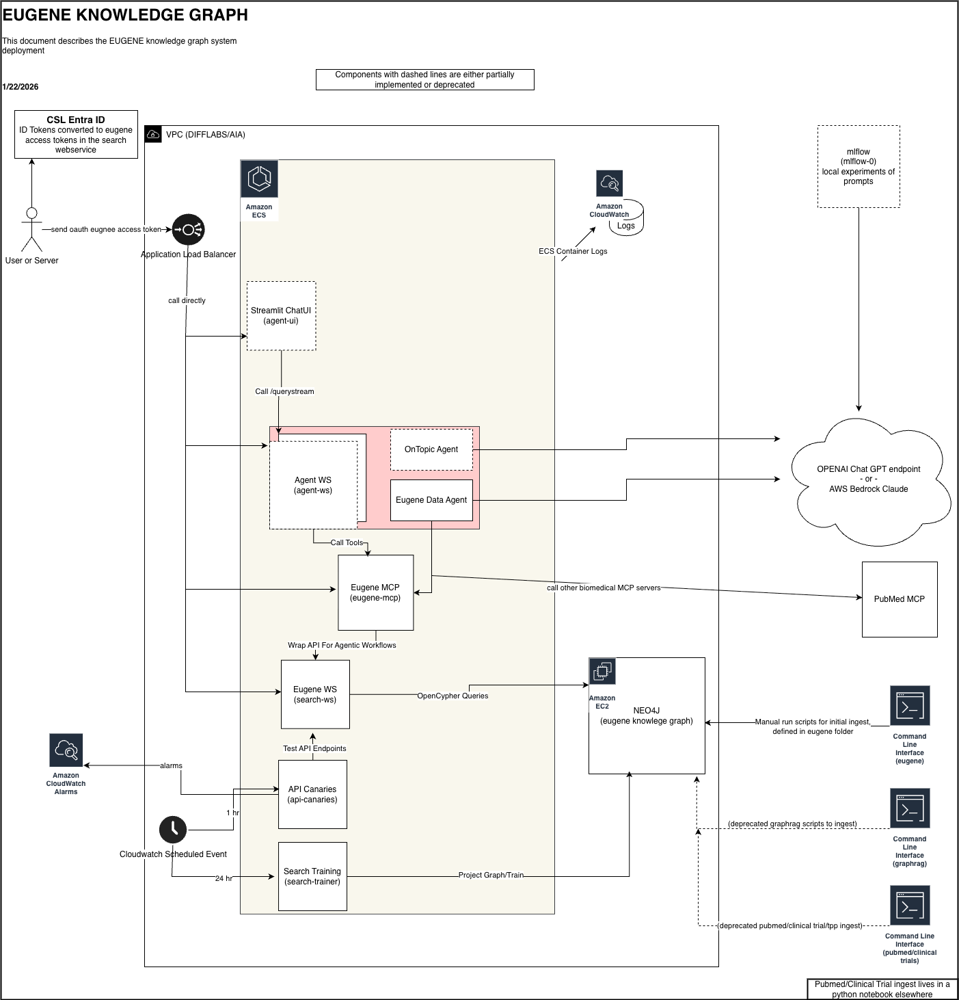

# Eugene Experiments

Welcome to EUGENE experiments. This project contains experiments in knowledge graph and agentic workflows for biomedical data.

Since this project is a experiement, some folders and files are deprecated. This document is an entry point to guide you to parts of the codebase that are most active.

## Deployment
The deployment and system diagram

* [DNS](./docs/dns.md) setup
* [MS ENTRA ID](./docs/entra_id.md) setup
* [EUGENE OAUTH](./docs/oauth.md) setup

## Links

* [CYBERARK](https://csl.privilegecloud.cyberark.com/PasswordVault/v10/Accounts)
* [CSL AWS](https://csl-cloud.awsapps.com/start/#/?tab=accounts)

* [difflabs eugene_ws](https://internal-eugene-search-alb-616664632.us-east-1.elb.amazonaws.com/docs)
* [difflabs agent_ws](https://internal-eugene-search-alb-616664632.us-east-1.elb.amazonaws.com/agent/api/docs)
* [difflabs eugene_mcp](https://internal-eugene-search-alb-616664632.us-east-1.elb.amazonaws.com:8443/health)

* [AIA eugene_ws](https://eugene.ai.cslg1.cslg.net/docs) - not used and stale
* [AIA staging eugene_ws](https://eugene-staging.ai.cslg1.cslg.net/docs) - not used and stale

## Setup

* [GIT](./docs/git.md)
* [Dev Setup](./docs/local_dev_setup.md)
* [AWS Accounts](./docs/csl_aws.md)

* [Setup EUGENE EC2](./eugene/MACHINE_SETUP.md)
* [Installing EUGENE database](./eugene/README.md)

## Development

* [Docker](./docs/docker.md)
* [Terraform](./docs/terraform.md)
* [Code](./docs/folders.md)
* [Maintenance](./docs/maintenance.md)
* [Next Steps](./docs/next_steps.md)

## Deprecated

* [GRAPHRAG](./docs/graphrag.md)
* [IRD] - deprecated in fuze experiments gitlab repo
* [AWS graphrag toolkit] - deprecated, in a notebook in AIA? not checked in?