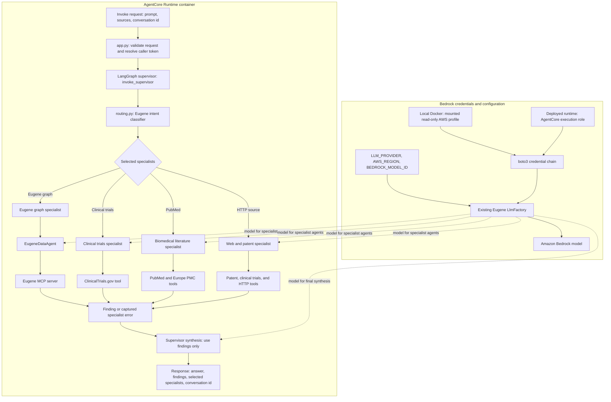

# Eugene Supervisor Agent

Amazon Bedrock AgentCore Runtime entrypoint backed by a LangGraph supervisor. The supervisor reuses Eugene's existing intent classifier, model factory, MCP graph agent, and external research tools from `agents/eugene-agent-ws`.

## Architecture



The graph performs source selection once, fans out to the selected specialists, and synthesizes their findings. `all_sources` dispatches to the knowledge graph, live clinical trials, and biomedical literature. Specialist failures are captured so successful branches can still contribute; synthesis is constrained to the returned findings. AWS credentials are supplied outside the image: a local profile for Docker development or the AgentCore execution role after deployment. The runtime currently keeps no LangGraph checkpoint state between invocations.

## Layout

```text
agents/agentcore-runtime/
  src/supervisor_agent/
    app.py           AgentCore Runtime entrypoint
    routing.py       Existing intent classifier adapter and specialist registry
    specialists.py   Existing Eugene, clinical trial, PubMed, and web integrations
    workflow.py      LangGraph fan-out and synthesis workflow
    shared.py        Loads the existing eugene-agent-ws source tree
  tests/test_routing.py
  Dockerfile
  pyproject.toml
```

## Configuration

Set these in the AgentCore environment or local process:

| Variable | Purpose |
| --- | --- |
| `LLM_PROVIDER` | Set to `bedrock` to use the existing `LlmFactory` with the AgentCore execution role. |
| `BEDROCK_MODEL_ID` | Optional model override; defaults to the existing Eugene default `amazon.nova-lite-v1:0`. |
| `AWS_REGION`, `AWS_DEFAULT_REGION` | Region containing the Bedrock model. Set both for local Docker runs. |
| `EUGENE_MCP_SERVER_URL` | Existing Eugene MCP endpoint, including `/mcp`. Required when routing to the graph specialist. |
| `EUGENE_AGENT_WS_SRC` | Optional path to `agents/eugene-agent-ws/src`; set automatically in the container. |
| `EUGENE_MCP_BEARER_TOKEN` | Optional managed MCP token for workloads that do not forward a caller bearer token. |

The request accepts `prompt`, and optionally `include_tools` or `sources` with existing values such as `eugene`, `clinical_trials`, `pubmed`, `http`, and `all_sources`. Explicit selections remain authoritative and use the existing classifier. A caller bearer token may be forwarded in the invocation request headers or supplied as `access_token` when the trusted gateway contract requires it; do not log or persist it.

The AgentCore execution role should have Bedrock model invocation permissions, network access to the configured MCP endpoint, and access to any secret provider used to supply `EUGENE_MCP_BEARER_TOKEN`. Prefer private networking and a rotating secret source for MCP credentials. The runtime does not enable LangGraph checkpoint persistence; each invocation is isolated.

### AWS credentials

Do not bake AWS credentials into the image, `.env` files, or literal `docker run -e` arguments. Temporary credentials expire, and command-line values can be retained in shell history or process metadata. Any credentials already shared outside AWS should be revoked and replaced.

For local development, use a named AWS CLI profile and mount the host's AWS config read-only. Sign in or refresh SSO credentials on the host first (`aws sso login --profile your-profile`):

```powershell
$awsProfile = "your-profile"
$awsDir = Join-Path $HOME ".aws"
docker run --rm `
  --mount "type=bind,source=$awsDir,target=/home/agent/.aws,readonly" `
  -e AWS_PROFILE=$awsProfile `
  -e AWS_SDK_LOAD_CONFIG=1 `
  -e AWS_REGION=us-east-1 `
  -e AWS_DEFAULT_REGION=us-east-1 `
  eugene-agentcore-supervisor `
  python -c "import boto3; s=boto3.Session(); c=s.get_credentials(); print({'region': s.region_name, 'credentials_found': c is not None, 'provider': c.method if c else None}); print(s.client('sts').get_caller_identity()['Arn'] if c else 'No credentials')"
```

This check reports only whether credentials were found, the provider type, and the caller ARN; never print credential fields such as access keys or session tokens. To run the service locally with that profile:

```powershell
docker run --rm -p 8080:8080 `
  --mount "type=bind,source=$awsDir,target=/home/agent/.aws,readonly" `
  -e AWS_PROFILE=$awsProfile `
  -e AWS_SDK_LOAD_CONFIG=1 `
  -e AWS_REGION=us-east-1 `
  -e AWS_DEFAULT_REGION=us-east-1 `
  -e LLM_PROVIDER=bedrock `
  -e BEDROCK_MODEL_ID=amazon.nova-lite-v1:0 `
  eugene-agentcore-supervisor
```

Set `EUGENE_MCP_SERVER_URL` if requests will use the Eugene graph specialist. Recreate the container after changing its environment; a running container does not inherit credentials added later.

For AWS deployment, do not inject access keys into the AgentCore container. Configure an AgentCore Runtime execution role with the trust relationship required by AgentCore and least-privilege `bedrock:InvokeModel` permissions for the selected model in the configured region (add `bedrock:InvokeModelWithResponseStream` if streaming is used). The runtime's AWS SDK credential chain obtains temporary role credentials. A missing credential provider causes `NoCredentialsError`; a role that is found but lacks access normally causes an authorization error instead. Keep `LLM_PROVIDER=bedrock`, set the model and region, and separately configure MCP network access and any MCP secret through the runtime's secret mechanism.

## Run and validate

From the repository root, build the container so both runtime and existing Eugene source trees are included:

```powershell
docker build -f agents/agentcore-runtime/Dockerfile -t eugene-agentcore-supervisor .
```

For local tests, install this package and its test extra, then set `EUGENE_AGENT_WS_SRC` to the sibling source directory:

```powershell
python -m pip install -e ".[test]"
$env:EUGENE_AGENT_WS_SRC = "../eugene-agent-ws/src"
python -m pytest
```

For a local AgentCore SDK run, set the model and MCP environment variables above and run `python -m supervisor_agent.app` with this package's `src` directory on `PYTHONPATH`. In AWS, publish the image to an AgentCore-supported ECR repository and configure the AgentCore Runtime to use port `8080` and the image entrypoint.