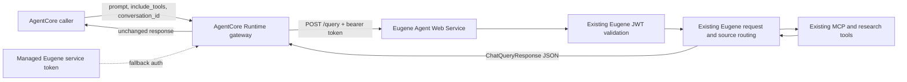

# Eugene AgentCore Gateway

The AgentCore Runtime is intentionally a thin gateway to the existing Eugene Agent Web Service. It does not run an LLM, classify intent, select data sources, connect to MCP, or host domain sub-agents. Eugene retains ownership of authentication validation, session conversation, intent/source routing, tool integrations, and response generation.

## Architecture



## Sequence

```mermaid
sequenceDiagram
  participant C as Caller
  participant A as AgentCore Runtime
  participant E as Eugene Agent API
  participant M as Existing MCP and research tools
  C->>A: Invoke(prompt, include_tools, conversation_id/session_id)
  A->>A: Validate request; map session_id to stable Eugene UUID if needed
  A->>A: Resolve caller bearer from supplied runtime headers or managed secret
  A->>E: POST /query with Eugene request JSON and Authorization header
  E->>E: Validate JWT and preserve existing Eugene behavior
  E->>M: Route and execute the selected existing tools
  M-->>E: Tool results
  E-->>A: ChatQueryResponse JSON
  A-->>C: Return Eugene response unchanged
```

## Folder Structure

```text
agents/agentcore-runtime/
  src/supervisor_agent/
    app.py          AgentCore entrypoint and forwarding lifecycle
    gateway.py      Request mapping, auth resolution, HTTP forwarding
    __init__.py
  tests/
    test_gateway.py Mocked Eugene API contract and auth/session tests
  architecture.mmd Architecture diagram source
  Dockerfile       Minimal non-root runtime image
  pyproject.toml   AgentCore SDK, HTTP client, and test dependency
  README.md
```

## Request and Response

Send the existing Eugene query shape:

```json
{
  "prompt": "Find recent trial evidence for factor IX",
  "conversation_id": "9951c5a8-585e-40ac-9f57-c09a369539ec",
  "include_tools": ["all_sources"]
}
```

When `conversation_id` is omitted, a supplied AgentCore `session_id` is mapped deterministically to a UUID so repeated requests in that session reach Eugene with the same conversation key. With neither value, the gateway generates a UUID. Explicit conversation IDs must already be valid UUIDs, matching Eugene's current API behavior. The response body is Eugene's existing `{prompt, message, conversation_id, is_complete}` object, returned without a second synthesis pass.

## Authentication

Eugene's `/query` requires an `Authorization: Bearer …` token and validates the Eugene JWT itself. The gateway forwards a bearer token from `context.request_headers` or `context.headers` when the AgentCore hosting adapter supplies those fields. Otherwise it uses `EUGENE_AGENT_AUTH_TOKEN`, which must be injected through the runtime's managed secret configuration. The token is never accepted from the invocation JSON, logged, or included in the response.

AgentCore caller IAM identity is not automatically an Eugene Entra JWT. For production, choose an explicit trust bridge: either a trusted upstream passes a short-lived Eugene-audience token in the invocation context, or the runtime uses a least-privilege service identity whose token is rotated through a secret manager. Confirm the hosting adapter's header propagation; if it does not forward request headers, provision the service identity. Eugene remains the authorization authority.

## Configuration and Deployment

Required runtime variables:

| Variable | Purpose |
| --- | --- |
| `EUGENE_AGENT_QUERY_URL` | Full upstream URL, for example `http://eugene_agent_ws:8000/query` inside the Compose network. The service's FastAPI `root_path` is a browser/proxy prefix; the actual router path is `/query`. |
| `EUGENE_AGENT_AUTH_TOKEN` | Optional fallback bearer token, provisioned as a runtime-managed secret rather than an image build arg or source-controlled env value. |
| `EUGENE_AGENT_TIMEOUT_SECONDS` | Optional total upstream timeout; defaults to 120 seconds. |

The AgentCore execution role needs only the permissions required to run the AgentCore runtime and read the configured secret, plus private network access to the Eugene Agent API. It does not need Bedrock model-invocation permissions because the existing Eugene service owns model calls. Apply TLS verification for HTTPS endpoints and keep internal HTTP traffic inside a trusted private network.

Build from the repository root:

```powershell
docker build -f agents/agentcore-runtime/Dockerfile -t eugene-agentcore-gateway .
```

For a local package test:

```powershell
python -m pip install -e ".[test]"
python -m pytest agents/agentcore-runtime/tests -q
```

For production, publish the image to the AgentCore-supported ECR repository and configure the runtime to use port `8080`. Configure `EUGENE_AGENT_QUERY_URL`, the managed auth secret, network access, and the upstream timeout in the runtime environment. Do not put tokens in invocation payloads, Docker build arguments, or committed environment files.