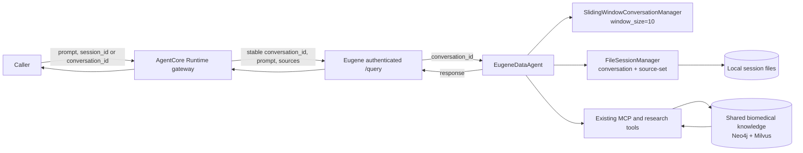
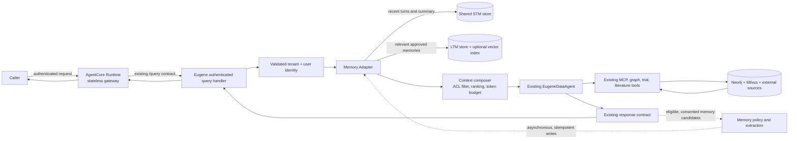

# Eugene AgentCore Memory Strategy

**Status:** Design proposal  
**Assessment date:** 2026-10-03  
**Scope:** Short-term conversational memory (STM) and long-term user memory (LTM) for the existing AgentCore Runtime and Eugene Agent Web Service. This proposal does not change the current architecture or implement code.

## Executive Summary

The codebase has a limited form of STM in the existing Eugene Agent Web Service, but not in the AgentCore Runtime itself. AgentCore maps a supplied `session_id` to a stable Eugene `conversation_id`; Eugene's Strands agent then uses a source-scoped `FileSessionManager` and a `SlidingWindowConversationManager(window_size=10)`. This supports replay of conversation context when the same conversation/source is used again, subject to the session files being available.

The current deployment does not demonstrate durable, shared session storage. The Eugene Agent service uses local file-backed sessions, while the checked-in Compose service definitions do not mount a session volume or configure a shared session database. Restart recovery and cross-replica continuity therefore are not established. The session key is conversation plus source-set, not an authenticated user/tenant key.

No LTM implementation was found for user preferences, durable facts, goals, or episodic summaries. Neo4j and Milvus provide shared biomedical knowledge retrieval; they are not user-specific memory stores. The recommended approach is to keep AgentCore as the invocation gateway and Eugene as the owner of agent behavior, adding a memory adapter at the authenticated Eugene query/agent boundary. Use a managed AgentCore Memory backend if it meets the account's region, security, retention, deletion, and operational requirements; otherwise use DynamoDB as the authoritative store with a separately managed vector index for semantic LTM retrieval.

**Key decision:** Do not enable user-scoped LTM until the request has a trusted, immutable user and tenant identity from validated authentication. The current service-token fallback must not be treated as an end-user identity.

## Findings

| Capability | Current status | Evidence and implications |
| --- | --- | --- |
| AgentCore conversation identity | Implemented, limited | `gateway.py` preserves a valid `conversation_id`, or deterministically maps `session_id` to a UUID. It forwards the Eugene request but does not persist conversation contents. |
| Recent conversation STM | Partially implemented in Eugene | `EugeneDataAgent` constructs `SlidingWindowConversationManager(window_size=10)` and a `FileSessionManager`. Session IDs include conversation and source-set to avoid cross-source history bleed. |
| Conversation ID when bypassing AgentCore | Caveat | The Eugene handler computes a fallback UUID for a request without `conversation_id`, but the execution call passes the raw optional request value. Validation does not populate it. Direct Eugene callers may therefore not use the generated ID for session storage; the AgentCore gateway avoids this by always forwarding a UUID. |
| Durable/shared STM | Not demonstrated | Local file-backed storage is used. The inspected local and production Compose service definitions do not mount or configure a shared session store for `eugene_agent_ws`; persistence across container replacement or multiple replicas is not assured. |
| User/tenant isolation for memory | Gap | The session scope is conversation/source-set. The memory/session key does not include a validated user or tenant identifier. The query handler has an authenticated `user`, but it is not used to scope `FileSessionManager`. |
| Long-term personalized memory | Not implemented | No user memory extraction, profile/fact write path, retrieval API, retention policy, or user memory deletion path was found in the runtime or Eugene Agent Web Service. |
| Biomedical domain retrieval | Implemented, separate concern | Eugene uses Neo4j and Milvus through its graph/tool path for shared domain evidence. That corpus is not a user's LTM and should remain the authoritative source for biomedical claims. |
| AgentCore checkpoint state | Not implemented | The executable AgentCore entrypoint forwards to the existing `/query` API. AgentCore itself has no conversation checkpoint or memory store. |

### Code and documentation alignment

The current executable package is the forwarding gateway in `agents/agentcore-runtime/src/supervisor_agent/`. The AgentCore README currently describes a LangGraph supervisor with `workflow.py`, `routing.py`, and `specialist` modules, but those modules are not in that source package; the Dockerfile copies only `src/`. Use the executable source and Eugene Agent Web Service behavior as the baseline for this proposal. Aligning the README is recommended before using it as a deployment or architecture specification.

### Current-state architecture



**Interpretation:** There is an STM mechanism, but file-backed storage is not a production-grade shared persistence contract unless its location is mounted, protected, and shared appropriately. Neo4j/Milvus are domain knowledge retrieval, not a substitute for user memory.

## Proposed Strategy

### Design principles

1. Preserve the current call path: AgentCore gateway -> authenticated Eugene `/query` -> existing Eugene agent and tools.
2. Keep memory orchestration in Eugene, where authentication and agent/session construction already occur. Do not turn the AgentCore gateway into a second agent or a source of truth.
3. Treat STM and LTM as different data classes with separate retention, retrieval, and deletion rules.
4. Derive user and tenant identity from validated claims on the server. Never trust an invocation payload's `user_id`, tenant, or namespace for memory access.
5. Use LTM to personalize interaction, not as evidence for scientific or clinical answers. Existing domain tools remain authoritative for those answers.
6. Make memory optional and failure-tolerant: a memory-store outage should degrade to a fresh or current-session-only interaction, not take down the core Eugene query path.

### Recommended target architecture

Keep the API and existing agent/tool topology. Add an internal Memory Adapter at the Eugene query/agent boundary. It resolves authorized identity, retrieves bounded memory context, passes it into the existing agent, and submits eligible memory updates after the response. The adapter hides the selected backing service from routing and tool logic.



### Memory lifecycle and retrieval flow

```mermaid
sequenceDiagram
    autonumber
    participant U as Caller
    participant A as AgentCore gateway
    participant Q as Eugene /query
    participant I as Auth and identity resolver
    participant M as Memory Adapter
    participant S as STM store
    participant L as LTM store
    participant E as Existing Eugene agent
    participant W as Async memory writer

    U->>A: Invoke(prompt, session_id)
    A->>Q: POST /query(prompt, stable conversation_id)
    Q->>I: Validate token; resolve tenant and immutable subject
    I-->>Q: trusted identity claims
    Q->>M: Recall(identity, conversation_id, source scope)
    M->>S: Load recent conversation state and summary
    S-->>M: bounded STM context
    M->>L: Search approved memories with identity filter
    L-->>M: ranked LTM candidates with provenance
    M-->>Q: authorized, bounded memory context
    Q->>E: Existing query + internal memory context
    E-->>Q: Eugene response
    Q-->>A: Existing response JSON
    A-->>U: Response
    Q-)W: Eligible candidates, consent and provenance metadata
    W->>M: Idempotent upsert, expiry and audit metadata
```

## STM and LTM Design

### Short-term memory

- **Purpose:** Continue the active conversation, including recent user and assistant turns and a rolling summary when the history exceeds the model context budget.
- **Identity and partitioning:** `tenant_id + subject_id + conversation_id + source_scope`. Keep the existing source scoping so a change in source selection does not replay incompatible tool history. The user/tenant dimensions prevent a guessed or reused conversation UUID from becoming a cross-user memory key.
- **Retention:** Configurable TTL. A proposed starting policy is 30 days for raw turn history and retention of only the current summary while the conversation remains active; confirm with client privacy/legal requirements before adopting. Do not retain tool credentials or unnecessary raw tool payloads.
- **Storage:** Replace local-only persistence with a shared managed session store. Preserve a session manager interface so the underlying Strands agent behavior and current HTTP contract remain unchanged.
- **Context assembly:** Load a bounded recent window and its summary. Apply size limits and drop/re-summarize old turns before model invocation.

### Long-term memory

- **Purpose:** Remember explicit, durable user preferences and recurring workflow context across conversations. Examples include preferred answer structure, preferred evidence sources, and a user-confirmed research topic.
- **Not for:** General biomedical facts already represented in Eugene's knowledge corpus; patient medical records; credentials; speculative traits; or unconfirmed sensitive personal data.
- **Extraction:** Start with explicit “remember this”/“forget this” actions and low-risk preference candidates. Require user confirmation before persisting sensitive or ambiguous items. Avoid silently converting every conversation into profile data.
- **Representation:** Store a normalized memory item with `memory_id`, `tenant_id`, immutable `subject_id`, type, content/structured value, source conversation/turn, created/updated/expiry timestamps, confidence, consent state, sensitivity label, and deletion/version metadata. Keep provenance so the item can be explained, corrected, or deleted.
- **Retrieval:** Apply tenant/user ACL filters before semantic ranking; combine semantic relevance, recency, and confidence; cap the number and token size of returned items. Include provenance in internal context. Do not let recalled text override system instructions or domain evidence.
- **Lifecycle:** Support list, inspect, correct, revoke consent, delete, export where required, TTL expiry, and auditable deletion propagation to indexes and backups according to policy.

## Storage Options

| Option | Fit | Benefits | Trade-offs / decision gates |
| --- | --- | --- | --- |
| **Amazon Bedrock AgentCore Memory (preferred to evaluate first)** | Managed STM and LTM close to the existing AgentCore deployment | Lowest operational burden; managed memory lifecycle and retrieval capabilities; keeps the Eugene agent integration behind one adapter. | Confirm supported region and account availability, identity/namespace isolation, encryption/KMS, retention and deletion behavior, data residency, export, service limits, and cost before commitment. Keep the adapter provider-neutral. |
| **DynamoDB + OpenSearch Serverless vector collection** | Control-oriented AWS fallback | DynamoDB can be the authoritative source for session events, summaries, and structured user preferences; TTL and key design are explicit. OpenSearch adds semantic LTM retrieval and metadata filtering. | More components and operations; index consistency/deletion, embedding lifecycle, capacity/cost, and multi-store failure behavior must be engineered. DynamoDB alone is sufficient for exact-key STM and structured preferences but not semantic recall. |
| **Aurora PostgreSQL + pgvector** | Relational governance or existing Aurora standard | One relational system can hold metadata, lifecycle, and vector search; SQL supports audit/reporting. | Adds a database dependency and vector operations; validate latency, scale, HA, and operational ownership against expected traffic. |
| **Reuse Neo4j/Milvus domain stores for user memory** | Not recommended as the default | Reuses existing retrieval infrastructure. | Couples user PII/lifecycle to the biomedical corpus, complicates ACLs, deletion, retention, and indexing. Existing graph/vector results are shared domain evidence and must remain conceptually separate from personalized memory. |

**Selection recommendation:** Prototype AgentCore Memory behind a small provider-neutral interface. If it cannot meet required identity isolation, residency, deletion, or cost controls, use DynamoDB as the source of truth and add a vector service only if evaluation demonstrates a need for semantic LTM. Avoid persisting LTM in Neo4j/Milvus.

## Integration Points

1. **AgentCore gateway:** Keep it stateless. Preserve `conversation_id`/`session_id` mapping and the existing Eugene request/response contract. Ensure trusted caller identity is forwarded through a validated token or an authenticated service-to-service identity plus explicit end-user claims.
2. **Eugene query handler:** After token validation and before agent execution, resolve immutable tenant/user identifiers from validated claims. Pass these as internal arguments; do not accept them as authoritative request fields. Also pass the handler's computed `conversation_id` into agent execution, including when direct Eugene callers omit it.
3. **EugeneDataAgent session construction:** Replace or wrap local `FileSessionManager` with the shared STM provider. Keep current source-set partitioning and the existing sliding context window. Inject recalled memory through a dedicated, bounded context channel rather than mutating caller prompt text.
4. **Post-response path:** Emit eligible memory candidates to an asynchronous writer after a successful response. Use an idempotency key based on tenant, subject, source turn, and memory type. Do not block the user's response on LTM extraction or vector indexing.
5. **Existing domain tools:** No change to MCP, Neo4j, Milvus, trial search, or literature search. The LTM adapter must not replace evidence retrieval or fabricate citations.
6. **Management surface:** Expose user-controlled inspect/delete/forget actions through the existing authenticated API or UI in a later phase; perform authorization and deletion server-side.

## Scalability and Reliability

- Use an external shared store, not sticky sessions or container-local files, so any AgentCore/Eugene replica can serve the next turn.
- Partition by tenant and immutable subject; use conversation identifiers for STM. Add secondary access patterns for expiry, user memory listing, and deletion.
- Keep request-path recall bounded and read-only. Put extraction, embedding, indexing, and compaction on an asynchronous queue/worker where practical.
- Make all writes idempotent and versioned. Handle retries, duplicate events, partial index updates, and eventual consistency.
- Define timeouts, circuit breakers, and fallback behavior. If memory is unavailable, continue with current prompt and available STM; record a metric without exposing stored content in logs.
- Apply retention/TTL to raw history and stale memory. Track storage growth and per-tenant quotas; provide backpressure for extraction queues.
- Establish service objectives during discovery. Initial targets for evaluation could be memory recall p95 below 200 ms and no material increase in end-to-end query p95; confirm using representative traffic and the selected store.

## Security, Privacy, and Governance

- **Identity:** Resolve memory scope from validated issuer, tenant, and immutable subject claims. The current `EUGENE_AGENT_AUTH_TOKEN` fallback can represent a service identity, not necessarily the end user; do not use it to scope personal memory without a trusted identity propagation design.
- **Authorization:** Enforce tenant and subject filtering in the memory service and again in the adapter. Never rely on vector similarity or an untrusted payload field for access control.
- **Sensitive data:** Treat prompts, conversation history, and extracted memory as sensitive. Do not store patient-identifiable or regulated health data under this proposal without a separate approved data-flow and compliance assessment.
- **Minimization and consent:** Collect only useful preferences, use explicit consent/confirmation, provide a clear forget action, and set retention by memory type.
- **Encryption and secrets:** Use TLS in transit and service-managed/customer-managed encryption at rest as required. Keep AWS credentials and service tokens in managed identity/secret mechanisms, never in prompts, logs, image layers, or memory records.
- **Prompt injection:** Treat retrieved memories as untrusted data. Delimit and label them; do not interpret recalled content as policy or tool instructions. Limit what can be written to memory and defend against a user asking to persist malicious instructions.
- **Audit and observability:** Log memory operation IDs, actor, decision, type, and outcome, not raw memory content. Audit access, mutation, and deletion. Redact prompts/tokens and configure least-privilege access for operators.
- **Deletion:** Define propagation to primary records, vector indexes, caches, replicas, and backups. Document any backup expiry window and deletion completion SLO.

## Implementation Phases and Effort

Estimates are planning ranges, not a commitment. Assumptions: one backend engineer, part-time AWS/platform support, an available Eugene test environment, and timely privacy/security decisions. They exclude procurement, account enablement, and major UI redesign.

| Phase | Scope and exit criteria | Estimate |
| --- | --- | --- |
| **0. Discovery and controls** | Confirm identity claim propagation through AgentCore, user/tenant model, data classification, consent, region/residency, retention, deletion, target traffic, and memory success metrics. Select managed service or fallback. | 3-5 person-days |
| **1. Durable STM foundation** | Implement the provider contract in Eugene, migrate from container-local session persistence, scope by tenant/user/conversation/source, TTL and summaries, then test multi-replica and restart continuity. Keep response/request contract stable. | 5-8 person-days |
| **2. LTM pilot** | Add explicit save/forget flow, normalized preference memory, retrieval filters and token budget, provenance, asynchronous idempotent writes, and a representative quality evaluation. Start with a limited internal cohort. | 7-12 person-days |
| **3. Security and production readiness** | Threat model, isolation/deletion tests, load/failure tests, alarms, audit events, operational runbook, rollout controls, and cost review. | 5-8 person-days |

**Initial delivery range:** approximately **20-33 person-days**, or about **4-7 calendar weeks** with one engineer and part-time platform/security participation. Choosing DynamoDB plus a vector index instead of a suitable managed memory service may add roughly **5-10 person-days** for indexing, consistency, and operational controls. Re-estimate after Phase 0 and a small service/API proof of concept.

### Suggested acceptance criteria

- The same user can continue STM across service restarts and across replicas; different users and tenants cannot retrieve each other's sessions or memories.
- A deleted memory is excluded from retrieval immediately after the documented deletion completion point and is removed from all active indexes.
- Memory store timeouts or failures do not prevent a regular Eugene response.
- User-visible memory is inspectable, correctable, and removable; stored facts include provenance and consent state.
- LTM improves preference-following in a curated evaluation set without reducing factual accuracy or source citation quality.
- No raw memory text or credentials appear in routine logs; access and mutation are auditable.

## Future Roadmap

- **Pilot:** Durable STM and explicit, user-confirmed preferences for an opt-in internal cohort.
- **Personalization:** Add safe preference extraction, confidence thresholds, recency decay, and user controls after quality and privacy review.
- **Cross-session learning:** Add episodic summaries and retrieval across conversations only where the user has opted in and retention policy permits.
- **Team memory:** Consider curated, access-controlled workspace memory separately from personal memory. Require ownership, provenance, review, and conflict resolution.
- **Evaluation and tuning:** Track retrieval precision/recall, memory usefulness, stale-memory rate, correction/deletion rate, leakage incidents (target zero), latency, availability, and cost per active user.
- **Advanced retrieval:** Add hybrid semantic/keyword retrieval, reranking, or memory graph relationships only if measured pilot results justify the added complexity.
- **Governance maturity:** Add export, retention automation, legal hold and audit integrations where required by client policy.

## Decisions Required From Client / Product / Security

1. Is memory opt-in, and which memory types may be saved automatically versus only on explicit user request?
2. Which immutable identity claims define a user and tenant, and can the AgentCore-to-Eugene call reliably convey them?
3. What are raw STM and LTM retention periods, deletion SLAs, data residency requirements, and encryption-key requirements?
4. Is any patient-identifiable or regulated health data in scope? If yes, complete a separate compliance and threat review before implementation.
5. Does the target AWS account/region permit AgentCore Memory and meet required isolation, audit, export, and deletion controls?
6. What are expected peak concurrent users, turns per user, and latency/cost budgets?

## Assessment References

- AgentCore executable entrypoint and request mapping: [app.py](../agents/agentcore-runtime/src/supervisor_agent/app.py), [gateway.py](../agents/agentcore-runtime/src/supervisor_agent/gateway.py), and [gateway tests](../agents/agentcore-runtime/tests/test_gateway.py).
- Eugene authenticated query and conversation ID handling: [chat query router](../agents/eugene-agent-ws/src/query/router/chat_query_agent_router.py) and [request model](../agents/eugene-agent-ws/src/query/model/chat_query_request.py).
- Eugene Strands conversation manager and file session manager: [Eugene data agent](../agents/eugene-agent-ws/src/query/agent/eugene_data_agent.py).
- Deployment persistence context: [local Compose service](../docker-compose.yml) and [production Compose service](../docker-compose.prod.yml).
- AgentCore README/source alignment note: [AgentCore Runtime README](../agents/agentcore-runtime/README.md) and [runtime Dockerfile](../agents/agentcore-runtime/Dockerfile).