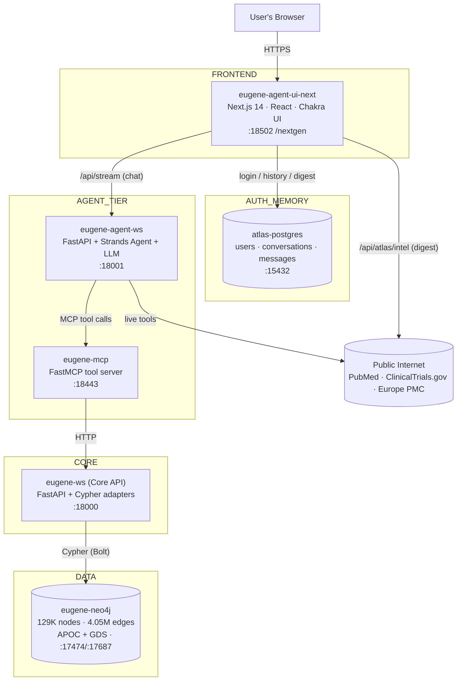

# CSL Atlas / Eugene — Developer Guide (current system)

> A practical, beginner-friendly guide to the **whole system as it exists today**
> (the `feature/nextgen` branch: CSL Atlas Next.js app + Eugene agent + graph).
>
> **Companion doc:** `docs/DEVELOPER_GUIDE.md` is an older guide that goes deep on
> the **backend** (Core API, Domain-Driven-Design package layout, data loading).
> It predates the Next.js "CSL Atlas" frontend, Postgres chat memory, and the
> live digest — so read *this* file first for the big picture and the frontend,
> and dip into that one for backend internals.

---

## 1. What is this project? (in one paragraph)

**Eugene** is a biomedical **knowledge-graph question-answering system**, and
**CSL Atlas** is the modern web app on top of it. A user asks a natural-language
question ("What proteins does Clozapine target?"). An **AI agent** figures out
which **tools** to call, those tools query a **Neo4j graph database** of
~4-million biomedical relationships (or the live internet — PubMed / ClinicalTrials
/ patents), and the agent writes a **cited** answer that streams back to the
browser while an **interactive graph** of its reasoning is drawn on screen.

Think of it as *"ChatGPT for a private biomedical database, with clickable
sources and a live network diagram."*

---

## 2. The big picture (architecture)

Everything runs as **Docker containers** on one internal network. Each box is a
container.



**One line per container**

| Container | Port | Role |
|---|---|---|
| `eugene-agent-ui-next` | 18502 | The web app (chat, dashboard, history). Served under `/nextgen`. |
| `atlas-postgres` | 15432 | Users, login audit, conversations & messages (chat memory). |
| `eugene-agent-ws` | 18001 | The **AI agent** — plans, calls tools, streams the answer. |
| `eugene-mcp` | 18443 | A **tool server** — exposes graph operations as callable tools. |
| `eugene-ws` (Core API) | 18000 | Turns tool requests into **Cypher** queries. |
| `eugene-neo4j` | 17474/17687 | The **graph database** (the knowledge). |
| `eugene-agent-ui` | 18501 | Legacy Streamlit UI (kept for parity; new work uses `:18502`). |

> **Why so many layers?** Separation of concerns. The UI never touches Neo4j. The
> agent never writes Cypher. The MCP server is the only thing that knows the
> graph's API. Each piece is independently testable and replaceable.

---

## 3. Tech stack

| Layer | Tech |
|---|---|
| Web UI | **Next.js 14** (App Router), React 18, **Chakra UI**, TypeScript |
| Graph viz | **Cytoscape.js** (cola/dagre layouts) |
| Auth & chat memory | **PostgreSQL**, `bcryptjs`, `jose` (JWT) |
| Agent | **Python**, **FastAPI**, **Strands Agents**, **OpenAI** (default LLM) |
| Tool server | **FastMCP** (Model Context Protocol) |
| Core API | **Python**, FastAPI, official **neo4j** driver |
| Database | **Neo4j 5** + **APOC** + **GDS** plugins |
| Live data | NCBI E-utilities, ClinicalTrials.gov v2, Europe PMC |
| Tests | **Playwright** |
| Infra | **Docker Compose** (local), Terraform + EC2 (AWS) |

---

## 4. Repository layout (where things live)

```
knowledgeGraph/
├── docker-compose.yml            # defines & wires all containers
├── docker.env                    # secrets (LLM keys, Neo4j pw) — gitignored
├── src/                          # Core API (eugene-ws) — Python
│   ├── eugene_ws.py              #   entrypoint, registers routers
│   ├── foundation/…              #   node/relationship/path Cypher adapters
│   └── stats/…                   #   /stats endpoints (counts, analytics)
├── agents/
│   ├── eugene-agent-ws/          # The AI agent — Python
│   │   └── src/query/
│   │       ├── agent/eugene_data_agent.py         # ⭐ agent + system prompt
│   │       ├── router/chat_query_agent_router.py  # /agent/api/query/stream
│   │       ├── tools/external_tools.py            # PubMed/trials/patents/http
│   │       └── util/intent_classifier.py          # picks tools from the prompt
│   ├── eugene-mcp/               # The tool server — Python
│   │   └── src/tools/eugene_*_tools.py            # graph tools for the agent
│   └── eugene-agent-ui-next/     # ⭐ The web app — TypeScript
│       ├── app/(atlas)/…         #   routed pages: today, ask, radar, …
│       ├── app/api/atlas/…       #   auth, conversations, intel API routes
│       ├── components/atlas/…    #   AtlasShell, views, CommandPalette…
│       ├── hooks/useChatStream.ts#   ⭐ streaming + persistence brain
│       ├── lib/atlas/…           #   db, auth, conversations, intel, areas
│       └── e2e/                  #   Playwright tests
└── docs/                         # this guide, the backend guide, Cypher catalog
```

⭐ = the three files to read first.

---

## 5. The web app — views and tabs

Navigation is in `lib/atlas/nav.ts`, rendered by `components/atlas/AtlasShell.tsx`.
`⌘1`–`⌘7` switch views; `⌘K` opens the command palette.

### 5a. The 8 views

| View | Route | What it does | Data source |
|---|---|---|---|
| **Today** | `/today` | Greeting + "While you were away" **live digest** + signals | live intel + seed |
| **Ask** | `/ask` | The **chat** — the heart of the app | live agent |
| **Research** | `/research` | Diligence workflow templates | seed |
| **Radar** | `/radar` | Competitive-monitoring feed | seed |
| **Watchlist** | `/watchlist` | Live-ranked company table | seed |
| **Programs** | `/programs` | Strategic priorities / target profiles | seed |
| **Library** | `/library` | **Searchable conversation history** + briefs | Postgres |
| **Settings** | `/settings` | Account, theme, **research focus area** | Postgres |

> "seed" = demo constants in `lib/atlas/seed.ts`. Only **Ask**, **Today's digest**,
> **Library**, and **Settings** use real live data today; the rest are realistic
> placeholders ready to be wired to live sources.

### 5b. The three **source tabs** (inside Ask) — the most important control

Pick **one** source at the top-right of Ask. It decides *where the answer comes from*.

| Tab | Sends `include_tools` | Agent may use | Use it for |
|---|---|---|---|
| **Eugene Graph** | `["eugene"]` | `lookup_*`, `fetch_*`, `find_*` | anything in the 4M-edge graph |
| **Web** | `["http"]` | `search_clinical_trials`, `search_patents_web`, `http_request` | live trials, patents, any URL |
| **PubMed** | `["pubmed"]` | `search_pubmed`, `search_europepmc` | current literature |

Single-select **on purpose**: it keeps the toolset small and makes provenance
unambiguous. Every answer ends with a green **"Sources:"** chip naming the source
and the entities used.

### 5c. Other Ask controls
- **Graph** toggle → the interactive Cytoscape graph, built from the agent's tool
  calls. Reopening an old chat **rebuilds** its graph from stored tool calls.
- **Context meter** (bottom-right) → estimates conversation "fullness"
  (claude-code style); at ≥90% it nudges "start a new chat". *It measures
  conversation length, not the size of one answer's graph payload.*
- **Sidebar recents** → every chat is saved with an **auto-generated title**;
  click to resume (`/ask?c=<uuid>`).

---

## 6. The agent — how a question becomes an answer

Lives in `agents/eugene-agent-ws/src/query/agent/eugene_data_agent.py`, built on
**Strands Agents**. It is an **LLM (OpenAI by default) wrapped with tools + a
system prompt**.

### 6a. What "prompt" means here (3 layers, assembled per request)

1. **Base system prompt** — a long fixed block: the agent's identity, scope
   (drugs, diseases, genes, pathways, trials, patents, orgs), per-tool usage
   rules, and hard limits (e.g. *"never fetch an entire label — it overflows the
   model input"*).
2. **Source directive** — `build_source_directive(include_tools)` prepends a
   per-turn policy based on the tab you picked:
   - **Eugene-only:** *answer strictly from the graph; if it's not there, say so
     and ask the user to enable Web/PubMed — never invent a link.*
   - **Web / PubMed:** *you MAY call the live tools; cite real URLs / PMIDs.*
3. **Your message + history** — plus the last ~10 messages (a **sliding window**).

So a "prompt" = *system rules + source policy + history + your question*, fed to
the LLM together.

### 6b. Tool routing (`util/intent_classifier.py`)
- **If you picked a tab, that's authoritative.** The classifier honours it.
- If nothing is selected, it keyword-matches ("latest patent" → Web, "papers" →
  PubMed) and otherwise defaults to the **Eugene graph** (bounded, offline, safe).
- Fewer tools = shorter prompt = faster/cheaper, and the model can't misuse a
  tool it never loaded.

### 6c. The agent loop
```
question → LLM: "call lookup_node_by_value('Clozapine')"
        → tool returns node id
        → LLM: "call fetch_facts(node_id)"
        → tool returns indications/side-effects
        → LLM writes final answer + "Sources: …"
```
Each tool call streams to the UI as an event → that's how the **context graph**
builds live and the answer appears token-by-token.

### 6d. Resilience
- **Session scoping:** memory keyed `"{conversation_id}__{source}"`, so switching
  tabs never bleeds another source's answer into a new turn.
- **Retry** with a fresh session on transient malformed tool-use errors.

---

## 7. The tools — the agent's "hands"

### 7a. Graph tools (MCP → Core API → Neo4j), 16 total
Registered in `agents/eugene-mcp/src/eugene_mcp.py`. Key ones:

| Tool | Answers |
|---|---|
| `lookup_node_by_value` | "find node named X" (exact + fuzzy, fulltext index) |
| `fetch_node_details` | a node's properties |
| `fetch_facts` | a drug's indications/contraindications; a disease's genes |
| `fetch_node_relationships` | a node's edges (neighbours, trials, targets) |
| `fetch_paths` / `has_reachable_path` | shortest path / reachability |
| `fetch_by_label` / `fetch_similar` | list names of a type / similar entities |
| `fetch_drug_aliases` | a drug's synonyms & product names |
| `find_organization_*` | company/assignee lookups |
| `search_summaries` | vector (semantic) search |
| `fetch_graph_stats` | total node/edge counts & composition |
| `fetch_top_connected_proteins` | **graph-wide** hub ranking (degree) |
| `fetch_shared_gene_diseases` | **graph-wide** disease pairs sharing ≥N genes |

**Flow:** agent → MCP tool → HTTP to Core API (`eugene-ws`) → adapter builds
Cypher → Neo4j runs it. The agent never sees Cypher; the MCP never sees Neo4j creds.

### 7b. Live "external" tools (native to the agent)
In `agents/eugene-agent-ws/src/query/tools/external_tools.py` (descriptive
User-Agent, no API keys):

| Tool | Source | Returns |
|---|---|---|
| `search_pubmed` | NCBI E-utilities | recent papers (PMID, title, journal, year) |
| `search_europepmc` | Europe PMC | papers **and** patents (`SRC:PAT`) |
| `search_clinical_trials` | ClinicalTrials.gov v2 | live trials (NCT id, phase, sponsor) |
| `search_patents_web` | Google Patents | a deep-link to results |
| `http_request` | any URL | arbitrary web fetch |

---

## 8. The knowledge graph (the data)

- **Source:** PrimeKG-style biomedical graph — **129,375 nodes / 4,050,064 edges.**
- **10 node types:** `drug`, `gene_protein`, `disease`, `pathway`, `anatomy`,
  `effect_phenotype`, `biological_process`, `molecular_function`,
  `cellular_component`, `exposure`.
- **31 relationship types**, e.g. `drug_protein` (drug→target), `disease_protein`
  (gene↔disease), `protein_protein` (PPI), `drug_drug`, `contraindication`,
  `drug_effect`, `pathway_protein`.
- **Loaded via** `neo4j-admin database import` (bulk; ~1 min for 4M edges), not
  `LOAD CSV`.
- **Indexes:** fulltext `entity_names` (fast fuzzy name lookup) + per-label range
  indexes on `node_id`/`node_name`.

> A full, executed catalog of example Cypher (centrality, GDS, similarity,
> indexes, paths) is in `docs/Eugene_Cypher_Catalog_Production_2026-06-20.pdf`.

---

## 9. Auth, chat memory, and the digest (the app's own data)

All in the **Next.js app + Postgres**, independent of the graph.

### 9a. Auth (`lib/atlas/auth.ts`, `app/api/atlas/auth/*`)
- Email/password; passwords are **bcrypt-hashed** (never plaintext).
- Login issues a **signed JWT** in an `httpOnly` cookie.
- Each user has a **`focus_area`** (hematology / nephrology / immunology /
  oncology) chosen at registration — it personalizes the digest.

### 9b. Conversation memory (`lib/atlas/conversations.ts`)
- Tables **`conversations`** (id = the UUID sent to the agent) and **`messages`**
  (role, content, tool_calls, citations).
- Each conversation gets an **LLM-generated title**.
- `hooks/useChatStream.ts` persists each turn as it streams (best-effort — a DB
  hiccup never blocks chat) and can **resume** any conversation by id.

### 9c. The overnight digest (`lib/atlas/intel.ts`, `app/api/atlas/intel`)
- "While you were away" on Today.
- Builds a query from the user's `focus_area` (`lib/atlas/areas.ts`) **plus
  keywords mined from recent conversation titles** (history analysis), then
  fetches newest **PubMed + ClinicalTrials + patents** in parallel, sorted
  newest-first, cached ~15 min per user.

---

## 10. End-to-end: the life of one question

```mermaid
sequenceDiagram
    participant B as Browser (Ask)
    participant U as Next.js /api/stream
    participant A as Agent
    participant M as MCP
    participant C as Core API
    participant N as Neo4j
    participant P as Postgres

    B->>U: POST prompt + include_tools=["eugene"] + conversation_id
    U->>A: proxy (adds JWT bearer)
    A->>A: build system prompt + source directive
    A->>M: lookup_node_by_value("Clozapine")
    M->>C: GET /nodes/lookup
    C->>N: Cypher (fulltext index)
    N-->>C-->>M-->>A: node id
    A->>M: fetch_facts(node_id)
    M->>C->>N: Cypher
    N-->>C-->>M-->>A: indications / side effects
    A-->>U: stream tokens + tool_call events
    U-->>B: SSE → answer text + live graph
    B->>P: persist messages + generate title
```

---

## 11. Run it locally (5 minutes)

```bash
# 0. Docker Desktop running
cd knowledgeGraph
cp docker.env.template docker.env      # fill in OPENAI_API_KEY, etc.

# 1. bring up the whole stack
docker compose up -d --build

# 2. open the app
open http://localhost:18502/nextgen/login
```
**Demo login:** `sarah@csl.test` / `atlas-demo-2026` (or *Create an account*).

| Thing | URL |
|---|---|
| App | http://localhost:18502/nextgen |
| Core API docs | http://localhost:18000/docs |
| Agent API docs | http://localhost:18001/docs |
| Neo4j Browser | http://localhost:17474 (neo4j / eugene_local_2024) |

**Frontend hot-reload (no Docker rebuild while editing UI):**
```bash
cd agents/eugene-agent-ui-next
npm install && npm run dev     # → http://localhost:3010, talks to dockerized backend
```

---

## 12. Testing

```bash
cd agents/eugene-agent-ui-next
npm run test:e2e       # Playwright: 17 e2e tests (auth, chat, history, digest)
npm run test:e2e:ui    # interactive
npx tsc --noEmit       # type-check
```
Tests run against the Docker UI and **seed their own data via the API**, so they
are deterministic and don't depend on the slower live LLM.

---

## 13. Deployment (AWS, short version)

- Script-driven onto an EC2 instance (not `terraform apply` per deploy):
  - `bin/deploy_ec2.sh` — clone repo at a branch, `docker compose up` the stack.
  - `bin/redeploy_ui.sh` — bounce just the UI container via **AWS SSM**.
- UI built with a `/nextgen` **basePath** (ALB path routing).
- Needs an IAM identity with `ssm:SendCommand` (and VPN for private instances).

---

## 14. Glossary (for freshers)

| Term | Meaning |
|---|---|
| **Knowledge graph** | Data as *nodes* (things) + *edges* (relationships), not rows. |
| **Cypher** | Neo4j's query language (SQL for graphs). |
| **Node / edge / degree** | A thing / a link / how many links a node has. |
| **Agent** | An LLM that calls tools in a loop until it can answer. |
| **Tool** | A function the agent can call. |
| **MCP** | Model Context Protocol — a standard way to expose tools to an agent. |
| **SSE** | Server-Sent Events — how the answer streams token-by-token. |
| **JWT** | A signed token proving who you are, in a cookie. |
| **APOC / GDS** | Neo4j plugins: utilities / graph algorithms. |
| **PrimeKG** | The public biomedical graph this data is based on. |
| **Provenance** | Where a fact came from — the green "Sources:" chip. |

---

## 15. Ideas / where to improve next

1. **Wire live intel into Radar** (fetchers already exist in `lib/atlas/intel.ts`).
2. **Load patent/assignee/trial nodes** so patent questions answer from the graph
   (today they correctly route to Web/PubMed).
3. **Cache `/stats` + analytics** (there's a `# todo`) so they're instant.
4. **Multi-source answers** — allow >1 tab and blend graph + literature.
5. **Bake hot-copied tool files into images** — rebuild `eugene_ws`/`eugene_mcp`
   so `docker cp`'d files survive a container recreate.
6. **Digest recency filter** — add a true "last 24–48h" window for a sharper brief.

---

*Read `useChatStream.ts` (frontend brain), `eugene_data_agent.py` (agent brain),
and `docker-compose.yml` (the wiring). Everything else clicks into place from there.*
