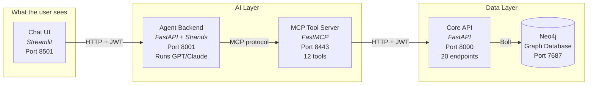
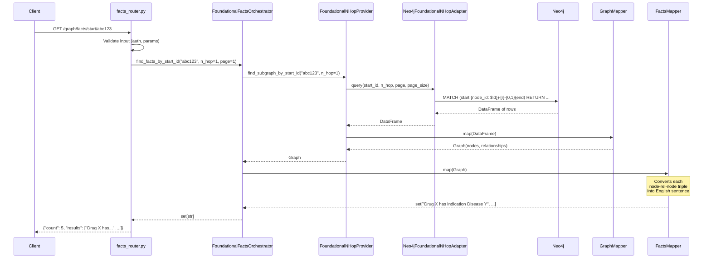
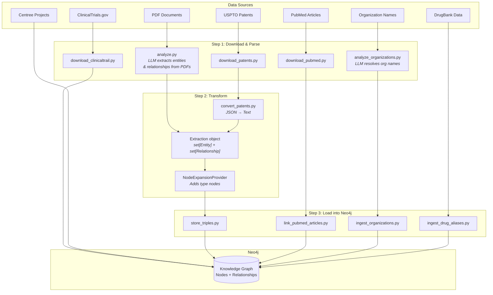
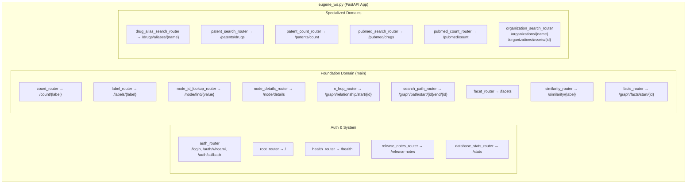
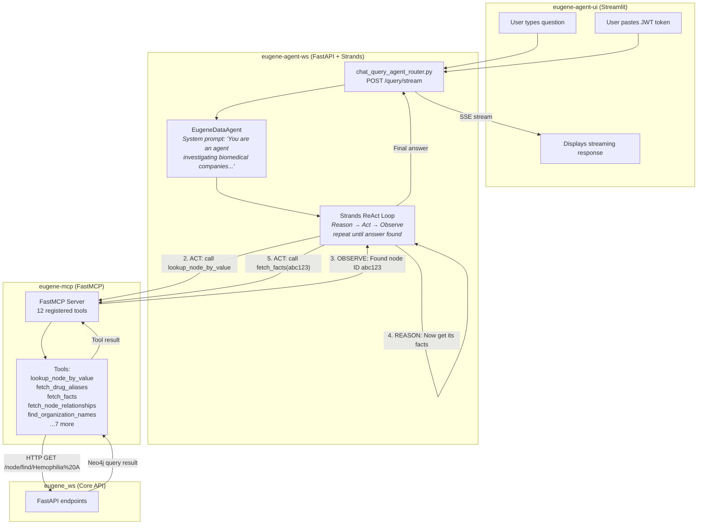
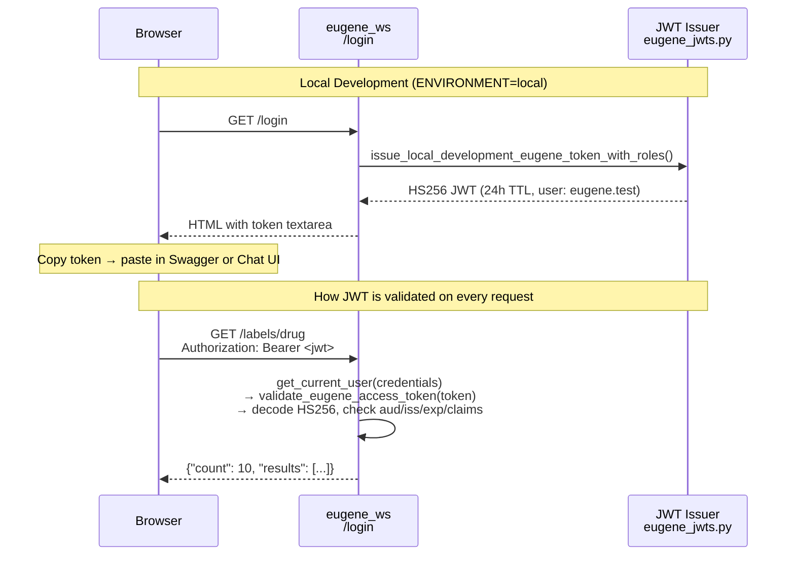
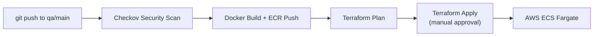

# Eugene Developer Guide

> **Start here if you're new to Eugene.** This guide walks you through the entire codebase — from the first file to read, through how data flows, to how to add your own features.

---

## Table of Contents

- [1. What is Eugene?](#1-what-is-eugene)
- [2. The 5-Minute Architecture](#2-the-5-minute-architecture)
- [3. Where to Start Reading Code](#3-where-to-start-reading-code)
- [4. How a Request Flows Through the System](#4-how-a-request-flows-through-the-system)
- [5. How Data Gets Into Neo4j](#5-how-data-gets-into-neo4j)
- [6. How the API is Built](#6-how-the-api-is-built)
- [7. How the AI Agent Works](#7-how-the-ai-agent-works)
- [8. The DDD Package Pattern](#8-the-ddd-package-pattern)
- [9. How to Add a New Feature](#9-how-to-add-a-new-feature)
- [10. Configuration and Dependency Injection](#10-configuration-and-dependency-injection)
- [11. Authentication Flow](#11-authentication-flow)
- [12. Testing](#12-testing)
- [13. Deployment](#13-deployment)
- [14. Complete File Reference](#14-complete-file-reference)

---

## 1. What is Eugene?

Eugene is a **biomedical knowledge graph** that connects drugs, diseases, genes, proteins, clinical trials, patents, and pharmaceutical organizations into a searchable graph database. An **AI chat agent** lets users ask natural-language questions like "What drugs treat Hemophilia A?" and gets answers by querying the graph.

**Tech stack**: Python 3.13, FastAPI, Neo4j 5.26, Milvus (vector DB), Strands (agent framework), FastMCP, Streamlit, Docker, Terraform, AWS.

---

## 2. The 5-Minute Architecture

Eugene has **5 running services** connected in a chain:



**In plain English:**
1. User types a question in the **Chat UI** (Streamlit)
2. The **Agent Backend** receives it and uses an LLM (GPT-4.1 or Claude) to reason about it
3. The LLM decides to call **MCP tools** (like `lookup_node_by_value`, `fetch_facts`)
4. Each tool makes an HTTP call to the **Core API** (`eugene_ws`)
5. The Core API runs a **Cypher query** against **Neo4j** and returns data
6. The LLM incorporates the data and generates a human-readable answer

---

## 3. Where to Start Reading Code

### The Single Most Important File

**`src/eugene_ws.py`** — This is the spine of the system. Read lines 23-75:

```python
def add_routers(app: FastAPI) -> None:
    from router.auth import auth_router
    from router import root_router, health_router, release_notes_router
    from stats.router import database_stats_router
    from foundation.router import label_router as foundation_label_router
    from foundation.router import count_router as foundation_count_router
    # ... 14 more router imports ...
    from organization.router import organization_search_router

    routers = [auth_router, root_router, health_router, ...]
    for router in routers:
        app.include_router(router.router)
```

Every import tells you a capability. Every router is a REST endpoint group.

### Read These 6 Files In Order (30 minutes)

| # | File | What you learn |
|---|---|---|
| 1 | `src/eugene_ws.py` | The entire API surface — all 20 routers |
| 2 | `src/foundation/router/label_router.py` | How an endpoint is defined (simplest example) |
| 3 | `src/foundation/conf/conf.py` | How dependencies are wired (manual DI) |
| 4 | `src/foundation/infra/db/adapter/neo4j_foundational_node_adapter.py` | How Cypher queries hit Neo4j |
| 5 | `src/foundation/mapper/graph_mapper.py` | How Neo4j results become API responses |
| 6 | `src/foundation/provider/foundational_n_hop_provider.py` | How business logic coordinates adapters + mappers |

After reading these 6 files, you understand the **entire pattern**. Every other endpoint follows the same structure.

---

## 4. How a Request Flows Through the System

### Example: "GET /graph/facts/start/abc123?page=1&page_size=50"

This is the flow when you ask "What are the facts about drug X?":



### The Layer Cake

Every request goes through these layers, top to bottom:

```
┌─────────────────────────────────────────────────┐
│  ROUTER          (FastAPI endpoint)             │
│  File: foundation/router/facts_router.py        │
│  Job: HTTP handling, input validation           │
├─────────────────────────────────────────────────┤
│  ORCHESTRATOR    (composes multiple providers)  │
│  File: foundation/provider/*_orchestrator.py    │
│  Job: coordinate multi-step workflows           │
├─────────────────────────────────────────────────┤
│  PROVIDER        (single business operation)    │
│  File: foundation/provider/*_provider.py        │
│  Job: call adapter, pass to mapper, validate    │
├─────────────────────────────────────────────────┤
│  MAPPER          (data transformation)          │
│  File: foundation/mapper/*_mapper.py            │
│  Job: DataFrame → Domain Model → Response       │
├─────────────────────────────────────────────────┤
│  ADAPTER         (database access)              │
│  File: foundation/infra/db/adapter/*.py         │
│  Job: build Cypher query, execute, return DF     │
├─────────────────────────────────────────────────┤
│  NEO4J           (graph database)               │
│  Cypher queries against the knowledge graph     │
└─────────────────────────────────────────────────┘
```

---

## 5. How Data Gets Into Neo4j

### Data Ingestion Architecture



### Tracing the Ingestion Code

**Start here:** `src/store_triples.py` — this is the main ingestion entry point:

```python
def main():
    driver = GraphDbConnectionFactory.remote_neo4j_instance_from_env()
    neo4j_adapter = Neo4jGraphragAdapter(driver, "PubMedRAG")
    stored_triples_loader = StoredTriplesLoader()
    node_expansion_provider = NodeExpansionProvider()

    # Step 1: Load CSV files into Entity + Relationship objects
    extraction = stored_triples_loader.load(data_dirs=_data_dirs())

    # Step 2: Add type nodes (e.g., a "Protein" type node linked to all proteins)
    node_expansion_provider.expand_type_nodes(extraction=extraction)

    # Step 3: Write to Neo4j using MERGE queries
    neo4j_adapter.ingest(extraction=extraction)
```

**The data model** (what entities and relationships look like):

```python
# src/graph/model/entity.py
@dataclass
class Entity:
    id: str           # unique hash
    type: str         # "Drug", "Disease", "Protein", etc.
    value: str        # "Hemophilia A", "Factor VIII", etc.
    description: str  # "A genetic bleeding disorder..."

# src/graph/model/relationship.py
@dataclass
class Relationship:
    id: str           # unique hash
    source: Entity    # from node
    target: Entity    # to node
    relation: str     # "indication", "drug_protein", etc.
    description: str  # "Afstyla treats Hemophilia A"
```

**How it hits Neo4j** (the actual Cypher in `neo4j_graphrag_adapter.py`):

```cypher
-- For each relationship, this MERGE query runs:
MERGE (n1:`Drug` { value: "Afstyla", id: "abc", description: "...", type: "Drug" })
MERGE (n2:`Disease` { value: "Hemophilia A", id: "def", description: "...", type: "Disease" })
MERGE (n1)-[rel:`indication` { id: "ghi", type: "indication", description: "..." }]->(n2)
RETURN n1.value, n2.value, rel.type
```

### Neo4j Property Conventions

The API adapters expect specific property names on nodes:

| Property | What it is | Used by |
|---|---|---|
| `node_name` | Display name of the entity | All search/lookup queries |
| `node_id` | Unique identifier | All ID-based queries |
| `value` | Same as node_name (legacy) | GraphRAG ingestion |
| `name` | Same as node_name (legacy) | Some mappers |
| `organization_canonical_name` | Organization display name | Organization search |
| `org_id` | Organization ID | Organization asset queries |

---

## 6. How the API is Built

### The 20 Registered Routers

Each router is a FastAPI `APIRouter` registered in `src/eugene_ws.py`:



### Anatomy of a Router

Every router follows this exact pattern. Here's `label_router.py` — the simplest:

```python
# src/foundation/router/label_router.py

router = APIRouter(prefix="", tags=["foundation"])

# Dependency injection via conf.py factory functions
adapter = neo4j_foundational_node_adapter()   # ← from foundation/conf/conf.py

@router.get("/labels/{label}")
def labels(
    label: str,
    page: int = Query(default=1, ge=1),
    page_size: int = Query(default=25, ge=1, le=50),
    user: dict = Depends(get_current_user),    # ← JWT auth required
):
    df = adapter.find_by_label(label, page, page_size)  # ← Cypher query
    return to_id_list_response(df)                       # ← Transform to JSON
```

**Key points:**
- `Depends(get_current_user)` enforces JWT authentication
- The adapter is created once at module load via `conf.py` factory
- The adapter returns a pandas DataFrame
- A utility function transforms it to the response JSON

---

## 7. How the AI Agent Works

### Agent Architecture



### Key Agent Files (read in this order)

| # | File | What it does |
|---|---|---|
| 1 | `agents/eugene-mcp/src/eugene_mcp.py` | MCP server — registers 12 tools |
| 2 | `agents/eugene-mcp/src/tools/eugene_node_tools.py` | Example tool: `lookup_node_by_value` |
| 3 | `agents/eugene-mcp/src/util/request.py` | HTTP client that calls eugene_ws |
| 4 | `agents/eugene-agent-ws/src/query/agent/eugene_data_agent.py` | **The agent** — Strands ReAct pattern |
| 5 | `agents/eugene-agent-ws/src/query/router/chat_query_agent_router.py` | `/query/stream` endpoint |
| 6 | `agents/eugene-agent-ws/src/query/conf/conf.py` | LLM provider selection (OpenAI/Anthropic) |
| 7 | `agents/eugene-agent-ui/src/eugene_agent_ui.py` | Streamlit chat frontend |

### The 12 MCP Tools

These are the "hands" the AI agent can use:

| Tool | What it does | Maps to API |
|---|---|---|
| `fetch_identity` | Who am I? (JWT claims) | `/auth/whoami` |
| `fetch_by_label` | List drugs, diseases, etc. | `/labels/{label}` |
| `fetch_similar` | Find similar nodes | `/similarity/{label}` |
| `lookup_node_by_value` | Find a node by name | `/node/find/{value}` |
| `fetch_node_details` | Get details for node IDs | `/node/details` |
| `fetch_drug_aliases` | Drug aliases, indications | `/drugs/aliases/{name}` |
| `fetch_facts` | Relationships as sentences | `/graph/facts/start/{id}` |
| `fetch_node_relationships` | N-hop graph traversal | `/graph/relationship/start/{id}` |
| `fetch_paths` | Shortest path between nodes | `/graph/path/start/{id}/end/{id}` |
| `has_reachable_path` | Can you reach B from A? | `/graph/reachability/start/{id}/end/{id}` |
| `find_organization_names` | Search org names by pattern | `/organizations/{pattern}` |
| `find_organization_assets` | Org's drugs, trials, IP | `/organizations/assets/{id}` |

---

## 8. The DDD Package Pattern

Every domain in `src/` follows the same **6-folder structure**. Learn it once, navigate any domain:

```
src/foundation/                    ← Domain name
├── model/                         ← Data classes, enums, Pydantic models
│   ├── foundational_node_enum.py  ←   36 node types (Drug, Disease, etc.)
│   ├── foundational_relationship_enum.py  ← 27 relationship types
│   └── graph/graph.py             ←   Graph, Node, Relationship response models
│
├── provider/                      ← Business logic
│   ├── foundational_n_hop_provider.py     ← N-hop graph traversal
│   ├── foundational_path_provider.py      ← Shortest path queries
│   ├── foundational_facts_orchestrator.py ← Composes n-hop + facts mapper
│   └── foundational_node_details_provider.py ← Node detail retrieval
│
├── conf/                          ← Dependency injection (factory functions)
│   └── conf.py                    ←   40+ factory functions wiring everything
│
├── mapper/                        ← Data transformation
│   ├── graph_mapper.py            ←   DataFrame → Graph model
│   ├── facts_mapper.py            ←   Graph → human-readable fact sentences
│   ├── node_details_mapper.py     ←   DataFrame → NodeDetails model
│   └── patent_search_result_mapper.py ← DataFrame → PatentSearchResult
│
├── infra/                         ← Infrastructure adapters
│   ├── db/adapter/                ←   20 Neo4j adapter classes
│   │   ├── neo4j_foundational_node_adapter.py
│   │   ├── neo4j_foundational_n_hop_adapter.py
│   │   ├── neo4j_drug_aliases_adapter.py
│   │   └── ... (17 more)
│   └── embedding/                 ←   Embedding generation for vector search
│
├── router/                        ← FastAPI endpoints
│   ├── label_router.py            ←   GET /labels/{label}
│   ├── n_hop_router.py            ←   GET /graph/relationship/start/{id}
│   ├── facts_router.py            ←   GET /graph/facts/start/{id}
│   └── ... (14 more)
│
├── load/                          ← File loaders (CSV, checkpoints)
└── writer/                        ← Output writers (TSV, CSV export)
```

**All 9 domains follow this pattern:**

| Domain | Package | Key Responsibility |
|---|---|---|
| **Foundation** | `src/foundation/` | Core biomedical search (drugs, diseases, genes, paths, similarity) |
| **Organization** | `src/organization/` | Company name resolution + LLM disambiguation |
| **Graph** | `src/graph/` | Knowledge extraction, community detection |
| **Patent** | `src/patent/` | USPTO patent processing |
| **PubMed** | `src/pubmed/` | PubMed article processing |
| **TPP** | `src/tpp/` | Target Product Profiles |
| **Centree** | `src/centree/` | Therapeutic area projects |
| **ClinicalTrail** | `src/clinicaltrail/` | Clinical trial data |
| **Document** | `src/document/` | PDF parsing, LLM analysis |

---

## 9. How to Add a New Feature

### Example: Add a "Disease Search by Gene" endpoint

#### Step 1: Create the adapter (Cypher query)

```python
# src/foundation/infra/db/adapter/neo4j_disease_gene_adapter.py

class Neo4jDiseaseGeneAdapter:
    def __init__(self, driver: Driver):
        self.driver = driver

    def find_diseases_by_gene(self, gene_name: str) -> DataFrame:
        query = """
        MATCH (g:GENE_PROTEIN {node_name: $gene})-[:disease_protein]-(d:DISEASE)
        RETURN d.node_id AS id, d.node_name AS name, g.node_name AS gene
        ORDER BY d.node_name
        """
        with self.driver.session() as session:
            result = session.run(query, gene=gene_name)
            return DataFrame(result.data())
```

#### Step 2: Wire it in conf.py

```python
# src/foundation/conf/conf.py — add these functions:

def neo4j_disease_gene_adapter() -> Neo4jDiseaseGeneAdapter:
    return Neo4jDiseaseGeneAdapter(driver=_neo4j_driver())
```

#### Step 3: Create the router

```python
# src/foundation/router/disease_gene_router.py

from fastapi import APIRouter, Depends
from router.auth.auth import get_current_user
from foundation.conf.conf import neo4j_disease_gene_adapter

router = APIRouter(prefix="", tags=["foundation"])
adapter = neo4j_disease_gene_adapter()

@router.get("/diseases/by-gene/{gene_name}")
def diseases_by_gene(
    gene_name: str,
    user: dict = Depends(get_current_user),
):
    df = adapter.find_diseases_by_gene(gene_name)
    results = [{"id": r["id"], "name": r["name"]} for _, r in df.iterrows()]
    return {"gene": gene_name, "count": len(results), "results": results}
```

#### Step 4: Register in eugene_ws.py

```python
# src/eugene_ws.py — add to add_routers():
from foundation.router import disease_gene_router
# ... in the routers list:
routers = [
    # ... existing routers ...
    disease_gene_router,
]
```

#### Step 5 (optional): Add an MCP tool so the agent can use it

```python
# agents/eugene-mcp/src/tools/eugene_disease_tools.py

class EugeneDiseaseTools:
    @staticmethod
    async def find_diseases_by_gene(gene_name: str) -> dict | str:
        """Find diseases associated with a gene or protein.
        Args:
            gene_name: gene or protein name, e.g. 'Factor VIII'
        """
        token = extract_token()
        url = f"{EUGENE_API_BASE}/diseases/by-gene/{gene_name}"
        return await make_eugene_request(token=token, url=url)
```

Register it in `eugene_mcp.py`:
```python
register_tools(mcp, [
    # ... existing tools ...
    EugeneDiseaseTools.find_diseases_by_gene,
])
```

---

## 10. Configuration and Dependency Injection

Eugene uses **manual DI** — no framework. Each domain has a `conf/conf.py` with factory functions.

### How it works

```python
# src/foundation/conf/conf.py

# Private: accepts explicit dependencies (for testing)
def _foundational_n_hop_provider(
    neo4j_foundational_n_hop_adapter: Neo4jFoundationalNHopAdapter,
    graph_mapper: GraphMapper,
) -> FoundationalNHopProvider:
    return FoundationalNHopProvider(
        neo4j_foundational_n_hop_adapter=neo4j_foundational_n_hop_adapter,
        graph_mapper=graph_mapper,
    )

# Public: resolves dependencies from environment (for production)
def foundational_n_hop_provider() -> FoundationalNHopProvider:
    return _foundational_n_hop_provider(
        neo4j_foundational_n_hop_adapter=neo4j_foundational_n_hop_adapter(),
        graph_mapper=graph_mapper(),
    )
```

**Why two functions?**
- **Public** (`foundational_n_hop_provider()`) — used by routers in production; auto-resolves dependencies
- **Private** (`_foundational_n_hop_provider(...)`) — used in tests; you pass mock dependencies directly

### Key environment variables

| Variable | Purpose |
|---|---|
| `NEO4J_URI` | Neo4j connection (e.g., `bolt://localhost:7687`) |
| `NEO4J_USERNAME` / `NEO4J_PASSWORD` | Neo4j credentials |
| `ENVIRONMENT` | Set to `local` to skip Entra ID OAuth |
| `EUGENE_CLIENT_SECRET` | JWT signing secret (shared by all services) |
| `OPENAI_API_KEY` | For GPT models in the agent |
| `ANTHROPIC_API_KEY` | For Claude models in the agent |
| `LLM_PROVIDER` | `openai` or `anthropic` |
| `EUGENE_MCP_SERVER_URL` | MCP server URL for the agent |

---

## 11. Authentication Flow



**Key files:**
- `src/router/auth/auth.py` — `get_current_user()` dependency (3 lines)
- `src/router/auth/eugene_jwts.py` — JWT encode/decode logic
- `src/router/auth/roles.py` — `USER_ROLE_MAP` (who gets what roles)
- `src/router/auth/const.py` — All auth constants from env

**Token claims:**
```json
{
  "iss": "https://eugene.ai.cslg1.cslg.net/{tenant_id}",
  "aud": "api://eugene/{client_id}",
  "sub": "eugene.test",
  "upn": "eugene.test@cslhering.com",
  "roles": ["user.public.read"],
  "exp": 1711086400
}
```

---

## 12. Testing

### Run tests

```bash
pytest                          # All tests, parallel, with coverage
pytest -v                       # Verbose
pytest src/foundation/mapper/   # One package
pytest -k "test_graph"          # By name pattern
```

### Test conventions

- Tests are **colocated**: `graph_mapper.py` → `graph_mapper_test.py` (same directory)
- Shared fixtures in `conftest.py` per package
- Test data in `tests/data/` (JSON fixtures)
- Parallel execution via `pytest-xdist` (`-n 2`)

### Config (`.pytest.ini`)

```ini
[pytest]
minversion = 7.0
addopts = -n 2 --cov=src --cov-report=lcov:reports/coverage/lcov.info
log_cli = true
log_cli_level = INFO
markers =
    serial: Run serially
    integration: Integration tests
```

---

## 13. Deployment

### Local (Docker Compose)

```bash
cp docker.env.template docker.env  # Fill in credentials
docker compose up --build -d       # Start all 5 services
```

Services at: Neo4j `:17474`, API `:18000`, MCP `:18443`, Agent `:18001`, UI `:18501`

### Production (CI/CD)



| Environment | Branch | AWS Account | Region |
|---|---|---|---|
| difflabs (dev) | Manual | 087084717211 | us-east-1 |
| AIA (prod) | `qa`/`main` | 010928221940 | eu-central-1 |

---

## 14. Complete File Reference

### Directory Map

```
src/
├── eugene_ws.py                          ★ START HERE — FastAPI app, registers all routers
├── fetch_secrets.py                      AWS Secrets Manager → .env
├── helper.py                             Env loading helpers
│
├── router/auth/                          Authentication
│   ├── auth.py                           ★ get_current_user() — the auth dependency
│   ├── auth_router.py                    /login, /auth/whoami, /auth/callback
│   ├── eugene_jwts.py                    ★ JWT issue + validate (HS256)
│   ├── entra_id_jwts.py                  Entra ID token handling (RS256)
│   ├── roles.py                          USER_ROLE_MAP — who gets what access
│   ├── conf.py                           MSAL + env var loading
│   └── const.py                          All auth constants
│
├── foundation/                           ★ MAIN DOMAIN — start reading here
│   ├── conf/conf.py                      ★ 40+ factory functions (DI wiring)
│   ├── model/                            Domain models
│   │   ├── foundational_node_enum.py     ★ All 36 node types
│   │   └── foundational_relationship_enum.py  ★ All 27 relationship types
│   ├── router/                           17 FastAPI routers
│   │   ├── label_router.py               ★ Simplest router — read first
│   │   ├── n_hop_router.py               Graph traversal
│   │   ├── facts_router.py               Facts as sentences
│   │   └── ...
│   ├── provider/                         Business logic
│   │   ├── foundational_n_hop_provider.py    ★ Core provider pattern
│   │   ├── foundational_facts_orchestrator.py ★ Orchestrator pattern
│   │   └── ...
│   ├── mapper/                           Data transformation
│   │   ├── graph_mapper.py               ★ DataFrame → Graph
│   │   ├── facts_mapper.py              Graph → English sentences
│   │   └── ...
│   └── infra/db/adapter/                 20 Neo4j adapters
│       ├── neo4j_foundational_node_adapter.py  ★ Node lookup queries
│       ├── neo4j_foundational_n_hop_adapter.py  N-hop Cypher queries
│       └── ...
│
├── organization/                         Org name resolution
│   ├── analyzer/                         LLM-based analysis
│   ├── provider/                         Multi-pass merge orchestrators
│   └── router/organization_search_router.py  /organizations/* endpoints
│
├── graph/                                Knowledge extraction
│   ├── model/entity.py                   ★ Entity dataclass
│   ├── model/relationship.py             ★ Relationship dataclass
│   ├── model/extraction.py               Container: set[Entity] + set[Relationship]
│   ├── infra/db/neo4j_graphrag_adapter.py  ★ MERGE queries for ingestion
│   └── community/                        Community detection
│
├── infra/                                Cross-cutting infrastructure
│   ├── llm/llm_factory.py               ★ LLM singletons (Ollama/Bedrock/OpenAI)
│   ├── embedding/                        Embedding providers
│   └── db/graph_db_connection_factory.py  ★ Neo4j connection factory
│
├── [25 CLI scripts]                      Data pipeline entry points
│   ├── store_triples.py                  ★ Main ingestion script
│   ├── ingest_organizations.py           Load orgs into Neo4j
│   ├── analyze_organizations.py          LLM org disambiguation
│   └── ...
│
agents/
├── eugene-mcp/src/                       MCP Tool Server
│   ├── eugene_mcp.py                     ★ Server entry, registers 12 tools
│   ├── tools/                            7 tool classes
│   │   ├── eugene_node_tools.py          ★ lookup_node_by_value, fetch_node_details
│   │   ├── eugene_drug_tools.py          fetch_drug_aliases
│   │   ├── eugene_graph_tools.py         fetch_relationships, fetch_paths
│   │   ├── eugene_organization_tools.py  find_org_names, find_org_assets
│   │   └── ...
│   └── util/request.py                   ★ HTTP client for eugene_ws API
│
├── eugene-agent-ws/src/                  Agent Backend
│   ├── eugene_chat_ws.py                 FastAPI entry point
│   ├── query/agent/eugene_data_agent.py  ★ THE AGENT — Strands ReAct
│   ├── query/router/chat_query_agent_router.py  /query, /query/stream
│   ├── query/conf/conf.py               ★ LLM provider selection
│   ├── query/infra/llm/llm_factory.py   OpenAI + Anthropic model factories
│   └── query/model/                      Request/response/metrics models
│
├── eugene-agent-ui/src/                  Streamlit Chat UI
│   └── eugene_agent_ui.py               ★ Full Streamlit app
│
└── mlflow-0/src/                         Agent evaluation framework
    ├── bedrock_eval.py                   Bedrock evaluation
    ├── openai_eval.py                    OpenAI evaluation
    ├── evaluate/scorers/                 Custom MLflow scorers
    └── prompt/                           Prompt registry
```

### Files marked with ★ are the essential ones to read first.

---

## Quick Reference: "I want to..."

| I want to... | Start here |
|---|---|
| Understand the API | `src/eugene_ws.py` → follow any router import |
| Add a new endpoint | Copy `src/foundation/router/label_router.py` as template |
| Add a new Neo4j query | Create adapter in `src/foundation/infra/db/adapter/` |
| Add a new MCP tool | Add method in `agents/eugene-mcp/src/tools/`, register in `eugene_mcp.py` |
| Change the LLM model | Edit `OPENAI_MODEL_ID` or `ANTHROPIC_MODEL_ID` in `docker.env` |
| Add a new data source | Create CLI script in `src/`, follow `store_triples.py` pattern |
| Understand auth | Read `src/router/auth/auth.py` (3 lines) → `eugene_jwts.py` |
| Add a new user role | Edit `USER_ROLE_MAP` in `src/router/auth/roles.py` |
| Run tests | `pytest` (parallel, with coverage) |
| Deploy locally | `docker compose up --build -d` |
| Deploy to AWS | Push to `qa` or `main` branch → GitLab CI/CD |
| Debug the agent | Check `docker logs eugene-agent-ws` |
| See what's in Neo4j | Open `http://localhost:17474`, run `MATCH (n) RETURN n LIMIT 25` |
