# Eugene - Biomedical Knowledge Graph Platform

## Complete Production Documentation

> **Version**: 1.0.0 | **Last Updated**: 2026-03-21 | **Classification**: Internal - CSL

---

# Master Table of Contents

- [Part 1: Stakeholder Documentation](#part-1-stakeholder-documentation)
  - [1.1 Executive Summary](#11-executive-summary)
  - [1.2 System Capabilities Overview](#12-system-capabilities-overview)
  - [1.3 Architecture at a Glance](#13-architecture-at-a-glance)
  - [1.4 Security and Compliance Summary](#14-security-and-compliance-summary)
  - [1.5 Operational Status and Risk Register](#15-operational-status-and-risk-register)
  - [1.6 Roadmap Implications](#16-roadmap-implications)
- [Part 2: Architect Documentation](#part-2-architect-documentation)
  - [2.1 System Context Diagram (C4 Level 1)](#21-system-context-diagram-c4-level-1)
  - [2.2 Container Diagram (C4 Level 2)](#22-container-diagram-c4-level-2)
  - [2.3 Component Diagrams (C4 Level 3)](#23-component-diagrams-c4-level-3)
  - [2.4 Design Patterns and Architectural Decisions](#24-design-patterns-and-architectural-decisions)
  - [2.5 Data Architecture](#25-data-architecture)
  - [2.6 Security Architecture](#26-security-architecture)
  - [2.7 Infrastructure Architecture](#27-infrastructure-architecture)
  - [2.8 CI/CD Architecture](#28-cicd-architecture)
  - [2.9 Scalability and Performance](#29-scalability-and-performance)
  - [2.10 Resilience and Error Handling](#210-resilience-and-error-handling)
  - [2.11 Technology Decision Records](#211-technology-decision-records)
- [Part 3: Developer Documentation](#part-3-developer-documentation)
  - [3.1 Development Environment Setup](#31-development-environment-setup)
  - [3.2 Code Organization and Conventions](#32-code-organization-and-conventions)
  - [3.3 API Reference](#33-api-reference)
  - [3.4 Data Model Reference](#34-data-model-reference)
  - [3.5 Database Adapter Reference](#35-database-adapter-reference)
  - [3.6 Provider and Orchestrator Reference](#36-provider-and-orchestrator-reference)
  - [3.7 LLM Integration Reference](#37-llm-integration-reference)
  - [3.8 Embedding and Vector Search](#38-embedding-and-vector-search)
  - [3.9 CLI Scripts Reference](#39-cli-scripts-reference)
  - [3.10 Authentication Implementation Guide](#310-authentication-implementation-guide)
  - [3.11 Testing Guide](#311-testing-guide)
  - [3.12 Docker and Container Guide](#312-docker-and-container-guide)
  - [3.13 Terraform and Deployment Guide](#313-terraform-and-deployment-guide)
  - [3.14 Configuration Reference](#314-configuration-reference)
  - [3.15 Monitoring and Observability](#315-monitoring-and-observability)
  - [3.16 Error Handling Patterns](#316-error-handling-patterns)
  - [3.17 Operational Runbooks](#317-operational-runbooks)
- [Part 4: Appendices](#part-4-appendices)
  - [A. Glossary](#a-glossary)
  - [B. File Index](#b-file-index)
  - [C. Environment Variable Reference](#c-environment-variable-reference)
  - [D. External Dependencies](#d-external-dependencies)
  - [E. Related Documentation Links](#e-related-documentation-links)

---

# Part 1: Stakeholder Documentation

> **Audience**: Product owners, business sponsors, and managers at CSL. No code. Business language.

---

## 1.1 Executive Summary

**Eugene** is a biomedical knowledge graph and AI-powered competitive intelligence platform built for CSL. It integrates data from multiple pharmaceutical sources -- drugs, diseases, genes, proteins, clinical trials, patents, PubMed articles, and company organizational structures -- into a unified, searchable knowledge graph.

**What problems Eugene solves:**

- **Competitive Intelligence**: Quickly answers questions like "What drugs does Biogen have in clinical trials?" or "What companies are developing therapies for hemophilia?" -- queries that previously required manual research across dozens of databases.
- **Organization Disambiguation**: Automatically resolves company name variations (e.g., "CSL Behring", "CSL Behring LLC", "CSL Behring AG") into canonical entities using AI, eliminating duplicate records.
- **Drug Pipeline Visibility**: Maps relationships between drugs, diseases, clinical trials, patents, and sponsoring organizations to provide a holistic view of therapeutic landscapes.
- **Conversational Querying**: A chat interface powered by AI agents allows users to ask natural-language questions and receive structured answers drawn directly from the knowledge graph.

**Current state**: Eugene is deployed and active in the CSL difflabs development environment (AWS us-east-1). The production AIA environment (AWS eu-central-1) is provisioned but pending an ECS IAM permissions fix. The system contains foundational biomedical data, USPTO patent records, clinical trial data, PubMed articles, and organization mappings.

---

## 1.2 System Capabilities Overview

| Capability | What It Does | Business Value | Data Source |
|---|---|---|---|
| **Drug Alias Search** | Finds all names for a drug (generic, brand, chemical) | Eliminates missed results due to naming inconsistencies | DrugBank, foundation graph |
| **Organization Assets** | Lists clinical trials, drugs, patents, and IP tied to a company | One-click competitive landscape for any organization | Neo4j knowledge graph |
| **Graph Traversal** | Explores connections between drugs, diseases, genes, proteins | Discovers hidden relationships for drug repurposing | Foundation biomedical data |
| **Patent Search** | Searches USPTO patents by drug, clinical trial, or keyword | Tracks IP landscape for competitive positioning | USPTO patent data |
| **PubMed Search** | Finds and links published research articles to graph entities | Monitors latest research for therapeutic areas | PubMed/NCBI |
| **Clinical Trial Lookup** | Searches clinical trials by sponsor, drug, or condition | Monitors competitor trial activity | ClinicalTrials.gov |
| **Organization Disambiguation** | Resolves variant company names to canonical entities | Ensures accurate competitive analysis across name variations | AI-powered analysis |
| **Path Discovery** | Finds connections between any two entities in the graph | Reveals indirect relationships (e.g., Drug -> Gene -> Disease) | Neo4j graph algorithms |
| **Similarity Search** | Finds drugs or diseases similar to a given entity | Identifies comparable therapeutics or conditions | Graph embeddings |
| **AI Chat Agent** | Natural-language Q&A over the entire knowledge graph | Enables non-technical users to query complex data | All sources via AI agent |

### Example Questions Users Can Ask

- "What are the drug aliases for Prednisone?"
- "What assets does Biogen have?"
- "Find organizations with names like CSL"
- "What are the relationships between Hemophilia and Factor VIII?"
- "Search for clinical trials related to immunoglobulins"
- "What PubMed studies mention adalimumab?"
- "Is there a path between Drug X and Disease Y?"

---

## 1.3 Architecture at a Glance

Eugene consists of four connected components that work together:

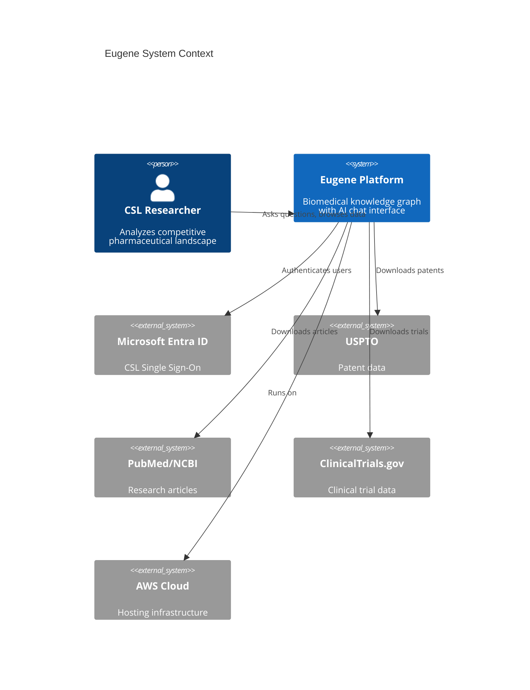

**How it works in simple terms:**

1. **Chat Interface** (the front door): A web-based chat where researchers type questions in plain English.
2. **AI Agent** (the brain): An AI assistant that understands the question, decides which data to look up, and constructs a response.
3. **Tool Server** (the hands): A set of 12 specialized tools that the AI agent can use to query the knowledge graph -- things like "look up a drug", "find an organization's assets", or "trace a path between two entities".
4. **Knowledge Graph API** (the library): The core database and search engine containing all the biomedical data, accessed through a structured REST API.
5. **Graph Database** (the memory): A Neo4j graph database storing all entities and their relationships, plus a Milvus vector database for semantic similarity searches.

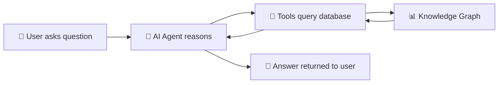

---

## 1.4 Security and Compliance Summary

| Area | Implementation | Status |
|---|---|---|
| **Authentication** | Microsoft Entra ID (SSO) -- same credentials as other CSL systems | Active |
| **Authorization** | Role-based access control (public read, confidential read) | Roles defined, enforcement pending |
| **Token Security** | JWT tokens with 24-hour expiry, HS256 signing for internal services | Active |
| **Data Encryption** | TLS for all data in transit; encrypted Neo4j connections (Bolt+SSL) | Active |
| **Data Residency** | Production: AWS eu-central-1 (Frankfurt); Dev: AWS us-east-1 (Virginia) | Configured |
| **Secrets Management** | AWS Secrets Manager for all credentials | Active |
| **Network Security** | Internal Application Load Balancer (no public internet access) | Active |
| **Security Scanning** | Checkov IaC scanning on all merge requests | Active |
| **Access Control** | User allowlist for agent service access | Active |

**Known compliance gaps:**
- Role-based data filtering not yet enforced (all data treated as public)
- No audit logging of user queries (planned)
- Neo4j Community Edition does not support database-level RBAC

---

## 1.5 Operational Status and Risk Register

### Current Deployment Status

| Environment | Status | Access |
|---|---|---|
| difflabs (Development) | **Active** | Internal ALB at `internal-eugene-search-alb-616664632.us-east-1.elb.amazonaws.com` |
| AIA (Production Target) | **Blocked** | ECS IAM permission issue preventing deployment |

### Risk Register

| # | Risk | Impact | Likelihood | Mitigation | Status |
|---|---|---|---|---|---|
| R1 | AIA deployment blocked by ECS IAM permissions | No production environment available | High | Escalate IAM role configuration with CSL cloud team | Open |
| R2 | Neo4j CE lacks RBAC and clustering | Cannot enforce data-level security; single point of failure | Medium | Evaluate Neo4j Enterprise license for production | Planned |
| R3 | difflabs network cannot reach OpenAI/Claude APIs | Agent features limited in difflabs | High | Use AWS Bedrock (within VPC) or configure proxy routing | Workaround via Bedrock |
| R4 | Neo4j SSL certificate expiry | Service disruption when certificate expires | Low | Set calendar alert for renewal; automate rotation | Monitored |
| R5 | Single-instance Neo4j database | Data loss risk if EC2 instance fails | Medium | Implement EBS snapshots and backup strategy | Planned |
| R6 | No centralized monitoring/alerting | Late detection of service failures | Medium | Implement CloudWatch dashboards and alarms | Planned |

---

## 1.6 Roadmap Implications

### Adding Proprietary/Confidential Data
To support confidential CSL-internal data:
1. **Neo4j Enterprise license** required (enables database-level RBAC)
2. **Role-based query filtering** must be implemented in all database adapters
3. **Auth role enforcement** must be activated (roles already defined: `user.public.read`, `user.confidential.read`)
4. **Audit logging** must be implemented to track who accessed what data

### Expanding AI Capabilities
The agent architecture is designed for expansion. Infrastructure is ready for additional MCP data sources:
- PubMed MCP (pubmed.mcp.claude.com)
- ClinicalTrials MCP (mcp.deepsense.ai/clinical_trials)
- ChEMBL MCP (mcp.deepsense.ai/chembl)
- bioRxiv MCP (mcp.deepsense.ai/biorxiv)

These are currently commented out in the codebase and can be enabled with configuration changes.

### Cost Considerations
| Component | Cost Driver | Estimate |
|---|---|---|
| LLM API calls | OpenAI GPT-4o / AWS Bedrock per-token pricing | Variable by usage |
| Neo4j Enterprise | License fee for RBAC + clustering | Significant uplift |
| AWS ECS Fargate | Per-vCPU-hour for 4+ containers | Moderate |
| AWS S3 + ECR | Storage for data staging + container images | Low |

---

# Part 2: Architect Documentation

> **Audience**: Solution architects, tech leads, senior engineers.

---

## 2.1 System Context Diagram (C4 Level 1)

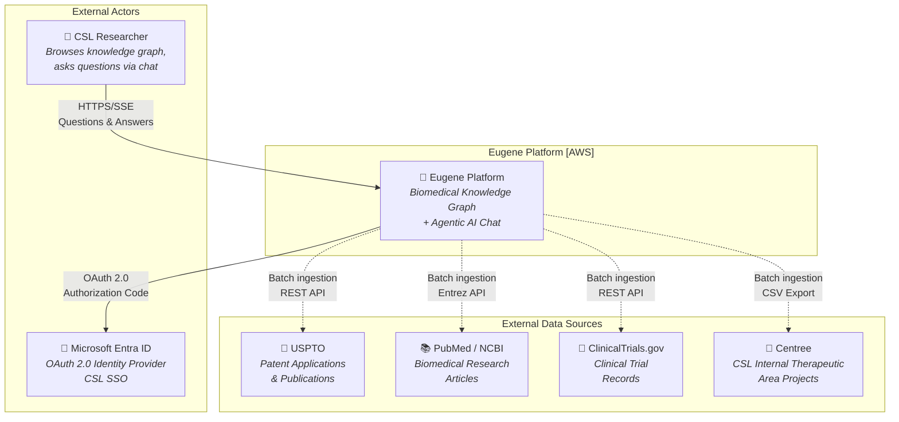

---

## 2.2 Container Diagram (C4 Level 2)

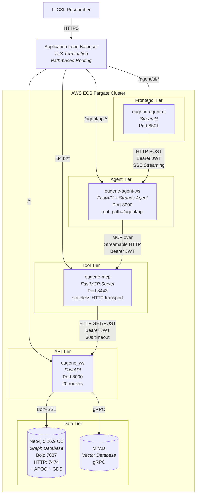

---

## 2.3 Component Diagrams (C4 Level 3)

### 2.3.1 eugene_ws — Core API Service

```mermaid
graph TB
    subgraph "eugene_ws [FastAPI Application]"
        ENTRY["eugene_ws.py<br><i>App Entry Point<br>Router Registration</i>"]

        subgraph "Auth Layer"
            AUTH["auth_router<br>/login, /auth/whoami<br>/auth/callback"]
        end

        subgraph "System Layer"
            ROOT["root_router<br>/"]
            HEALTH["health_router<br>/health"]
            RELEASE["release_notes_router<br>/release-notes"]
            STATS["database_stats_router<br>/stats"]
        end

        subgraph "Foundation Domain"
            COUNT["count_router<br>/count/{label}"]
            LABEL["label_router<br>/labels/{label}"]
            NODEID["node_id_lookup_router<br>/node/find/{value}"]
            DETAILS["node_details_router<br>/node/details"]
            NHOP["n_hop_router<br>/graph/relationship/start/{id}"]
            PATH["search_path_router<br>/graph/path/start/{id}/end/{id}"]
            FACET["facet_router<br>/facets"]
            SIM["similarity_router<br>/similarity/{label}"]
            FACTS["facts_router<br>/graph/facts/start/{id}"]
        end

        subgraph "Drug Domain"
            DRUG["drug_alias_search_router<br>/drugs/aliases/{name}"]
        end

        subgraph "Patent Domain"
            PATSEARCH["patent_search_router<br>/patents/drugs, /patents/clinicaltrials"]
            PATCOUNT["patent_count_router<br>/patents/count"]
        end

        subgraph "PubMed Domain"
            PUBSEARCH["pubmed_search_router<br>/pubmed/drugs, /pubmed/clinicaltrials"]
            PUBCOUNT["pubmed_count_router<br>/pubmed/count"]
        end

        subgraph "Organization Domain"
            ORGSEARCH["organization_search_router<br>/organizations/{name}<br>/organizations/assets/{id}"]
        end

        subgraph "Infrastructure Layer"
            ADAPTERS["20 Neo4j Adapters<br><i>foundation/infra/db/adapter/</i>"]
            MAPPERS["Domain Mappers<br><i>*/mapper/</i>"]
            PROVIDERS["Providers & Orchestrators<br><i>*/provider/</i>"]
        end
    end

    NEO4J[("Neo4j")]

    ENTRY --> AUTH & ROOT & HEALTH & RELEASE & STATS
    ENTRY --> COUNT & LABEL & NODEID & DETAILS & NHOP & PATH & FACET & SIM & FACTS
    ENTRY --> DRUG & PATSEARCH & PATCOUNT & PUBSEARCH & PUBCOUNT & ORGSEARCH

    COUNT & LABEL & NODEID & DETAILS & NHOP & PATH & FACET & SIM & FACTS --> PROVIDERS
    DRUG & PATSEARCH & PATCOUNT & PUBSEARCH & PUBCOUNT & ORGSEARCH --> PROVIDERS
    PROVIDERS --> MAPPERS --> ADAPTERS --> NEO4J
```

### 2.3.2 eugene-agent-ws — Agent Backend Service

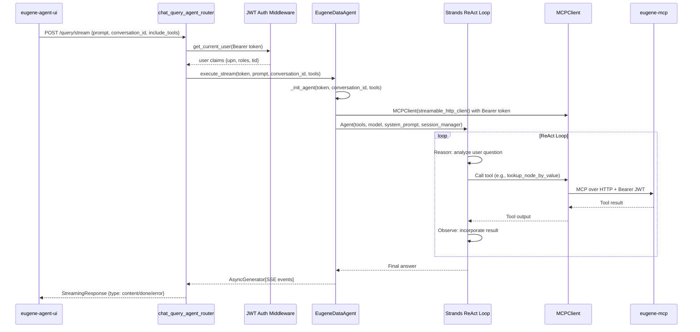

### 2.3.3 eugene-mcp — MCP Tool Server

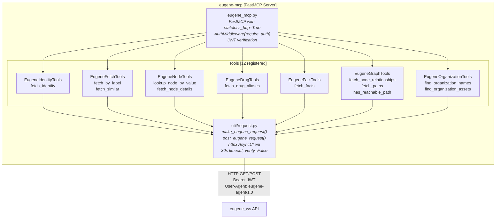

**MCP Tool to API Endpoint Mapping:**

| MCP Tool | HTTP Method | eugene_ws Endpoint |
|---|---|---|
| `fetch_identity` | GET | `/auth/whoami` |
| `fetch_by_label` | GET | `/labels/{label}?page=&page_size=` |
| `fetch_similar` | POST | `/similarity/{label}` body: `{values: [...]}` |
| `lookup_node_by_value` | GET | `/node/find/{value}?fuzzy_match=` |
| `fetch_node_details` | POST | `/node/details` body: `{ids: [...]}` |
| `fetch_drug_aliases` | GET | `/drugs/aliases/{drug_name}` |
| `fetch_facts` | GET | `/graph/facts/start/{node_id}?page=&page_size=` |
| `fetch_node_relationships` | GET | `/graph/relationship/start/{node_id}?n_hop=` |
| `fetch_paths` | GET | `/graph/path/start/{start_id}/end/{end_id}?n_hop=` |
| `has_reachable_path` | GET | `/graph/reachability/start/{start_id}/end/{end_id}?n_hop=` |
| `find_organization_names` | GET | `/organizations/{name_pattern}?page=&page_size=` (paginated, max 10 pages) |
| `find_organization_assets` | GET | `/organizations/assets/{org_id}?page=&page_size=` (paginated, max 10 pages) |

---

## 2.4 Design Patterns and Architectural Decisions

### 2.4.1 Domain-Driven Design (DDD)

Every domain package in `src/` follows a consistent internal structure:

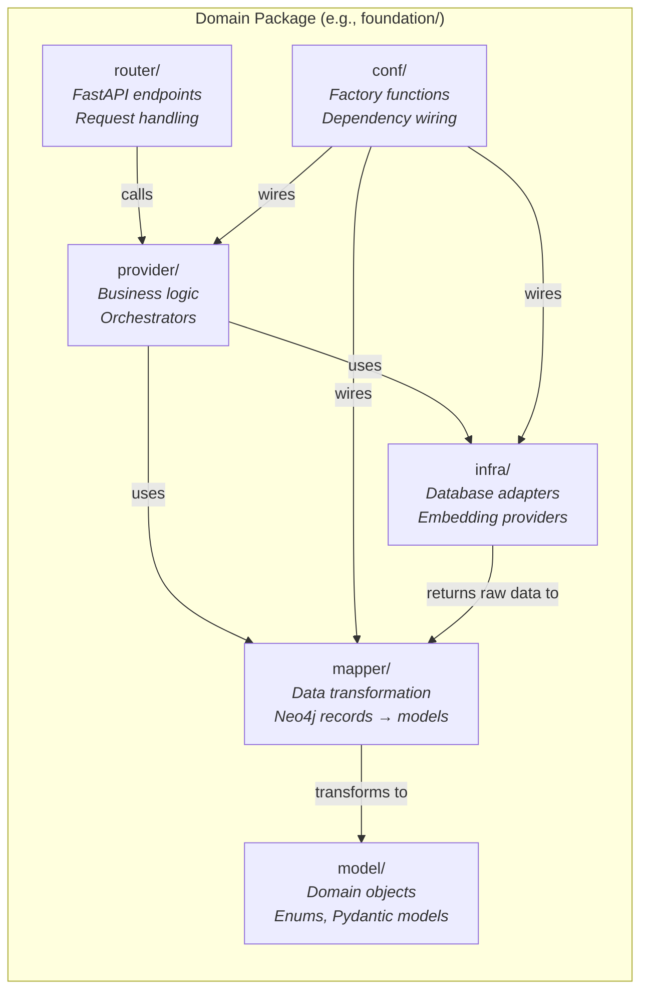

**Domains following this pattern:**

| Domain Package | Primary Responsibility |
|---|---|
| `src/foundation/` | Core biomedical node search, traversal, facets, similarity |
| `src/organization/` | Organization name resolution and disambiguation |
| `src/graph/` | Knowledge extraction, community detection, GraphRAG |
| `src/patent/` | USPTO patent ingestion and querying |
| `src/pubmed/` | PubMed article ingestion and linking |
| `src/tpp/` | Target Product Profile processing |
| `src/centree/` | Centree therapeutic area project management |
| `src/clinicaltrail/` | Clinical trial data integration |
| `src/document/` | PDF parsing and document analysis |

### 2.4.2 Hexagonal Architecture

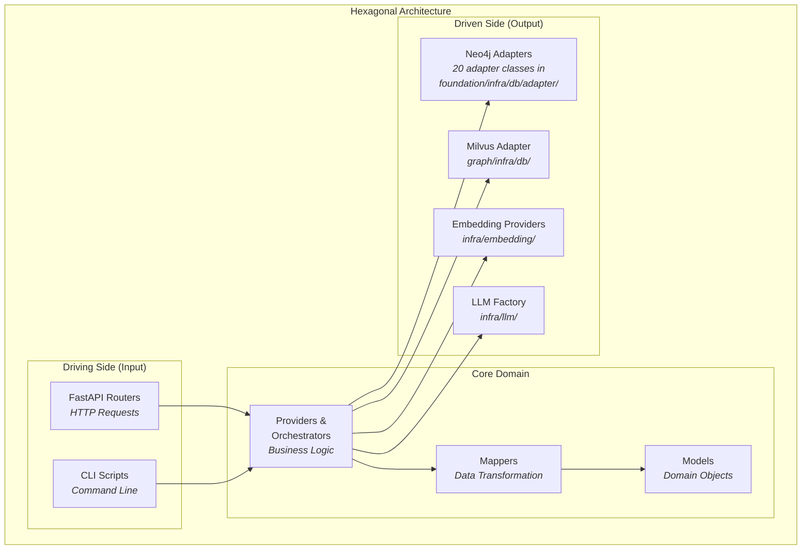

The infrastructure adapters are fully isolated from domain logic. Providers depend on adapter abstractions, never on direct database calls. This enables:
- **Testability**: Mock adapters in unit tests without a database
- **Database flexibility**: Both Neo4j and Kuzu are supported via `GraphDbConnectionFactory`
- **Independent evolution**: Adapters can be rewritten without changing business logic

### 2.4.3 Factory and Manual Dependency Injection

Eugene uses **manual DI via factory functions** in `conf/conf.py` files -- no DI framework.

Example from `src/foundation/conf/conf.py`:
```python
def foundational_n_hop_provider() -> FoundationalNHopProvider:
    return _foundational_n_hop_provider(
        neo4j_foundational_n_hop_adapter=neo4j_foundational_n_hop_adapter(),
        graph_mapper=graph_mapper(),
    )

def _foundational_n_hop_provider(
    neo4j_foundational_n_hop_adapter: Neo4jFoundationalNHopAdapter,
    graph_mapper: GraphMapper,
) -> FoundationalNHopProvider:
    return FoundationalNHopProvider(
        neo4j_foundational_n_hop_adapter=neo4j_foundational_n_hop_adapter,
        graph_mapper=graph_mapper,
    )
```

**Pattern**: Each public factory function calls a private function that accepts explicit dependencies. This separation enables:
- Public functions for production wiring (resolve dependencies from env)
- Private functions for test wiring (inject mocks directly)

**`LlmFactory`** (`src/infra/llm/llm_factory.py`) uses the **singleton pattern**:
```python
class LlmFactory:
    _LOCAL_INSTANCE = None
    _BEDROCK_INSTANCE = None
    _OPENAI_INSTANCE = None

    @classmethod
    def local_instance(cls, model="llama3.1", base_url="http://localhost:11434"):
        if cls._LOCAL_INSTANCE is None:
            cls._LOCAL_INSTANCE = OllamaLLM(model=model, base_url=base_url)
        return cls._LOCAL_INSTANCE
```

**Trade-off analysis:**

| Aspect | Manual DI | Framework (e.g., dependency-injector) |
|---|---|---|
| Explicitness | High -- every dependency visible | Medium -- declared via decorators |
| Boilerplate | Higher -- factory functions per component | Lower -- auto-resolution |
| Debugging | Easy -- follow function calls | Harder -- magic resolution |
| Scalability | Degrades with >50 providers | Better for large systems |
| **Current choice** | **Manual DI** | Not used |

### 2.4.4 Agent Architecture (Strands + MCP)

The agentic chat system implements the **ReAct (Reason, Act, Observe)** pattern via the Strands agent framework:

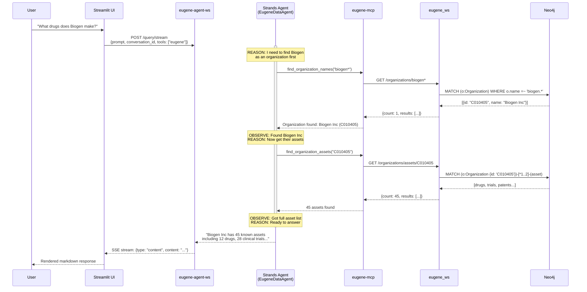

**Conversation Management:**
- `SlidingWindowConversationManager(window_size=32, per_turn=3)` -- keeps last 32 messages, max 3 per turn
- `FileSessionManager(session_id=conversation_id)` -- persists sessions to disk
- Conversation continuity via UUID `conversation_id` across requests

**Available local tools** (non-MCP): `calculator`, `current_time`, `python_repl`, `http_request` (optional)

**Future MCP sources** (commented out, ready to enable):
- PubMed MCP: `pubmed.mcp.claude.com/mcp`
- ClinicalTrials MCP: `mcp.deepsense.ai/clinical_trials/mcp`
- ChEMBL MCP: `mcp.deepsense.ai/chembl/mcp`
- bioRxiv MCP: `mcp.deepsense.ai/biorxiv/mcp`

---

## 2.5 Data Architecture

### 2.5.1 Knowledge Graph Schema

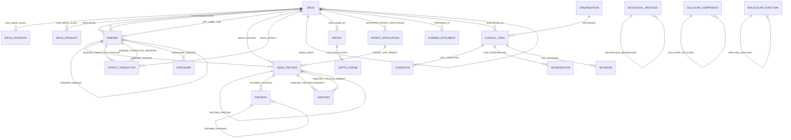

**Node type ranges:**
- **Foundation (1-22)**: Core biomedical entities -- Drugs, Diseases, Genes/Proteins, Pathways, Anatomy, etc.
- **Organization (30-34)**: Organizations, Patents, Research
- **GraphRAG (100-101)**: LLM-generated summaries and findings
- **USPTO (200-201)**: Patent applications and publications
- **CSL TPP (300-301)**: Target Product Profiles
- **PubMed (400-402)**: Articles, summaries, findings

### 2.5.2 Vector Search Architecture

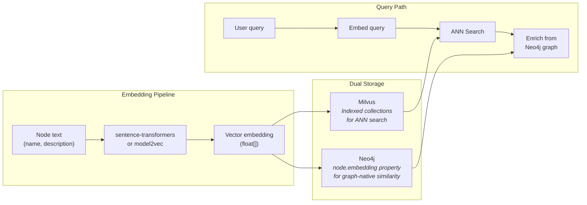

### 2.5.3 Data Ingestion Pipelines

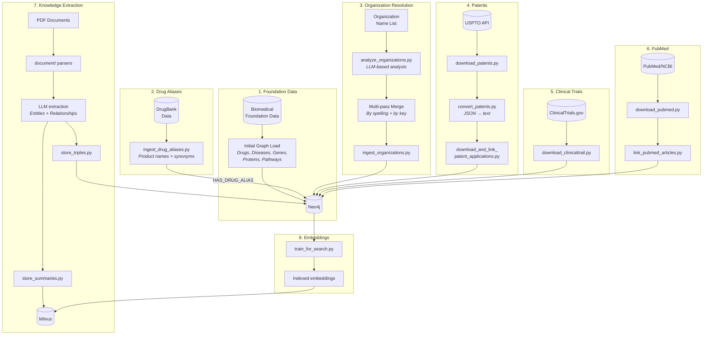

### 2.5.4 Graph Analytics

The system leverages Neo4j GDS (Graph Data Science) library for advanced analytics. Saved queries are maintained in `eugene/saved_queries/`:

| Algorithm | Location | Purpose |
|---|---|---|
| **GraphSage** | `eugene/saved_queries/graphsage/` | Link prediction, node embedding generation |
| **FastRP** | `eugene/saved_queries/fastrp/` | Fast Random Projection for node embeddings |
| **Node Similarity** | `eugene/saved_queries/node_similarity/` | Cosine/Jaccard similarity between nodes |
| **Label Propagation** | `eugene/saved_queries/label_propagation/` | Community detection via label propagation |
| **Drug Repurposing** | `eugene/saved_queries/drug_repurposing/` | Disease-drug relationship discovery |
| **Community Detection** | `src/graph/community/` | Leiden algorithm for community analysis |
| **Graph Summarization** | `src/graph/analyze/` | LLM-based community reports |

---

## 2.6 Security Architecture

### Authentication Flow

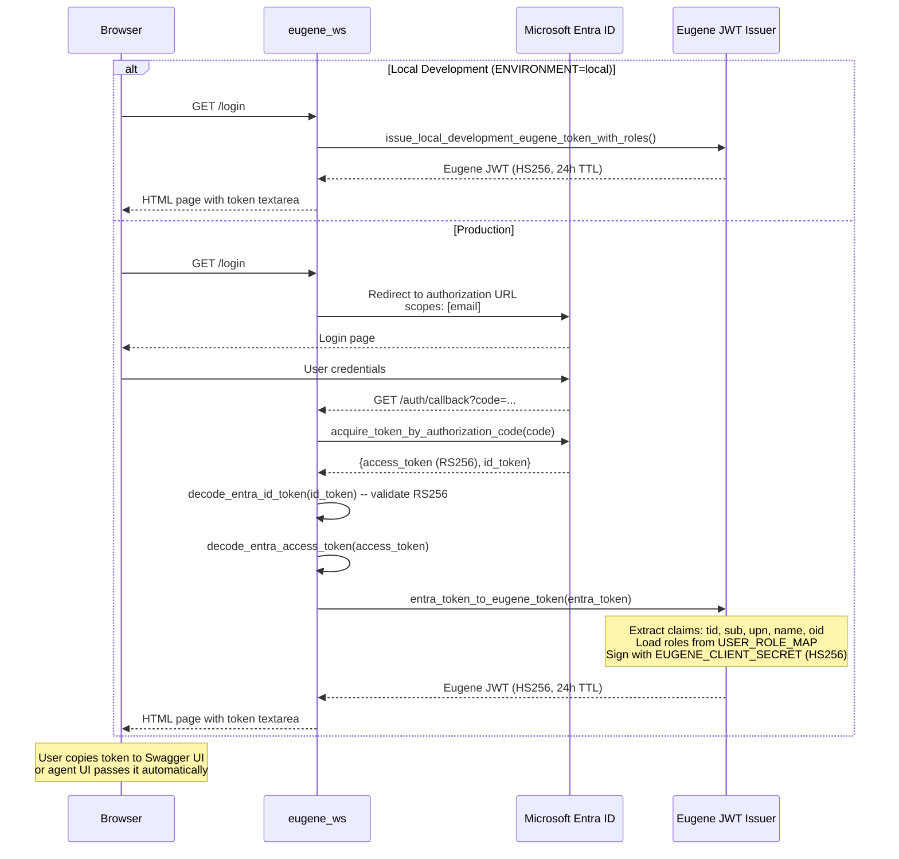

### Token Propagation Across Services

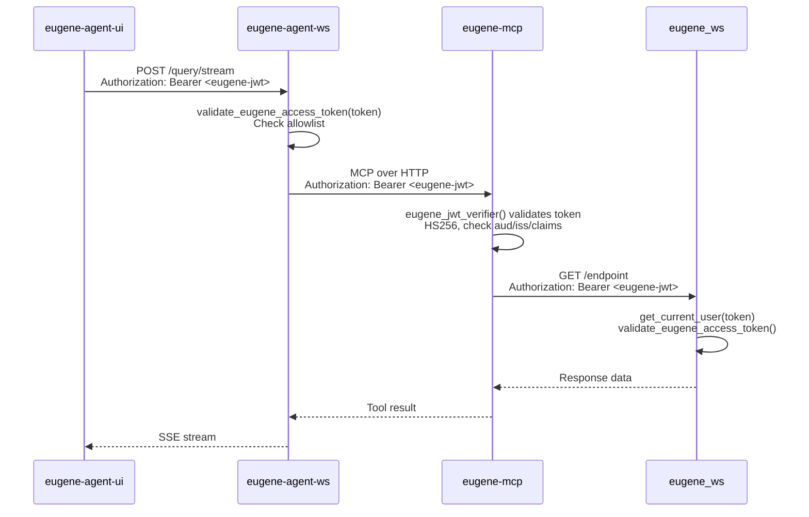

### JWT Token Structure

```json
{
  "iss": "https://eugene.ai.cslg1.cslg.net/{EUGENE_TENANT_ID}",
  "aud": "api://eugene/{EUGENE_CLIENT_ID}",
  "iat": 1711000000,
  "exp": 1711086400,
  "tid": "f8645748-68c6-4eec-bd61-c71341a6ed7d",
  "sub": "user@cslbehring.com",
  "upn": "user@cslbehring.com",
  "name": "User Name",
  "preferred_username": "user@cslbehring.com",
  "oid": "...",
  "roles": ["user.public.read"]
}
```

### Role Model

| Role | Description | Users |
|---|---|---|
| `user.public.read` | Access to all public biomedical data | All authenticated users (DEFAULT) |
| `user.confidential.read` | Access to confidential CSL-internal data | Explicitly assigned users only |

> **Gap**: Roles are assigned to tokens but **not yet enforced** in query adapters. All data is currently served regardless of role. Enforcement requires per-adapter role checking and Neo4j Enterprise RBAC for database-level filtering.

---

## 2.7 Infrastructure Architecture

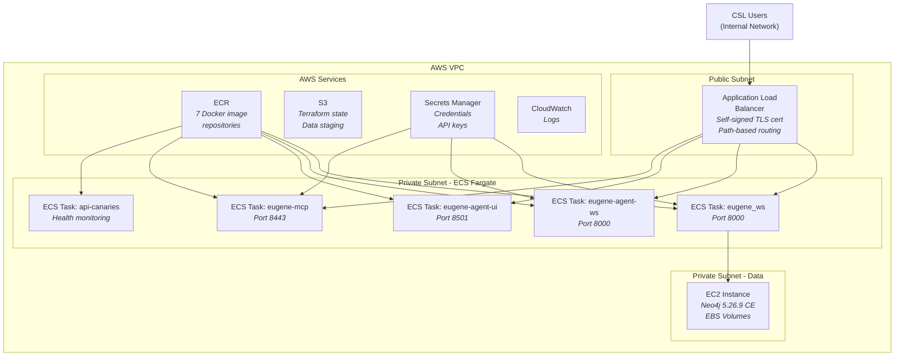

### Environment Comparison

| Aspect | difflabs (Dev) | AIA (Prod Target) |
|---|---|---|
| AWS Account | 087084717211 | 010928221940 |
| Region | us-east-1 | eu-central-1 |
| Terraform | `difflabs/iac/` | `infrastructure/` |
| Docker | `difflabs/containers/` | `containers/` |
| Deployment | Manual from desktop | GitLab CI/CD pipeline |
| Network | Internal ALB, Zscaler VPN | Internal ALB, standard |
| Status | **Active** | **Blocked** (IAM) |
| Access | Cyberark + AWS SSO | GitLab OIDC |

---

## 2.8 CI/CD Architecture

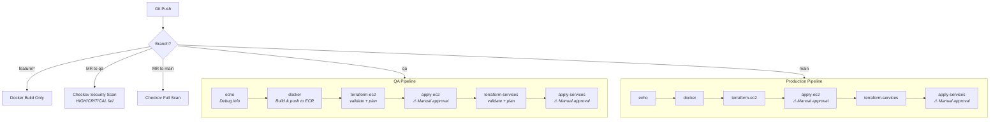

**AWS Authentication in CI/CD:**
```
GitLab OIDC Token → AWS STS AssumeRoleWithWebIdentity
→ Role: arn:aws:iam::010928221940:role/csl-gitlab-ci-cd-scop-all-branches
→ Session: 3600 seconds
→ Used for: ECR push, Terraform plan/apply
```

**Docker images built**: `eugene-neo4j-ce`, `eugene-ws`, `eugene-patent-search-trainer`

---

## 2.9 Scalability and Performance

| Aspect | Current Implementation | Constraint |
|---|---|---|
| **Neo4j queries** | Pagination in adapters; `MAX_RESULT_COUNT = 10,000` | Single CE instance, no clustering |
| **Agent context** | `SlidingWindowConversationManager(window_size=32, per_turn=3)` | Limits token usage per conversation |
| **MCP tool calls** | 30-second timeout, pagination (50/page, max 10-50 pages) | Sequential tool execution |
| **Performance monitoring** | `@log_time` decorator on key methods | No centralized metrics dashboard |
| **Horizontal scaling** | ECS task count adjustable per service | Neo4j CE is single-instance bottleneck |
| **Vector search** | Milvus supports horizontal scaling | Not yet configured for multi-node |

---

## 2.10 Resilience and Error Handling

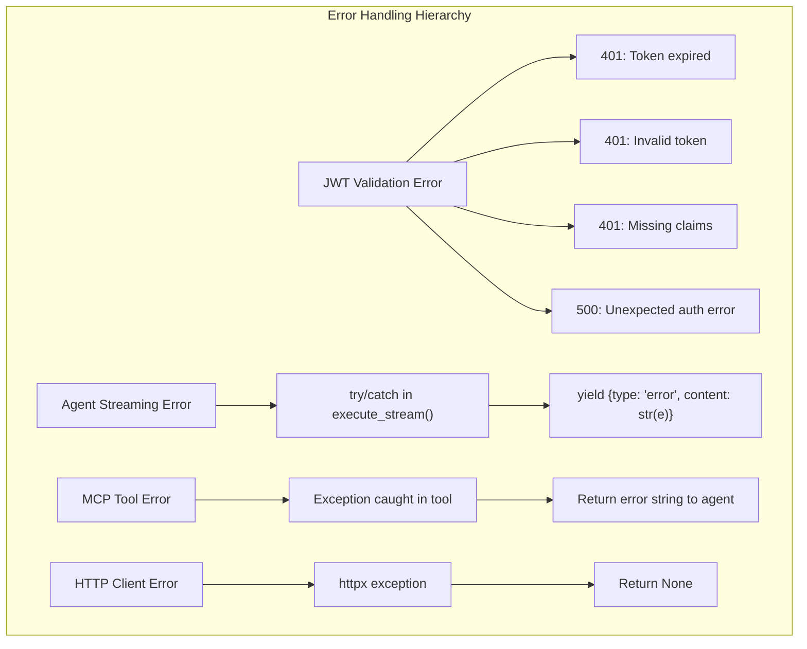

| Pattern | Implementation | Location |
|---|---|---|
| JWT validation hierarchy | Structured `HTTPException` with status codes | `src/router/auth/eugene_jwts.py:22-60` |
| Agent streaming errors | try/catch yields error event | `agents/eugene-agent-ws/src/query/agent/eugene_data_agent.py:130-139` |
| MCP tool errors | Return error string (not exception) | All tool classes in `agents/eugene-mcp/src/tools/` |
| HTTP client errors | Swallow exception, return `None` | `agents/eugene-mcp/src/util/request.py:35-36` |
| Input validation | Prompt length <2048, UUID format, special char filter | `agents/eugene-agent-ws/src/query/util/validation.py` |

> **Gap**: No circuit breaker, retry, or bulkhead patterns implemented. No dead letter queue for failed ingestion jobs.

---

## 2.11 Technology Decision Records

### ADR-1: Neo4j Community Edition vs. Enterprise

| | |
|---|---|
| **Context** | Eugene needs a graph database for biomedical knowledge storage with GDS algorithms |
| **Decision** | Use Neo4j Community Edition 5.26.9 |
| **Consequences** | No database-level RBAC (roles defined but unenforced); no clustering (single point of failure); no online backup; APOC and GDS plugins still available |
| **Alternatives** | Neo4j Enterprise (full RBAC, clustering, online backup -- significant license cost); Amazon Neptune (no GDS algorithms); Kuzu (embedded, supported in codebase via `GraphDbConnectionFactory` but limited ecosystem) |

### ADR-2: Strands vs. LangGraph for Agent

| | |
|---|---|
| **Context** | Need an agent framework for ReAct-pattern agentic chat with tool calling |
| **Decision** | Use AWS Strands agent framework |
| **Consequences** | Native MCP client support; built-in conversation management; file-based session persistence; OpenAI model compatibility; AWS ecosystem alignment |
| **Alternatives** | LangGraph (more mature, larger community, but heavier); LangChain agents (already in codebase for knowledge extraction, but being deprecated); custom ReAct loop |

### ADR-3: FastMCP for Tool Protocol

| | |
|---|---|
| **Context** | Need a server to expose Eugene API as tools for the AI agent |
| **Decision** | Use FastMCP with stateless HTTP transport and JWT auth middleware |
| **Consequences** | Python-native MCP implementation; built-in auth middleware support; stateless design enables horizontal scaling; tools auto-discovered by Strands agent |
| **Alternatives** | Custom REST tool adapter; LangChain tool wrappers; direct API calls from agent |

### ADR-4: Manual DI vs. Framework

| | |
|---|---|
| **Context** | Need dependency injection for wiring adapters, mappers, and providers |
| **Decision** | Manual DI via `conf/conf.py` factory functions |
| **Consequences** | Full transparency -- every dependency is explicit; easy debugging; but more boilerplate; public/private function pattern enables test injection |
| **Alternatives** | `dependency-injector` library; `inject` library; FastAPI's `Depends()` for all wiring |

### ADR-5: HS256 vs. RS256 for Internal Tokens

| | |
|---|---|
| **Context** | Need to sign Eugene-internal JWT tokens for service-to-service auth |
| **Decision** | HS256 (shared secret) for Eugene tokens; RS256 for Entra ID tokens |
| **Consequences** | Simpler key management (single shared secret vs. key pair); all services must share `EUGENE_CLIENT_SECRET`; faster signing/verification than RS256; token cannot be verified by third parties |
| **Alternatives** | RS256 everywhere (asymmetric, public key verification -- more complex key distribution); token introspection endpoint |

### ADR-6: Microservices vs. Monolith

| | |
|---|---|
| **Context** | Eugene started as a monolith (`eugene_ws`) and evolved to include agents |
| **Decision** | Four microservices: eugene_ws, eugene-agent-ws, eugene-mcp, eugene-agent-ui |
| **Consequences** | Independent scaling (agent tier can scale separately from API); independent deployment; team-level ownership possible; increased operational complexity (4 services to deploy, monitor, debug) |
| **Alternatives** | Single monolith with embedded agent; two services (API + agent); serverless functions per endpoint |

---

# Part 3: Developer Documentation

> **Audience**: Engineers writing and maintaining code.

---

## 3.1 Development Environment Setup

### 3.1.1 Prerequisites

| Tool | Version | Purpose |
|---|---|---|
| Python | 3.13 (3.12 for patent_search_trainer) | Runtime |
| Docker | Latest | Container builds |
| AWS CLI | v2 | ECR login, S3 access, Secrets Manager |
| Neo4j Desktop | 2.x | Local graph database |
| Terraform | Latest | Infrastructure changes |
| Git | Latest | Version control with `bin/pre-commit` hook |

### 3.1.2 Project Setup

```bash
# Clone the repository
git clone https://gitlab.com/cslagile/business/ai-accelerator-usecases/scop-experimentation.git
cd knowledgeGraph

# Create virtual environment
python3.13 -m venv venv
source venv/bin/activate

# Install dependencies
pip install -r requirements.txt

# Configure environment
cp .env.template .env   # if exists, or create from scratch
# Edit .env with your Neo4j, OpenAI, and auth credentials
```

### 3.1.3 Essential `.env` Configuration

```bash
# Neo4j
NEO4J_URI=bolt://localhost:7687
NEO4J_USER=neo4j
NEO4J_PASSWORD=your_password

# Auth (for ENVIRONMENT=local, these enable dev token bypass)
ENVIRONMENT=local
EUGENE_TENANT_ID=f8645748-68c6-4eec-bd61-c71341a6ed7d
EUGENE_CLIENT_ID=ff58ded5-c309-4cc8-ae6a-3b7157b83879
EUGENE_CLIENT_SECRET=your_secret

# LLM (needed for agent features)
OPENAI_API_KEY=sk-...

# MCP (for agent-ws)
EUGENE_MCP_SERVER_URL=http://localhost:8443/mcp

# Eugene API (for MCP server)
EUGENE_API_BASE=http://localhost:8000

# HuggingFace (optional, for embedding models)
HF_HUB_CACHE=/path/to/cache
```

### 3.1.4 Running Services Locally

```bash
# Core API (port 8000)
uvicorn eugene_ws:app --app-dir src --reload

# MCP Server (port 8443)
cd agents/eugene-mcp
pip install -r requirements.txt
python src/eugene_mcp.py --host 127.0.0.1 --port 8443

# Agent Backend (port 8001, to avoid port conflict)
cd agents/eugene-agent-ws
pip install -r requirements.txt
uvicorn eugene_chat_ws:app --app-dir src --reload --port 8001

# Agent UI (port 8501)
cd agents/eugene-agent-ui
pip install -r requirements.txt
streamlit run src/eugene_agent_ui.py

# Run tests
pytest  # uses .pytest.ini config
```

---

## 3.2 Code Organization and Conventions

### 3.2.1 DDD Package Structure

Every domain follows:

```
domain/
├── model/          # Pydantic models, dataclasses, enums
├── provider/       # Business logic, orchestrators
├── conf/           # Factory functions (manual DI)
├── mapper/         # Data transformation (Neo4j records → models)
├── infra/          # Infrastructure adapters (Neo4j, embeddings)
│   ├── db/adapter/ # Database access classes
│   └── embedding/  # Embedding generation
├── router/         # FastAPI endpoints
├── load/           # File/checkpoint loaders
├── writer/         # Output writers (TSV, CSV, export)
└── analyzer/       # LLM-based analysis (some domains)
```

### 3.2.2 File Naming Conventions

| Suffix | Purpose | Example |
|---|---|---|
| `*_adapter.py` | Database access layer (Cypher queries) | `neo4j_foundational_n_hop_adapter.py` |
| `*_provider.py` | Single-step business logic | `foundational_n_hop_provider.py` |
| `*_orchestrator.py` | Multi-step workflow coordination | `organization_resolution_orchestrator.py` |
| `*_mapper.py` | Data transformation | `graph_mapper.py` |
| `*_router.py` | FastAPI endpoint definitions | `foundation_n_hop_router.py` |
| `*_factory.py` | Object creation (singleton/factory) | `llm_factory.py` |
| `*_enum.py` | Enumerations | `foundational_node_enum.py` |
| `*_loader.py` | File/data loading | `drug_synonyms_loader.py` |
| `*_writer.py` | File/data writing | `tsv_embeddings_writer.py` |
| `*_test.py` | Test file (colocated with source) | `graph_mapper_test.py` |
| `conftest.py` | pytest fixtures | Distributed per package |

### 3.2.3 Code Style

- **Formatter**: `black` (line-length 88)
- **Linter**: `ruff`, `pylint`, `isort`
- **Pre-commit hook** (`bin/pre-commit`): runs `terraform validate` → `black src/` → `pytest src/`

---

## 3.3 API Reference

### 3.3.1 eugene_ws Endpoints (20 routers)

Registered in `src/eugene_ws.py:47-68`:

#### Authentication

| Method | Path | Auth | Description | File |
|---|---|---|---|---|
| GET | `/login` | No | Initiates OAuth flow or issues dev token (if `ENVIRONMENT=local`) | `src/router/auth/auth_router.py:29` |
| GET | `/auth/whoami` | Yes | Returns current user claims from JWT | `src/router/auth/auth_router.py:54` |
| GET | `/auth/callback` | No | Entra ID OAuth redirect callback | `src/router/auth/auth_router.py:59` |

#### System

| Method | Path | Auth | Description | File |
|---|---|---|---|---|
| GET | `/` | No | Welcome message | `src/router/root_router.py` |
| GET | `/health` | No | Health check | `src/router/health_router.py` |
| GET | `/release-notes` | No | Release notes | `src/router/release_notes_router.py` |
| GET | `/stats` | Yes | Database node/relationship counts | `src/stats/router/database_stats_router.py` |

#### Foundation Domain

| Method | Path | Auth | Description | File |
|---|---|---|---|---|
| GET | `/count/{label}` | Yes | Count nodes by label | `src/foundation/router/count_router.py` |
| GET | `/labels/{label}` | Yes | List nodes by label (paginated) | `src/foundation/router/label_router.py` |
| GET | `/node/find/{value}` | Yes | Lookup node by name/value | `src/foundation/router/node_id_lookup_router.py` |
| POST | `/node/details` | Yes | Get details for node IDs. Body: `{ids: [...]}` | `src/foundation/router/node_details_router.py` |
| GET | `/graph/relationship/start/{id}` | Yes | N-hop subgraph from node. Query: `?n_hop=` | `src/foundation/router/n_hop_router.py` |
| GET | `/graph/path/start/{id}/end/{id}` | Yes | Shortest path between nodes. Query: `?n_hop=` | `src/foundation/router/search_path_router.py` |
| GET | `/graph/reachability/start/{id}/end/{id}` | Yes | Check if path exists. Query: `?n_hop=` | `src/foundation/router/search_path_router.py` |
| POST | `/facets` | Yes | Faceted search | `src/foundation/router/facet_router.py` |
| POST | `/similarity/{label}` | Yes | Node similarity. Body: `{values: [...]}` | `src/foundation/router/similarity_router.py` |
| GET | `/graph/facts/start/{id}` | Yes | Facts/relationships for node. Query: `?page=&page_size=` | `src/foundation/router/facts_router.py` |

#### Drug, Patent, PubMed, Organization

| Method | Path | Auth | Description | File |
|---|---|---|---|---|
| GET | `/drugs/aliases/{name}` | Yes | Drug alias lookup | `src/foundation/router/drug_alias_search_router.py` |
| GET | `/patents/drugs` | Yes | Patent search by drug | `src/foundation/router/patent_search_router.py` |
| GET | `/patents/clinicaltrials` | Yes | Patent search by trial | `src/foundation/router/patent_search_router.py` |
| GET | `/patents/count` | Yes | Patent count | `src/foundation/router/patent_count_router.py` |
| GET | `/pubmed/drugs` | Yes | PubMed search by drug | `src/foundation/router/pubmed_search_router.py` |
| GET | `/pubmed/clinicaltrials` | Yes | PubMed search by trial | `src/foundation/router/pubmed_search_router.py` |
| GET | `/pubmed/count` | Yes | PubMed article count | `src/foundation/router/pubmed_count_router.py` |
| GET | `/organizations/{name}` | Yes | Search organizations by pattern | `src/organization/router/organization_search_router.py` |
| GET | `/organizations/assets/{id}` | Yes | Get organization assets | `src/organization/router/organization_search_router.py` |

### 3.3.2 eugene-agent-ws Endpoints

File: `agents/eugene-agent-ws/src/query/router/chat_query_agent_router.py`

| Method | Path | Auth | Description |
|---|---|---|---|
| POST | `/agent/api/query` | Yes | Synchronous chat query |
| POST | `/agent/api/query/stream` | Yes | Streaming chat query (SSE) |

**Request model** (`ChatQueryRequest` at `agents/eugene-agent-ws/src/query/model/chat_query_request.py`):
```python
class ChatQueryRequest(BaseModel):
    prompt: str              # User's question (max 2048 chars)
    conversation_id: str     # UUID for conversation continuity
    include_tools: list[ToolRequestEnum]  # ["eugene", "http", "pubmed"]
```

**Response model** (`ChatQueryResponse` at `agents/eugene-agent-ws/src/query/model/chat_query_response.py`):
```python
class ChatQueryResponse(BaseModel):
    prompt: str             # Original prompt
    message: str            # Agent's response
    conversation_id: UUID   # Conversation UUID
    is_complete: bool       # Whether response is final
```

**Streaming response** (SSE events):
```json
{"type": "session", "session_id": "uuid", "content": ""}
{"type": "content", "content": "partial response text", "session_id": "uuid"}
{"type": "done", "content": "", "session_id": "uuid"}
{"type": "error", "content": "Error: ...", "session_id": "uuid"}
```

**Tool request enum** (`ToolRequestEnum` at `agents/eugene-agent-ws/src/query/model/tool_request_enum.py`):

| Value | Description | Status |
|---|---|---|
| `eugene` | Eugene knowledge graph tools | Active |
| `http` | General HTTP request tool | Active |
| `pubmed` | PubMed MCP tools | Commented out |
| `clinical_trials` | ClinicalTrials MCP tools | Commented out |
| `chembl` | ChEMBL MCP tools | Commented out |
| `biorxiv` | bioRxiv MCP tools | Commented out |

### 3.3.3 eugene-mcp Tools (12 registered)

File: `agents/eugene-mcp/src/eugene_mcp.py:37-55`

| # | Tool | Class | File | Parameters | Description |
|---|---|---|---|---|---|
| 1 | `fetch_identity` | `EugeneIdentityTools` | `eugene_identity_tools.py` | none | Current user identity from JWT |
| 2 | `fetch_by_label` | `EugeneFetchTools` | `eugene_fetch_tools.py` | `label: str, page: int=1, page_size: int=25` | List drug/disease names |
| 3 | `fetch_similar` | `EugeneFetchTools` | `eugene_fetch_tools.py` | `label: str, values: list[str]` | Find similar nodes by relationships |
| 4 | `lookup_node_by_value` | `EugeneNodeTools` | `eugene_node_tools.py` | `value: str, fuzzy_match: bool=False` | Find node by name |
| 5 | `fetch_node_details` | `EugeneNodeTools` | `eugene_node_tools.py` | `ids: list[str]` | Get details for node IDs |
| 6 | `fetch_drug_aliases` | `EugeneDrugTools` | `eugene_drug_tools.py` | `drug_name: str` | List drug aliases, indications, contraindications |
| 7 | `fetch_facts` | `EugeneFactTools` | `eugene_fact_tools.py` | `node_id: str` | Fetch relationships (paginated, max 50 pages x 50/page) |
| 8 | `fetch_node_relationships` | `EugeneGraphTools` | `eugene_graph_tools.py` | `node_id: str, n_hop: int=2` | Get 1-2 hop relationships |
| 9 | `fetch_paths` | `EugeneGraphTools` | `eugene_graph_tools.py` | `start_id: str, end_id: str, n_hop: int=2` | Find paths between nodes |
| 10 | `has_reachable_path` | `EugeneGraphTools` | `eugene_graph_tools.py` | `start_id: str, end_id: str, n_hop: int=2` | Check path existence |
| 11 | `find_organization_names` | `EugeneOrganizationTools` | `eugene_organization_tools.py` | `name_pattern: str` | Find orgs matching pattern (paginated, max 10 pages) |
| 12 | `find_organization_assets` | `EugeneOrganizationTools` | `eugene_organization_tools.py` | `organization_id: str` | Get org's drugs, trials, IP (paginated) |

---

## 3.4 Data Model Reference

### 3.4.1 Node Types

Source: `src/foundation/model/foundational_node_enum.py`

| Enum Value | ID | Neo4j Label | Domain |
|---|---|---|---|
| `UNKNOWN` | 0 | `unknown` | - |
| `ANATOMY` | 1 | `anatomy` | Foundation |
| `BIOLOGICAL_PROCESS` | 2 | `biological_process` | Foundation |
| `CELLULAR_COMPONENT` | 3 | `cellular_component` | Foundation |
| `CLINICAL_TRIAL` | 4 | `ClinicalTrial` | ClinicalTrial |
| `COLLABORATOR` | 5 | `collaborator` | ClinicalTrial |
| `CONDITION` | 6 | `condition` | ClinicalTrial |
| `DISEASE` | 7 | `disease` | Foundation |
| `DRUG` | 8 | `drug` | Foundation |
| `EFFECT_PHENOTYPE` | 9 | `effect_phenotype` | Foundation |
| `EXPOSURE` | 10 | `exposure` | Foundation |
| `FUNDER_TYPE` | 11 | `funder_type` | ClinicalTrial |
| `GENE_PROTEIN` | 12 | `gene_protein` | Foundation |
| `INTERVENTION` | 13 | `intervention` | ClinicalTrial |
| `MOLECULAR_FUNCTION` | 14 | `molecular_function` | Foundation |
| `PATHWAY` | 15 | `pathway` | Foundation |
| `PATENT` | 16 | `patent` | Patent |
| `PHASE` | 17 | `phase` | ClinicalTrial |
| `PRIMARY_OUTCOME_MEASURE` | 18 | `primary_outcome_measure` | ClinicalTrial |
| `SECONDARY_OUTCOME_MEASURE` | 19 | `secondary_outcome_measure` | ClinicalTrial |
| `SPONSOR` | 20 | `sponsor` | ClinicalTrial |
| `DRUG_PRODUCT` | 21 | `drug_product` | Drug |
| `DRUG_SYNONYM` | 22 | `drug_synonym` | Drug |
| `APPROVED_PATENT` | 30 | `Approved_Patent` | Patent |
| `PATENT_APPLICATION` | 31 | `Patent_Application` | Patent |
| `ORGANIZATION` | 32 | `Organization` | Organization |
| `RESEARCH` | 33 | `Research` | Organization |
| `INVESTIGATORS` | 34 | `Investigators` | ClinicalTrial |
| `GRAPHRAG_SUMMARY` | 100 | `summary` | Graph |
| `GRAPHRAG_SUMMARY_FINDING` | 101 | `summary_finding` | Graph |
| `USPTO_APPLICATION` | 200 | `uspto_application` | Patent |
| `USPTO_PGPUB` | 201 | `uspto_pgpub` | Patent |
| `CSL_TPP` | 300 | `csl_tpp` | TPP |
| `CSL_TPP_QUESTION` | 301 | `csl_tpp` | TPP |
| `PUBMED_DOCUMENT` | 400 | `pubmed_document` | PubMed |
| `PUBMED_SUMMARY` | 401 | `pubmed_summary` | PubMed |
| `PUBMED_SUMMARY_FINDING` | 402 | `pubmed_summary_finding` | PubMed |

### 3.4.2 Relationship Types

Source: `src/foundation/model/foundational_relationship_enum.py`

| Enum Value | ID | Neo4j Type | Source → Target |
|---|---|---|---|
| `OFF_LABEL_USE` | 1 | `off-label use` | Drug → Disease |
| `ANATOMY_PROTEIN_ABSENT` | 2 | `anatomy_protein_absent` | Anatomy → Protein |
| `ANATOMY_PROTEIN_PRESENT` | 3 | `anatomy_protein_present` | Anatomy → Protein |
| `BIOPROCESS_BIOPROCESS` | 4 | `bioprocess_bioprocess` | BioProcess → BioProcess |
| `CELLCOMP_CELLCOMP` | 5 | `cellcomp_cellcomp` | CellComp → CellComp |
| `CONTRAINDICATION` | 6 | `contraindication` | Drug → Disease |
| `DISEASE_DISEASE` | 7 | `disease_disease` | Disease → Disease |
| `DISEASE_PHENOTYPE_NEGATIVE` | 8 | `disease_phenotype_negative` | Disease → Phenotype |
| `DISEASE_PHENOTYPE_POSITIVE` | 9 | `disease_phenotype_positive` | Disease → Phenotype |
| `DISEASE_PROTEIN` | 10 | `disease_protein` | Disease → Protein |
| `DRUG_DRUG` | 11 | `drug_drug` | Drug → Drug |
| `DRUG_EFFECT` | 12 | `drug_effect` | Drug → Phenotype |
| `DRUG_PROTEIN` | 13 | `drug_protein` | Drug → Protein |
| `EXPOSURE_DISEASE` | 14 | `exposure_disease` | Exposure → Disease |
| `INDICATION` | 15 | `indication` | Drug → Disease |
| `MOLFUNC_MOLFUNC` | 16 | `molfunc_molfunc` | MolFunc → MolFunc |
| `PATHWAY_PATHWAY` | 17 | `pathway_pathway` | Pathway → Pathway |
| `PATHWAY_PROTEIN` | 18 | `pathway_protein` | Pathway → Protein |
| `PROTEIN_PROTEIN` | 19 | `protein_protein` | Protein → Protein |
| `HAS_DRUG_ALIAS` | 20 | `has_drug_alias` | Drug → DrugSynonym/Product |
| `DISCLOSED_IN` | 21 | `disclosed_in` | Drug → Patent |
| `SUPPORTS_PATENT_APPLICATION` | 22 | `supports_patent_application` | Drug → PatentApp |
| `PATENT_APP_TARGET` | 23 | `patent_app_target` | PatentApp → Gene/Protein |
| `FEATURED_IN` | 24 | `featured_in` | Drug → PubMedDocument |
| `ANALYZED_IN` | 25 | `analyzed_in` | Drug → PubMedSummary |
| `EVALUATED_IN` | 26 | `evaluated_in` | Drug → ClinicalTrial |
| `HAS_PUBLICATION` | 200 | `has_publication` | Patent → UsptoPgpub |

---

## 3.5 Database Adapter Reference

All adapters in `src/foundation/infra/db/adapter/`:

| Adapter | File | Purpose |
|---|---|---|
| `Neo4jFoundationalNodeCountAdapter` | `neo4j_foundational_node_count_adapter.py` | Count nodes by label |
| `Neo4jFoundationalNodeAdapter` | `neo4j_foundational_node_adapter.py` | Basic node CRUD and lookup |
| `Neo4jFoundationalNodeDetailsAdapter` | `neo4j_foundational_node_details_adapter.py` | Node details with relationships |
| `Neo4jFoundationalOneHopAdapter` | `neo4j_foundational_one_hop_adapter.py` | Single-hop traversal |
| `Neo4jFoundationalNHopAdapter` | `neo4j_foundational_n_hop_adapter.py` | Multi-hop subgraph traversal |
| `Neo4jFoundationalPathAdapter` | `neo4j_foundational_path_adapter.py` | Shortest path and reachability queries |
| `Neo4jFoundationalFacetAdapter` | `neo4j_foundational_facet_adapter.py` | Faceted search queries |
| `Neo4jFoundationalSimilarityAdapter` | `neo4j_foundational_similarity_adapter.py` | Node similarity queries |
| `Neo4jPatentQueryAdapter` | `neo4j_patent_query_adapter.py` | Patent full-text search |
| `Neo4jPatentExportAdapter` | `neo4j_patent_export_adapter.py` | Patent data export to CSV |
| `Neo4jPubmedQueryAdapter` | `neo4j_pubmed_query_adapter.py` | PubMed article search |
| `Neo4jPubmedCountAdapter` | `neo4j_pubmed_count_adapter.py` | PubMed count queries |
| `Neo4jDrugAliasesAdapter` | `neo4j_drug_aliases_adapter.py` | Drug alias management |
| `Neo4jProjectGraphAdapter` | `neo4j_project_graph_adapter.py` | Project graph operations |
| `Neo4jProjectSimilarityGraphAdapter` | `neo4j_project_similarity_graph_adapter.py` | Project similarity |
| `Neo4jOnehotEncodingAdapter` | `neo4j_onehot_encoding_adapter.py` | One-hot encoding operations |
| `Neo4jTrainEmbeddingsAdapter` | `neo4j_train_embeddings_adapter.py` | Embedding training queries |
| `Neo4jListEmbeddingsAdapter` | `neo4j_list_embeddings_adapter.py` | Embedding listing |
| `Neo4jMissingNodeIndexEmbeddingAdapter` | `neo4j_missing_node_index_embedding_adapter.py` | Detect missing embeddings |

All adapters follow the same pattern:
```python
class Neo4jFoundationalNHopAdapter:
    def __init__(self, driver: Driver):
        self.driver = driver

    def query(self, node_id: str, n_hop: int, ...) -> DataFrame:
        with self.driver.session() as session:
            result = session.run(CYPHER_QUERY, parameters={...})
            return DataFrame(result.data())
```

---

## 3.6 Provider and Orchestrator Reference

Wired in `src/foundation/conf/conf.py`:

| Provider/Orchestrator | File | Dependencies | Purpose |
|---|---|---|---|
| `FoundationalNHopProvider` | `foundation/provider/foundational_n_hop_provider.py` | `Neo4jFoundationalNHopAdapter`, `GraphMapper` | N-hop subgraph traversal with graph mapping |
| `FoundationalPathProvider` | `foundation/provider/foundational_path_provider.py` | `Neo4jFoundationalPathAdapter` | Shortest path queries |
| `FoundationalNodeIdProvider` | `foundation/provider/foundational_node_id_provider.py` | `Neo4jFoundationalNodeAdapter`, `NodeIdLookupMapper` | Node ID resolution |
| `FoundationalNodeDetailsProvider` | `foundation/provider/foundational_node_details_provider.py` | `Neo4jFoundationalNodeDetailsAdapter`, `NodeDetailsMapper` | Detailed node info |
| `FoundationalFactsOrchestrator` | `foundation/provider/foundational_facts_orchestrator.py` | `FoundationalNHopProvider`, `FactsMapper` | Compose n-hop + facts mapping |
| `FoundationalNodeFixOrchestrator` | `foundation/provider/foundational_node_fix_orchestrator.py` | `FoundationalNodeEmbeddingProvider`, `Neo4jFoundationalNodeAdapter`, `Neo4jOnehotEncodingAdapter`, `Neo4jMissingNodeIndexEmbeddingAdapter` | Fix missing embeddings |
| `DrugAliasesUpdateOrchestrator` | `foundation/provider/drug_aliases_update_orchestrator.py` | `DrugProductNamesLoader`, `DrugSynonymsLoader`, `Neo4jDrugAliasesAdapter` | Ingest drug aliases |
| `ListEmbeddingsProvider` | `foundation/infra/embedding/list_embeddings_provider.py` | `Neo4jListEmbeddingsAdapter`, `TsvEmbeddingsWriter` | Export embeddings to TSV |

---

## 3.7 LLM Integration Reference

### LlmFactory (`src/infra/llm/llm_factory.py`)

Singleton factory for LangChain LLM instances:

```python
class LlmFactory:
    @classmethod
    def local_instance(cls, model="llama3.1", base_url="http://localhost:11434") -> BaseLLM:
        # OllamaLLM -- for local development

    @classmethod
    def bedrock_instance(cls, provider="meta", model_id="meta.llama3-1-70b-instruct-v1:0") -> BaseLLM:
        # BedrockLLM -- temperature 0.1, streaming=True

    @classmethod
    def openai_instance(cls, model_name="chatgpt-4o-latest") -> BaseLLM:
        # OpenAI -- temperature 0.1, max_retries 2

    @classmethod
    def instance(cls) -> BaseLLM:
        return cls.openai_instance()  # default
```

### Agent LLM (`agents/eugene-agent-ws/src/query/infra/llm/llm_factory.py`)

The agent uses the Strands `OpenAIModel` (not LangChain):
```python
class LlmFactory:
    @classmethod
    def openai_model(cls) -> OpenAIModel:
        return OpenAIModel(model_id="gpt-4.1-mini", ...)
```

### System Prompt

The agent system prompt (in `agents/eugene-agent-ws/src/query/agent/eugene_data_agent.py:25-30`):
```
You are an agent tasked with helping investigate biomedical companies to assess competitive
threat and collaboration opportunities. In our case assets here mean any drug, disease,
patents, clinical trials, intellectual property, or financial deals the company may have
involvement. As an agent follow the Reason, Act, Observe (ReAct) pattern.
You are an agent that may call tools to retrieve data.
```

---

## 3.8 Embedding and Vector Search

### Providers

| Class | File | Purpose |
|---|---|---|
| `EmbeddingProvider` | `src/infra/embedding/` | Base embedding functionality |
| `SemanticSearchEmbeddingProvider` | `src/infra/embedding/` | sentence-transformers for semantic search |
| `EmbeddingMerger` | `src/infra/embedding/` | Combining multiple embedding sources |
| `FoundationalNodeEmbeddingProvider` | `src/foundation/infra/embedding/foundational_node_embedding_provider.py` | Graph node embeddings |

### Model Caching

HuggingFace models are cached via `HF_HUB_CACHE` environment variable. In Docker builds, models are pre-cached during image build to avoid runtime downloads.

---

## 3.9 CLI Scripts Reference

All scripts in `src/`:

| Script | Purpose | Input | Output |
|---|---|---|---|
| `download_pubmed.py` | Download PubMed PDFs | Search terms | PDF files |
| `download_patents.py` | Download USPTO patents | Patent IDs | JSON files |
| `download_clinicaltrail.py` | Download clinical trials | Search criteria | JSON/XML |
| `download_and_link_patent_applications.py` | Download + link patents | Config | Neo4j relationships |
| `analyze.py` | Analyze docs for KG extraction | Document dir | Entities/relationships |
| `analyze_organizations.py` | LLM-based org disambiguation | Org names | Resolution checkpoints |
| `analyze_tpps.py` | Parse TPP PPTX files | PPTX dir | Structured TPP data |
| `ingest_organizations.py` | Load org resolutions to Neo4j | Checkpoints | Neo4j nodes |
| `ingest_drug_aliases.py` | Add drug synonyms/products | Drug data | Neo4j relationships |
| `ingest_centree_projects.py` | Load Centree projects | CSV files | Neo4j nodes |
| `store_triples.py` | Store entities + relationships | Triples JSON | Neo4j nodes/rels |
| `store_summaries.py` | Store summaries in Milvus | Summary data | Milvus vectors |
| `train_for_search.py` | Train search embeddings | Node data | Indexed embeddings |
| `link_pubmed_articles.py` | Link articles to nodes | PubMed data | Neo4j relationships |
| `export_organizations.py` | Export org mappings | Neo4j query | CSV files |
| `export_patent_ids.py` | Export patent relationships | Neo4j query | CSV files |
| `cypher_query.py` | Natural language → Cypher | User question | Query + results |
| `graph_query.py` | Q&A over knowledge graph | User question | LLM answer |
| `query_patents.py` | Semantic patent search | Search query | Ranked patents |
| `cleanup_organizations.py` | Clean org checkpoints | Checkpoints | Filtered checkpoints |
| `fix_foundational_nodes.py` | Update node embeddings | Node IDs | Updated Neo4j |
| `fix_pubmed_articles.py` | Fix missing article fields | Node IDs | Updated Neo4j |
| `fix_relationship_csv.py` | Repair relationship CSVs | CSV files | Fixed CSVs |
| `convert_patents.py` | USPTO JSON → text | JSON files | Text files |
| `convert_centree_projects.py` | Centree JSON → CSV | JSON export | CSV files |
| `visualize_embeddings.py` | Generate TSV for viz | Embeddings | TSV files |
| `lookup_organization_ids.py` | Map org names → IDs | Org names | ID mappings |
| `print_centree_rdcodes.py` | Print Centree RD codes | CSV files | Console output |
| `fetch_secrets.py` | Fetch AWS secrets | Secret name | .env file |

---

## 3.10 Authentication Implementation Guide

### File-by-File Walkthrough

**1. `src/router/auth/auth.py`** -- FastAPI dependency:
```python
def get_current_user(
    credentials: HTTPAuthorizationCredentials = Depends(SECURITY),
):
    token = credentials.credentials
    return validate_eugene_access_token(token)
```

**2. `src/router/auth/const.py`** -- All auth constants loaded from environment:
- `ENVIRONMENT` -- `local` enables dev bypass
- `ENTRA_CLIENT_ID`, `ENTRA_CLIENT_SECRET`, `ENTRA_TENANT_ID`
- `EUGENE_TENANT_ID`, `EUGENE_CLIENT_ID`, `EUGENE_CLIENT_SECRET`
- `EUGENE_TOKEN_ALGORITHM = "HS256"`
- `EUGENE_TOKEN_TTL_SECS = 86400` (24 hours)
- `EUGENE_TOKEN_ISSUER = f"https://eugene.ai.cslg1.cslg.net/{EUGENE_TENANT_ID}"`
- `EUGENE_TOKEN_AUDIENCE = f"api://eugene/{EUGENE_CLIENT_ID}"`
- Roles: `user.public.read`, `user.confidential.read`

**3. `src/router/auth/eugene_jwts.py`** -- JWT issuance and validation:
- `validate_eugene_access_token(token)` -- Decodes HS256, validates `aud`, `iss`, `exp`, `iat`, requires claims: `tid`, `sub`, `roles`, `upn`
- `entra_token_to_eugene_token(entra_token)` -- Converts Entra token → Eugene JWT
- `issue_local_development_eugene_token_with_roles()` -- Dev bypass token for `eugene.test@cslhering.com`

**4. `src/router/auth/roles.py`** -- Role management:
```python
USER_ROLE_MAP = {
    _composite_role_key("PingAMS.TestTen@cslgqa.net"): [EUGENE_USER_PUBLIC_READ_ROLE],
    _composite_role_key("Damian.Knopp@cslbehring.com"): [PUBLIC, CONFIDENTIAL],
    _composite_role_key("Sterling.Foster@cslbehring.com"): [PUBLIC, CONFIDENTIAL],
    _composite_role_key("Paul.Disney@cslbehring.com"): [PUBLIC, CONFIDENTIAL],
}
DEFAULT_ROLES = frozenset([EUGENE_USER_PUBLIC_READ_ROLE])
```

### How to Add a New User

Edit `src/router/auth/roles.py`:
```python
USER_ROLE_MAP = {
    # ... existing entries ...
    _composite_role_key("new.user@cslbehring.com"): [
        EUGENE_USER_PUBLIC_READ_ROLE,
        EUGENE_USER_CONFIDENTIAL_READ_ROLE,  # if needed
    ],
}
```

### How to Protect a New Endpoint

```python
from router.auth.auth import get_current_user

@router.get("/my-endpoint")
def my_endpoint(user: dict = Depends(get_current_user)):
    # user contains: tid, sub, roles, upn, name, preferred_username, oid
    return {"data": "protected"}
```

---

## 3.11 Testing Guide

### Configuration (`.pytest.ini`)

```ini
[pytest]
minversion = 7.0
addopts = -n 2 --cov=src --cov-report=lcov:reports/coverage/lcov.info
log_cli = true
log_cli_level = INFO
env_files = .env
markers =
    serial: Run test serially
    integration: Integration tests
```

### Running Tests

```bash
pytest                          # All tests, parallel (-n 2), with coverage
pytest -v                       # Verbose output
pytest src/foundation/mapper/   # Specific package
pytest -m serial                # Only serial tests
pytest -m integration           # Only integration tests
pytest -k "test_graph_mapper"   # By test name pattern
```

### Writing Tests

Tests are **colocated** -- place `foo_test.py` next to `foo.py`:

```python
# src/foundation/mapper/graph_mapper_test.py
import pytest
from foundation.mapper.graph_mapper import GraphMapper

class TestGraphMapper:
    def test_maps_neo4j_record_to_graph(self, mocker):
        mapper = GraphMapper()
        # Use pytest-mock's mocker fixture
        mock_record = mocker.MagicMock()
        result = mapper.map(mock_record)
        assert result is not None
```

Use `conftest.py` for shared fixtures per package. Test data lives in `tests/data/`.

---

## 3.12 Docker and Container Guide

### Container Inventory

| Image | Base | Port | Dockerfile |
|---|---|---|---|
| eugene_ws | python:3.13-slim | 8000 | `containers/eugene_ws/Dockerfile` |
| eugene_agent_ws | python:3.13-slim | 8000 | `difflabs/containers/eugene_agent_ws/Dockerfile` |
| eugene_agent_ui | python:3.13-slim | 8501 | `difflabs/containers/eugene_agent_ui/Dockerfile` |
| eugene_mcp | python:3.13-slim | 8000 | `difflabs/containers/eugene_mcp/Dockerfile` |
| eugene_neo4j_ce | neo4j:5.26.9 | 7687/7474 | `containers/eugene_neo4j_ce/Dockerfile` |
| patent_search_trainer | python:3.12-slim | N/A | `containers/patent_search_trainer/Dockerfile` |
| eugene_api_canaries | python:3.13-slim | N/A | `containers/eugene_api_canaries/Dockerfile` |

### Build and Deploy

```bash
# Login to ECR
bin/docker/ecr/login.sh

# Build, tag, push
bin/docker/ecr/build.sh eugene_ws
bin/docker/ecr/tag.sh eugene_ws
bin/docker/ecr/push.sh eugene_ws
```

---

## 3.13 Terraform and Deployment Guide

### Module Structure

| Module | Path | Purpose |
|---|---|---|
| eugene-containers | `infrastructure/modules/eugene-containers/` | ECR repositories |
| eugene-ec2 | `infrastructure/modules/eugene-ec2/` | EC2 + EBS for Neo4j |
| eugene-ecs-database | `infrastructure/modules/eugene-ecs-database/` | Neo4j in ECS (alternative) |
| eugene-services | `infrastructure/modules/eugene-services/` | ECS services, ALB, CloudWatch |

### difflabs Deployment

```bash
cd difflabs/iac/eugene-services
bin/init-difflabs.sh     # terraform init
bin/plan-difflabs.sh     # terraform plan
bin/apply-difflabs.sh    # terraform apply (⚠ destructive)
bin/output.sh            # show outputs
bin/force-service-update.sh  # force ECS redeployment
```

### AIA Deployment (CI/CD)

1. Push to `qa` or `main` branch
2. Pipeline runs automatically: scan → docker → terraform plan
3. **Manually approve** apply stages in GitLab UI
4. Monitor deployment in AWS ECS console

---

## 3.14 Configuration Reference

| Variable | Service(s) | Required | Default | Description |
|---|---|---|---|---|
| `NEO4J_URI` | eugene_ws | Yes | - | Neo4j Bolt URI (e.g., `bolt://localhost:7687`) |
| `NEO4J_USER` | eugene_ws | Yes | - | Neo4j username |
| `NEO4J_PASSWORD` | eugene_ws | Yes | - | Neo4j password |
| `ENVIRONMENT` | eugene_ws | No | `production` | Set to `local` for dev auth bypass |
| `OPENAI_API_KEY` | agent-ws | Yes | - | OpenAI API key for agent LLM |
| `EUGENE_TENANT_ID` | All | Yes | - | Eugene tenant UUID |
| `EUGENE_CLIENT_ID` | All | Yes | - | Eugene app client UUID |
| `EUGENE_CLIENT_SECRET` | All | Yes | - | Eugene JWT signing secret (HS256) |
| `ENTRA_TENANT_ID` | eugene_ws | Yes* | - | MS Entra ID tenant (*not needed if local) |
| `ENTRA_CLIENT_ID` | eugene_ws | Yes* | - | MS Entra app registration |
| `ENTRA_CLIENT_SECRET` | eugene_ws | Yes* | - | MS Entra client secret |
| `ENTRA_SCOPE` | eugene_ws | No | `email` | OAuth scope |
| `REDIRECT_URI` | eugene_ws | Yes* | - | OAuth callback URL |
| `REDIRECT_PATH` | eugene_ws | No | `/auth/callback` | OAuth callback path |
| `EUGENE_MCP_SERVER_URL` | agent-ws | Yes | - | MCP server endpoint URL |
| `EUGENE_API_BASE` | eugene-mcp | Yes | - | Eugene API base URL |
| `EUGENE_AGENT_API_URL` | agent-ui | No | `http://localhost:8000/agent/api/query` | Agent API endpoint |
| `EUGENE_AGENT_ALLOWLIST` | agent-ws | No | - | Comma-separated allowed UPNs |
| `HF_HUB_CACHE` | eugene_ws | No | `~/.cache/huggingface` | HuggingFace model cache dir |
| `MODEL_ID` | mlflow-0 | No | `meta.llama3-1-70b-instruct-v1:0` | Bedrock model ID |
| `MODEL_TEMP` | mlflow-0 | No | `0.6` | LLM temperature |
| `MODEL_MAX_TOKENS` | mlflow-0 | No | `32000` | Max tokens |

---

## 3.15 Monitoring and Observability

| Component | Implementation | File |
|---|---|---|
| **Performance timing** | `@log_time` decorator | `src/annotation/timer_annotation.py` |
| **Agent metrics** | `AgentMetrics` dataclass (total_tokens, execution_time, tools_used) | `agents/eugene-agent-ws/src/query/model/agent_metrics.py` |
| **Health checks** | `/health` endpoint on every service | `src/router/health_router.py`, `agents/*/health/` |
| **API canaries** | Periodic health/stats/search checks | `api-canaries/src/` |
| **Logging** | Python `logging` at INFO level, `log_cli=true` in pytest | All files |
| **Debug callbacks** | `debugger_callback_handler` for agent tool execution tracing | `agents/eugene-agent-ws/src/query/util/agent_debug.py` |

> **Gap**: No CloudWatch dashboards, no centralized metrics aggregation, no distributed tracing, no alerting rules configured.

---

## 3.16 Error Handling Patterns

### JWT Validation (`src/router/auth/eugene_jwts.py:22-60`)

```python
def validate_eugene_access_token(token: str) -> dict:
    try:
        claims = jwt.decode(token, key=SECRET, algorithms=["HS256"], ...)
        # Check required claims: tid, sub, roles, upn
        return claims
    except ExpiredSignatureError:
        raise HTTPException(status_code=401, detail="Token expired")
    except JWTError:
        raise HTTPException(status_code=401, detail="Invalid token")
    except Exception:
        raise HTTPException(status_code=500, detail="Authentication error")
```

### Agent Streaming (`eugene_data_agent.py:130-139`)

```python
async def execute_stream(self, ...):
    try:
        # ... streaming logic ...
        yield {"type": "done", "content": "", "session_id": conversation_id}
    except Exception as e:
        yield {"type": "error", "content": f"Error: {str(e)}", "session_id": conversation_id}
```

### Input Validation (`validation.py`)

- Prompt max length: 2048 characters
- Special character rejection: `%`, `_`, `$`, `;`, `:`, `^`, `*`, `@`
- UUID format validation for `conversation_id`

### MCP HTTP Client (`util/request.py`)

```python
async def make_eugene_request(token, url, params=None):
    async with httpx.AsyncClient(verify=False) as client:
        try:
            response = await client.get(url, params=params, headers=headers, timeout=30)
            response.raise_for_status()
            return response.json()
        except Exception:
            return None  # Swallow errors, return None for agent to handle
```

---

## 3.17 Operational Runbooks

### How to Add a New Data Domain

1. Create package under `src/` with DDD structure:
   ```
   src/new_domain/
   ├── __init__.py
   ├── model/          # Define your domain models
   ├── provider/       # Business logic
   ├── conf/conf.py    # Factory functions
   ├── mapper/         # Data transformation
   ├── infra/db/adapter/  # Neo4j adapter
   └── router/         # FastAPI router
   ```
2. Create Neo4j adapter with Cypher queries
3. Create mapper to transform Neo4j records → domain models
4. Create provider that wires adapter + mapper
5. Wire everything in `conf/conf.py`
6. Create FastAPI router
7. Register router in `src/eugene_ws.py` `add_routers()` function
8. Add tests alongside each file

### How to Add a New MCP Tool

1. Create or edit a tool class in `agents/eugene-mcp/src/tools/`
2. Add static async method with docstring (docstring becomes tool description):
   ```python
   @staticmethod
   async def my_tool(param: str) -> dict[str, Any] | str:
       """Description for the agent. Args: param: description"""
       token = extract_token()
       url = f"{EUGENE_API_BASE}/my-endpoint/{param}"
       return await make_eugene_request(token=token, url=url)
   ```
3. Register in `agents/eugene-mcp/src/eugene_mcp.py` `_register_tools()`:
   ```python
   register_tools(mcp, [
       # ... existing tools ...
       MyToolClass.my_tool,
   ])
   ```
4. Tool is auto-discovered by Strands agent at MCP connection time

### How to Deploy

**difflabs (manual):**
```bash
# 1. Build and push Docker image
bin/docker/ecr/login.sh && bin/docker/ecr/build.sh eugene_ws && bin/docker/ecr/push.sh eugene_ws
# 2. Force ECS service redeployment
cd difflabs/iac/eugene-services && bin/force-service-update.sh
```

**AIA (CI/CD):**
```bash
# 1. Push code to qa or main branch
git push origin qa
# 2. Monitor pipeline in GitLab
# 3. Approve apply stage when plan looks correct
```

### How to Rotate Secrets

1. Update secret in AWS Secrets Manager
2. Run `python src/fetch_secrets.py` to regenerate `.env`
3. Force new ECS deployment (picks up new env from Secrets Manager)
4. For JWT secrets: all services must be restarted with the new `EUGENE_CLIENT_SECRET`

### How to Troubleshoot Common Issues

| Issue | Check | Fix |
|---|---|---|
| Neo4j connection timeout | Security groups allow port 7687; Neo4j is running | Open port in SG; restart Neo4j |
| JWT validation failure | Secret matches across services; token not expired | Sync `EUGENE_CLIENT_SECRET`; reauth |
| MCP tool errors | eugene_ws is running; `EUGENE_API_BASE` correct | Check API health; fix URL |
| Agent not responding | `OPENAI_API_KEY` valid; MCP server URL correct | Rotate API key; fix MCP URL |
| Docker build fails | Python version; pip dependencies; network access | Check Dockerfile base image; retry |
| Terraform apply fails | AWS credentials; state lock; idempotency error | Re-run; check IAM role; unlock state |

---

# Part 4: Appendices

---

## A. Glossary

| Term | Definition |
|---|---|
| **APOC** | "Awesome Procedures on Cypher" -- Neo4j extension library providing hundreds of utility procedures |
| **ALB** | AWS Application Load Balancer -- routes HTTP/HTTPS traffic to ECS tasks |
| **Bolt** | Binary protocol used by Neo4j for database connections (port 7687) |
| **C4 Model** | Software architecture diagramming framework with 4 levels: Context, Container, Component, Code |
| **Cypher** | Neo4j's declarative graph query language |
| **DDD** | Domain-Driven Design -- organizing code around business domains |
| **ECR** | AWS Elastic Container Registry -- Docker image storage |
| **ECS Fargate** | AWS serverless container orchestration service |
| **Entra ID** | Microsoft's identity platform (formerly Azure Active Directory) |
| **FastMCP** | Python library for building Model Context Protocol servers |
| **FastRP** | Fast Random Projection -- algorithm for generating node embeddings |
| **GDS** | Neo4j Graph Data Science library -- provides graph algorithms |
| **GraphSage** | Graph neural network for inductive representation learning |
| **HS256** | HMAC-SHA256 -- symmetric JWT signing algorithm using shared secret |
| **JWT** | JSON Web Token -- compact, URL-safe token format for claims |
| **Knowledge Graph** | Graph-structured database representing entities and their relationships |
| **MCP** | Model Context Protocol -- Anthropic's standard for LLM tool integration |
| **Milvus** | Open-source vector database for similarity search |
| **MSAL** | Microsoft Authentication Library -- handles OAuth flows with Entra ID |
| **OIDC** | OpenID Connect -- identity layer on top of OAuth 2.0 |
| **ReAct** | Reasoning + Acting -- LLM agent pattern that interleaves thought and action |
| **RS256** | RSA-SHA256 -- asymmetric JWT signing algorithm using key pairs |
| **SSE** | Server-Sent Events -- HTTP-based streaming protocol for server-to-client events |
| **Strands** | AWS agent framework implementing ReAct pattern with tool calling |
| **TPP** | Target Product Profile -- pharmaceutical product specification document |
| **Centree** | CSL internal therapeutic area project management system |

---

## B. File Index

### Core Application (`src/`)

| File | Description |
|---|---|
| `eugene_ws.py` | FastAPI app entry point, registers 20 routers |
| `fetch_secrets.py` | AWS Secrets Manager integration |
| `helper.py` | Environment loading helpers |
| `annotation/timer_annotation.py` | `@log_time` performance decorator |
| `foundation/model/foundational_node_enum.py` | 36 node type enumerations |
| `foundation/model/foundational_relationship_enum.py` | 27 relationship type enumerations |
| `foundation/conf/conf.py` | Dependency injection wiring (40+ factory functions) |
| `foundation/infra/db/adapter/` | 20 Neo4j adapter classes |
| `foundation/router/` | 17 FastAPI routers |
| `infra/llm/llm_factory.py` | Singleton LLM factory (Ollama, Bedrock, OpenAI) |
| `router/auth/auth.py` | `get_current_user` FastAPI dependency |
| `router/auth/auth_router.py` | `/login`, `/auth/whoami`, `/auth/callback` |
| `router/auth/eugene_jwts.py` | Eugene JWT issuance and validation |
| `router/auth/entra_id_jwts.py` | Entra ID RS256 token handling |
| `router/auth/roles.py` | `USER_ROLE_MAP` and `DEFAULT_ROLES` |
| `router/auth/const.py` | All auth configuration constants |

### Agents (`agents/`)

| File | Description |
|---|---|
| `eugene-agent-ui/src/eugene_agent_ui.py` | Streamlit chat frontend |
| `eugene-agent-ws/src/eugene_chat_ws.py` | FastAPI agent backend entry point |
| `eugene-agent-ws/src/query/agent/eugene_data_agent.py` | Strands Agent core (ReAct) |
| `eugene-agent-ws/src/query/router/chat_query_agent_router.py` | `/query` and `/query/stream` endpoints |
| `eugene-agent-ws/src/query/model/chat_query_request.py` | Chat request Pydantic model |
| `eugene-agent-ws/src/query/model/chat_query_response.py` | Chat response Pydantic model |
| `eugene-agent-ws/src/query/model/tool_request_enum.py` | Tool selection enum |
| `eugene-agent-ws/src/query/model/agent_metrics.py` | Agent performance metrics |
| `eugene-agent-ws/src/query/util/validation.py` | Input validation (2048 char limit, UUID, special chars) |
| `eugene-mcp/src/eugene_mcp.py` | FastMCP server entry point, 12 tool registrations |
| `eugene-mcp/src/tools/eugene_drug_tools.py` | `fetch_drug_aliases` tool |
| `eugene-mcp/src/tools/eugene_node_tools.py` | `lookup_node_by_value`, `fetch_node_details` |
| `eugene-mcp/src/tools/eugene_graph_tools.py` | `fetch_node_relationships`, `fetch_paths`, `has_reachable_path` |
| `eugene-mcp/src/tools/eugene_organization_tools.py` | `find_organization_names`, `find_organization_assets` |
| `eugene-mcp/src/tools/eugene_fact_tools.py` | `fetch_facts` |
| `eugene-mcp/src/tools/eugene_fetch_tools.py` | `fetch_by_label`, `fetch_similar` |
| `eugene-mcp/src/util/request.py` | HTTP client (`make_eugene_request`, `post_eugene_request`) |

### Infrastructure

| File | Description |
|---|---|
| `.gitlab-ci.yml` | Main CI/CD pipeline (7 stages) |
| `.gitlab/ci/docker.yml` | Docker build/push sub-pipeline |
| `.gitlab/ci/terraform-ec2.yml` | EC2 Terraform sub-pipeline |
| `.gitlab/ci/terraform-services.yml` | Services Terraform sub-pipeline |
| `.pytest.ini` | pytest configuration (parallel, coverage) |
| `.coveragerc` | Coverage exclusions |

---

## C. Environment Variable Reference

See [Section 3.14](#314-configuration-reference) for the complete table.

---

## D. External Dependencies

Key packages from `requirements.txt` (176 total):

| Package | Version | License | Purpose |
|---|---|---|---|
| neo4j | 5.25.0 | Apache 2.0 | Neo4j Python driver |
| langchain | 0.3.1 | MIT | LLM orchestration framework |
| langchain-aws | 0.2.1 | MIT | AWS Bedrock integration |
| langchain-openai | 0.2.1 | MIT | OpenAI integration |
| langchain-ollama | 0.2.0 | MIT | Local Ollama integration |
| pymilvus | 2.4.3 | Apache 2.0 | Milvus vector DB client |
| pydantic | 2.8.2 | MIT | Data validation |
| sentence-transformers | 3.3.0 | Apache 2.0 | Embedding generation |
| torch | 2.2.2 | BSD | ML backend |
| biopython | 1.85 | BSD | PubMed/bioinformatics |
| networkx | 3.3 | BSD | Graph algorithms |
| boto3 | 1.34.162 | Apache 2.0 | AWS SDK |
| PyMuPDF | 1.25.3 | AGPL | PDF parsing |
| openai | 1.42.0 | Apache 2.0 | OpenAI API client |
| python-jose | (via jose) | MIT | JWT handling |
| httpx | 0.27.0 | BSD | Async HTTP client |
| gensim | 4.3.3 | LGPL | NLP/topic modeling |
| scikit-learn | 1.5.2 | BSD | ML algorithms |
| model2vec | 0.3.2 | MIT | Fast embeddings |

---

## E. Related Documentation Links

| Document | Path | Content |
|---|---|---|
| OAuth Setup | `docs/oauth.md` | JWT token generation, HS256/RS256 config |
| DNS Config | `docs/dns.md` | DNS routing setup |
| Entra ID Config | `docs/entra_id.md` | MS Entra ID app registration |
| Docker Guide | `docs/docker.md` | Docker build process, registry mirrors |
| Terraform Guide | `docs/terraform.md` | IaC usage for both environments |
| Code Structure | `docs/folders.md` | DDD package structure explanation |
| Maintenance | `docs/maintenance.md` | Operational maintenance tasks |
| Dev Setup | `docs/local_dev_setup.md` | Local development environment |
| Git Workflow | `docs/git.md` | Branch strategy, CI/CD pipeline |
| AWS Access | `docs/csl_aws.md` | Cyberark and AWS SSO access |
| GraphRAG | `docs/graphrag.md` | GraphRAG experiments (deprecated) |
| Agent Demo | `docs/agent_demo.md` | Screenshots of agent capabilities |
| Next Steps | `docs/next_steps.md` | Known issues and tech debt |
| Neo4j Setup | `eugene/README.md` | Database installation guide |
| EC2 Setup | `eugene/MACHINE_SETUP.md` | EC2 instance setup |
| Agent WebService | `docs/eugene_ws.md` | Agent WebService docs |

---

> **Generated from the Eugene codebase using the documentation prompt at `docs/EUGENE_DOCUMENTATION_PROMPT.md`.**
