# Eugene — Enterprise Project Validation & Technical Reference Document

**Document Classification:** Confidential — Internal / Stakeholder & Engineering Use
**Document Version:** 2.0
**Date:** 30 March 2026
**Prepared By:** Solution Architecture & Engineering
**Client:** CSL Behring
**Review Status:** Draft for Stakeholder & Engineering Review

---

> **EXPORT NOTE:** This document is structured for direct conversion to `.docx` using Pandoc or Microsoft Word. All headings follow H1/H2/H3 conventions. Tables, code blocks, and section references are included for professional rendering. Mermaid diagrams render in GitHub, GitLab, Notion, and VS Code with the Markdown Preview Mermaid Support extension.

---

## Table of Contents

1. [Project Overview & Business Purpose](#1-project-overview--business-purpose)
2. [Detailed Architecture Diagram](#2-detailed-architecture-diagram)
3. [Technology Stack & Dependencies](#3-technology-stack--dependencies)
4. [Database Connectivity & Architecture](#4-database-connectivity--architecture)
5. [Component / Service Inventory](#5-component--service-inventory)
6. [API Endpoint Catalog](#6-api-endpoint-catalog)
7. [MCP Tooling & Agent Skills Design](#7-mcp-tooling--agent-skills-design)
8. [Authentication & Security Architecture](#8-authentication--security-architecture)
9. [Prompt Engineering & LLM Configuration](#9-prompt-engineering--llm-configuration)
10. [Workflow Orchestration](#10-workflow-orchestration)
11. [Deployment Model & CI/CD](#11-deployment-model--cicd)
12. [Environment Configuration Matrix](#12-environment-configuration-matrix)
13. [Monitoring, Observability & Health Checks](#13-monitoring-observability--health-checks)
14. [Testing Strategy & Quality Assurance](#14-testing-strategy--quality-assurance)
15. [Data Ingestion & Knowledge Strategy](#15-data-ingestion--knowledge-strategy)
16. [Project Structure & Folder Hierarchy](#16-project-structure--folder-hierarchy)
17. [Development Guide & Setup Instructions](#17-development-guide--setup-instructions)
18. [Risks, Mitigations & Open Questions](#18-risks-mitigations--open-questions)

**Appendices**
- [Appendix A: Complete Cypher Query Catalog](#appendix-a-complete-cypher-query-catalog)
- [Appendix B: Environment Variable Reference](#appendix-b-environment-variable-reference)
- [Appendix C: Release Notes](#appendix-c-release-notes)

---

# 1. Project Overview & Business Purpose

## 1.1 Executive Summary

**Eugene** is an enterprise-grade, AI-powered biomedical knowledge graph platform purpose-built for CSL Behring's competitive intelligence and research analytics operations. The system enables natural-language querying of a richly interconnected graph of pharmaceutical entities — drugs, diseases, genes, proteins, clinical trials, patents, and organisations — sourced from authoritative public databases (USPTO, PubMed, ClinicalTrials.gov) and internal CSL data assets.

Eugene fuses three convergent technology paradigms:

| Paradigm | Technology | Role |
|---|---|---|
| Graph-based knowledge representation | Neo4j 5.26 + APOC | Stores and traverses biomedical entities and relationships |
| Autonomous AI agents | Strands + GPT-4.1 / Claude Sonnet | Reasons over the graph in natural language |
| Structured tool orchestration | Model Context Protocol (FastMCP) | Governs all agent-to-graph interactions |

The net result: a scientist or analyst can pose a complex, multi-hop biomedical question in plain English and receive a synthesised, evidence-backed answer drawn from thousands of interconnected data nodes — in real time, within 30 seconds.

## 1.2 Business Purpose & Problem Statement

Prior to Eugene, CSL Behring's competitive intelligence process required analysts to manually search USPTO patent databases, ClinicalTrials.gov, and PubMed independently — a process that could take hours or days to correlate findings across sources. There was no unified data model connecting these domains.

**Eugene solves three distinct business problems:**

### Problem 1 — Siloed Data
Drug, patent, gene, and trial data lived in separate external databases with no shared identifier scheme. Eugene ingests all sources into a single Neo4j graph, creating a unified biomedical knowledge layer with shared canonical node IDs.

### Problem 2 — Query Complexity
Answering compound questions like *"Which European organisations have both a patent and an active Phase III trial in the same disease area as Drug X?"* required manual data stitching. Eugene's graph traversal and agent reasoning answer such questions in a single natural-language query.

### Problem 3 — Analyst Bottleneck
Only data engineers with Cypher knowledge could query the graph. Eugene's conversational AI layer removes this barrier entirely, making the knowledge graph accessible to non-technical scientists and medical affairs personnel.

## 1.3 Key Business Capabilities

| Capability | Business Value |
|---|---|
| Natural-language competitive intelligence | Analysts answer questions in seconds, not hours |
| Drug pipeline mapping | Map competitor pipelines across discovery, pre-clinical, and clinical phases |
| Patent landscape analysis | Identify patent holders, filing trends, and freedom-to-operate risks |
| Clinical trial competitive monitoring | Track competitor trials by phase, indication, and sponsor |
| Target identification | Discover which genes/proteins are associated with a given disease |
| Organisation asset profiling | List all drugs, trials, patents, and deals for a competitor |
| Multi-source correlation | Join USPTO + PubMed + ClinicalTrials.gov data in a single query |

## 1.4 Stakeholders

| Role | Stakeholder Group | Primary Need |
|---|---|---|
| Executive Sponsor | CSL Behring Leadership | Strategic direction and ROI validation |
| Product Owner | R&D / Competitive Intelligence | Feature prioritisation and acceptance criteria |
| Platform Engineering | AI/Data Engineering Team | Architecture, development, deployment |
| End Users | Scientists, Analysts, Medical Affairs | Accurate, fast answers to biomedical questions |
| IT Security | Information Security / Legal | Auth, data governance, compliance |
| Infrastructure | Cloud Platform Team | AWS environment management |

## 1.5 System Boundaries

**In scope:**
- Biomedical entity graph: drugs, diseases, genes/proteins, clinical trials, patents, PubMed articles, organisations
- Conversational AI chat interface
- REST API for programmatic access
- AWS ECS deployment with Terraform IaC
- Microsoft Entra ID authentication

**Out of scope:**
- Real-time streaming data ingestion from external databases
- Clinical EHR / FHIR data
- Regulatory submission workflows
- Financial analytics beyond deal data present in the graph

---

# 2. Detailed Architecture Diagram

## 2.1 C4 System Context Diagram

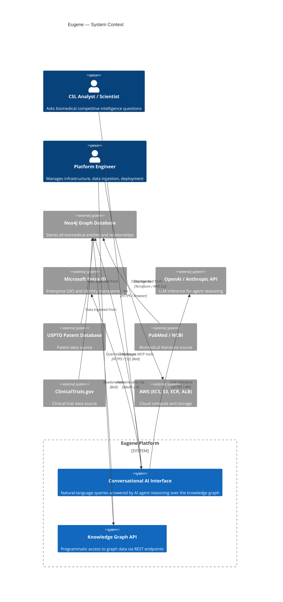

## 2.2 C4 Container Diagram

```mermaid
C4Container
  title Eugene — Container Architecture

  Person(user, "User (Analyst / Scientist)")

  Container_Boundary(frontend, "Presentation Tier") {
    Container(ui, "eugene-agent-ui", "Python / Streamlit", "Conversational chat UI with real-time streaming response rendering. Port 8501.")
  }

  Container_Boundary(agent, "Agent Tier") {
    Container(agentws, "eugene-agent-ws", "Python / FastAPI + Strands", "Hosts EugeneDataAgent. Manages ReAct reasoning loop, tool invocation, conversation history. Port 8001.")
  }

  Container_Boundary(mcp, "Tool / MCP Tier") {
    Container(mcpserver, "eugene-mcp", "Python / FastMCP", "Registers 12 knowledge graph tools. Enforces JWT on every tool call. Port 8443.")
  }

  Container_Boundary(coreapi, "Data / API Tier") {
    Container(ws, "eugene-ws", "Python / FastAPI", "20 REST endpoints across 10 biomedical domains. Primary data access layer. Port 8000.")
  }

  Container_Boundary(persistence, "Persistence Tier") {
    ContainerDb(neo4j, "Neo4j 5.26 + APOC", "Graph Database", "Stores all biomedical entities, relationships, and properties. Port 7687 (Bolt).")
    ContainerDb(milvus, "Milvus", "Vector Database", "Stores semantic embeddings for entity disambiguation and similarity search.")
  }

  Container_Boundary(eval, "Evaluation Sidecar") {
    Container(mlflow, "mlflow-0", "MLflow", "LLM evaluation, agent benchmarking, experiment tracking.")
  }

  Rel(user, ui, "Uses", "HTTPS")
  Rel(ui, agentws, "POST /query/stream", "HTTP + JWT Bearer")
  Rel(agentws, mcpserver, "Tool calls", "MCP over HTTP")
  Rel(mcpserver, ws, "REST calls", "HTTP + JWT Bearer")
  Rel(ws, neo4j, "Cypher queries", "Bolt")
  Rel(ws, milvus, "Vector search", "gRPC")
  Rel(agentws, mlflow, "Logs traces", "HTTP")
  Rel(ui, entra, "OAuth flow", "HTTPS")
```

## 2.3 Service Startup & Dependency Chain

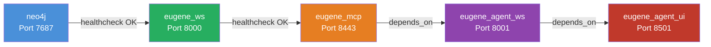

## 2.4 Request Flow — Agent Query (Sequence Diagram)

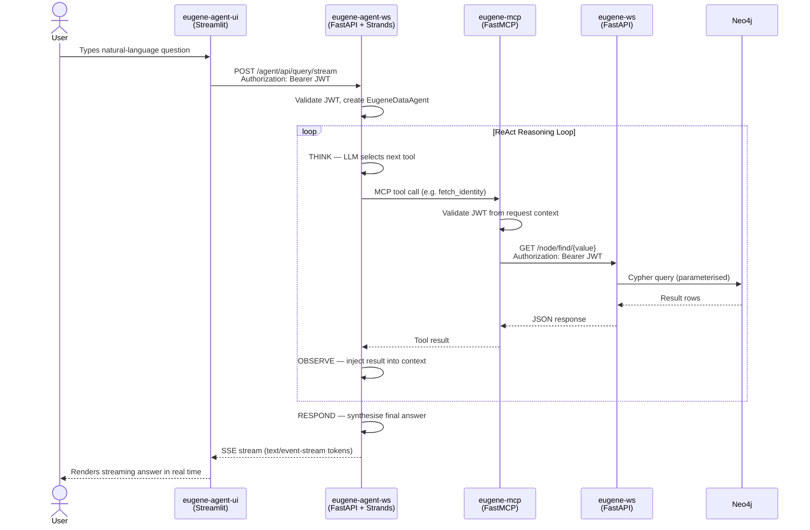

## 2.5 Authentication Flow (Sequence Diagram)

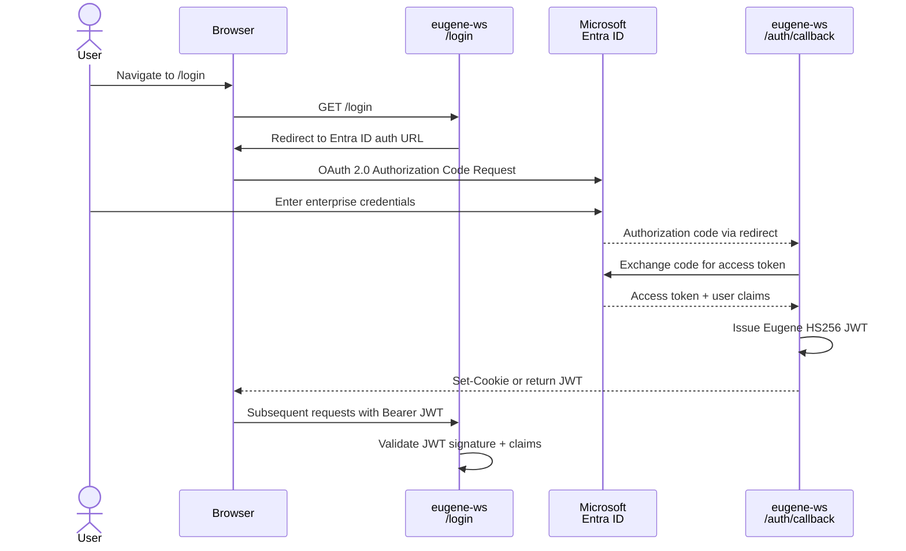

## 2.6 Knowledge Graph Entity-Relationship Diagram

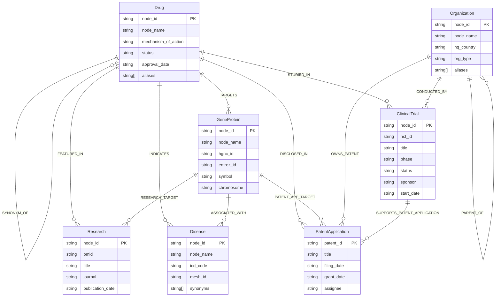

---

# 3. Technology Stack & Dependencies

## 3.1 Complete Technology Stack

| Layer | Technology | Version | Purpose |
|---|---|---|---|
| **Language** | Python | 3.13 | Primary platform language across all services |
| **Web Framework** | FastAPI | latest | Async REST API for eugene_ws and agent services |
| **Data Validation** | Pydantic | 2.8.2 | Request/response schema validation at all service boundaries |
| **ASGI Server** | Uvicorn | latest | Production-grade async server for FastAPI services |
| **Agent Framework** | Strands | latest | ReAct-pattern agentic loop with tool invocation |
| **Tool Protocol** | FastMCP | latest | Model Context Protocol server; tool registry and invocation |
| **LLM — Primary** | Anthropic Claude Sonnet 4 | `claude-sonnet-4-20250514` | Default inference model |
| **LLM — Secondary** | OpenAI GPT-4.1-mini | `gpt-4.1-mini` | Configurable alternative LLM |
| **LLM — Evaluation** | AWS Bedrock (Meta Llama 3.1 70B) | via langchain-aws | Evaluation and benchmarking |
| **LLM — Local Dev** | Ollama (llama3.1) | 0.3.1 | Offline development and testing |
| **LLM Orchestration** | LangChain | 0.3.1 | Knowledge extraction and ingestion pipelines |
| **Graph Database** | Neo4j Community Edition | 5.26.9 | Primary knowledge graph persistence |
| **Graph Plugins** | Neo4j APOC | 5.26.1 | Advanced Cypher procedures and data utilities |
| **Graph Plugins** | Neo4j GDS | 2.13.4 | Graph Data Science algorithms (community detection, PageRank) |
| **Vector Database** | Milvus (via pymilvus) | 2.4.3 | Semantic similarity and embedding-based entity search |
| **Embeddings** | sentence-transformers | 3.3.0 | Entity embedding generation for semantic search |
| **Embeddings** | model2vec | 0.3.2 | Fast lightweight embedding for rapid disambiguation |
| **ML Backend** | PyTorch | 2.2.2 | Model inference infrastructure (CPU-only in containers) |
| **NLP** | BioPython | 1.85 | PubMed data access and parsing |
| **Data Processing** | Pandas | latest | Tabular data processing in ingestion pipelines |
| **Graph Analytics** | NetworkX | 3.3 | In-memory graph algorithms |
| **Frontend** | Streamlit | latest | Conversational chat UI |
| **HTTP Client** | httpx / aiohttp | latest | Async HTTP between services |
| **Containerisation** | Docker | latest | Service packaging |
| **Container Orchestration** | AWS ECS Fargate | N/A | Production container hosting |
| **Container Registry** | AWS ECR | N/A | Docker image storage |
| **Load Balancer** | AWS ALB | N/A | TLS termination and traffic routing |
| **Secrets Management** | AWS Secrets Manager | via boto3 | Credential management in production |
| **IaC** | Terraform | latest | Declarative AWS infrastructure provisioning |
| **CI/CD** | GitLab CI/CD | N/A | Build, test, deploy pipeline |
| **Identity Provider** | Microsoft Entra ID | N/A | OAuth 2.0 enterprise SSO |
| **Token Standard** | JWT HS256 / RS256 | N/A | Stateless authorisation across services |
| **Experiment Tracking** | MLflow | latest | LLM evaluation, agent benchmarking |
| **Code Quality** | Black, Ruff, isort | latest | Formatting and linting |
| **Testing** | Pytest | latest | Unit and integration testing |
| **Storage** | AWS S3 | N/A | Data staging, Terraform state, backups |

## 3.2 Key Python Dependencies by Service

### `eugene_ws` (Core API)
| Package | Purpose |
|---|---|
| `fastapi`, `uvicorn` | HTTP server and routing |
| `pydantic` | Schema validation |
| `neo4j` | Bolt driver for Neo4j |
| `pymilvus` | Vector database client |
| `sentence-transformers` | Embedding generation |
| `networkx` | Graph algorithms |
| `pandas`, `numpy` | Data manipulation |
| `httpx` | Async HTTP for external API calls |
| `python-jose`, `cryptography` | JWT signing and validation |
| `msal` | Microsoft Entra ID (MSAL) OAuth client |

### `eugene-agent-ws` (Agent Backend)
| Package | Purpose |
|---|---|
| `strands-agents` | ReAct agentic framework |
| `anthropic` | Claude API SDK |
| `openai` | OpenAI API SDK |
| `fastapi`, `uvicorn` | HTTP server |
| `httpx` | MCP server client calls |
| `pydantic` | Request/response models |

### `eugene-mcp` (MCP Server)
| Package | Purpose |
|---|---|
| `fastmcp` | MCP server framework |
| `httpx` | Calls to eugene_ws Core API |
| `python-jose` | JWT validation middleware |
| `pydantic` | Tool parameter schemas |

### `eugene-agent-ui` (Streamlit UI)
| Package | Purpose |
|---|---|
| `streamlit` | Web UI framework |
| `boto3` | AWS Secrets Manager for production credentials |
| `httpx` | API calls to agent backend |

---

# 4. Database Connectivity & Architecture

## 4.1 Neo4j Connection Architecture

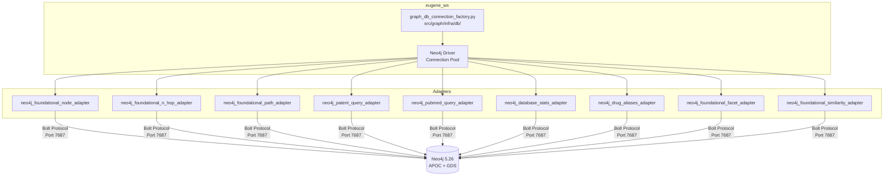

## 4.2 Connection Factory Pattern

The Neo4j driver is instantiated once via a factory function in `src/graph/infra/db/graph_db_connection_factory.py` and shared across all domain adapters through dependency injection wired in each domain's `conf/conf.py`. This pattern:

- Ensures a single driver instance per application lifecycle
- Manages connection pool settings centrally
- Allows test replacement via `conf.py` override

**Connection Parameters:**

| Parameter | Local Value | Production Value |
|---|---|---|
| URI | `bolt://neo4j:7687` (Docker) or `bolt://localhost:7687` | AWS VPC internal DNS |
| Transport | Bolt (unencrypted in container network) | Bolt with TLS (`bolt+s://`) |
| Auth | `neo4j` / `eugene_local_2024` (dev) | AWS Secrets Manager credential |
| Max connection pool | Default (100) | Configured per environment |

## 4.3 Milvus Vector Database Connectivity

Milvus is accessed via `pymilvus` for semantic similarity queries. It is used by:
- `src/foundation/infra/db/adapter/neo4j_foundational_similarity_adapter.py` — similarity search
- `src/tpp/` — Target Product Profile embedding-based patent search

**Milvus Collections:**
- Node embeddings indexed by `node_index` property
- Embeddings generated by `sentence-transformers` (3.3.0) and `model2vec` (0.3.2)
- Used for entity disambiguation when an exact name match is not available

## 4.4 Neo4j Memory Configuration

| Environment | Pagecache | Heap Initial | Heap Max | Notes |
|---|---|---|---|---|
| Local Docker | 512 MB | 512 MB | 1 GB | Defined in `docker-compose.yml` |
| Difflabs (Dev/Staging, AWS) | 4 GB | 2 GB | 4 GB | ECS task memory sizing |
| AIA (Production, AWS) | 16 GB | 4 GB | 8 GB | EC2-based deployment |

## 4.5 Neo4j Plugin Configuration

| Plugin | Version | Activation | Purpose |
|---|---|---|---|
| APOC | 5.26.1 | `NEO4J_PLUGINS=["apoc"]` | Advanced Cypher procedures, bulk import, metadata utilities |
| GDS | 2.13.4 | `NEO4J_PLUGINS=["gds"]` | Graph Data Science: community detection, PageRank, path algorithms |

Security: Both APOC and GDS procedures are allowlisted via:
```
NEO4J_dbms_security_procedures_unrestricted=apoc.*,gds.*
NEO4J_dbms_security_procedures_allowlist=apoc.*,gds.*
```

## 4.6 Data Volume Reference

| Entity Type | Neo4j Label | Estimated Node Count |
|---|---|---|
| Drugs | `Drug` | ~15,000 |
| Diseases | `Disease` | ~12,000 |
| Genes / Proteins | `GeneProtein` | ~30,000 |
| Patents | `PatentApplication` | ~50,000+ |
| Clinical Trials | `ClinicalTrial` | ~25,000 |
| Publications | `Research` | ~100,000+ |
| Organisations | `Organization` | ~8,000 |
| Therapeutic Areas | `TherapeuticArea` | ~500 |

> **Note:** Actual counts are returned in real time by `GET /stats`. The values above are approximate baseline figures. Run `GET /stats` against a live instance for current counts.

---

# 5. Component / Service Inventory

## 5.1 Service Summary Table

| Service | Directory | Port (Local) | Port (Docker) | Framework | Role |
|---|---|---|---|---|---|
| `eugene_ws` | `src/` | 18000 | 8000 | FastAPI + Uvicorn | Core REST API — 20 endpoints across 10 biomedical domains |
| `eugene_mcp` | `agents/eugene-mcp/` | 18443 | 8000 | FastMCP | MCP Tool Server — 12 tools for agent-to-graph interaction |
| `eugene_agent_ws` | `agents/eugene-agent-ws/` | 18001 | 8000 | FastAPI + Strands | Agent Backend — EugeneDataAgent ReAct loop |
| `eugene_agent_ui` | `agents/eugene-agent-ui/` | 18501 | 8501 | Streamlit | Chat UI — conversational frontend |
| `neo4j` | Docker image | 17474 / 17687 | 7474 / 7687 | Neo4j 5.26 | Graph database |
| `mlflow-0` | `agents/mlflow-0/` | — | — | MLflow | Agent evaluation and experiment tracking |
| `api-canaries` | `api-canaries/` | — | — | Python | Endpoint health monitoring |

## 5.2 `eugene_ws` — Core API Service

**Entry point:** `src/eugene_ws.py`
**Architecture:** DDD with hexagonal (ports-and-adapters) pattern

Each domain module follows a strict 6-layer structure:

```
<domain>/
├── router/         FastAPI route handlers — HTTP in, HTTP out
├── model/          Pydantic response models and enums
├── provider/       Business logic (orchestrators + providers)
├── mapper/         Data transformation (graph → domain model → response)
├── infra/db/       Neo4j adapters (Cypher queries)
└── conf/           Dependency injection factory functions
```

**Domains implemented:**
`foundation`, `organization`, `patent`, `pubmed`, `drug`, `clinicaltrail`, `tpp`, `centree`, `annotation`, `stats`, `graph`, `document`, `util`

## 5.3 `eugene-mcp` — MCP Tool Server

**Entry point:** `agents/eugene-mcp/src/eugene_mcp.py`
**Framework:** FastMCP with HTTP transport
**Auth middleware:** JWT validation on every incoming request
**Tool files:**

| File | Tools Registered |
|---|---|
| `tools/eugene_identity_tools.py` | `fetch_identity` |
| `tools/eugene_node_tools.py` | `lookup_node_by_value`, `fetch_node_details` |
| `tools/eugene_drug_tools.py` | `fetch_drug_aliases` |
| `tools/eugene_graph_tools.py` | `fetch_node_relationships`, `fetch_paths`, `has_reachable_path` |
| `tools/eugene_fact_tools.py` | `fetch_facts` |
| `tools/eugene_fetch_tools.py` | `fetch_by_label`, `fetch_similar` |
| `tools/eugene_organization_tools.py` | `find_organization_names`, `find_organization_assets` |
| `resources/eugene_greeting_resources.py` | MCP resource: system greeting |

## 5.4 `eugene-agent-ws` — Agent Backend

**Entry point:** `agents/eugene-agent-ws/src/eugene_chat_ws.py`
**Core class:** `EugeneDataAgent` in `src/query/agent/eugene_data_agent.py`

**Agent session management:**
- `FileSessionManager` — persists conversation history per `conversation_id` on disk
- `SlidingWindowConversationManager` — window_size=10, per_turn=2, truncate_results=True

**Streaming infrastructure:**
- `POST /query/stream` returns `StreamingResponse` with `text/event-stream` content type
- SSE events emitted: `session`, `content`, `done`, `error`
- Cache-Control and Connection headers set to prevent proxy buffering

## 5.5 `eugene-agent-ui` — Streamlit Chat UI

**Entry point:** `agents/eugene-agent-ui/src/eugene_agent_ui.py`
**Credential management:** `fetch_secrets.py` pulls from AWS Secrets Manager in production; falls back to environment variables locally

**UI capabilities:**
- Chat message history rendering
- Real-time token streaming (SSE consumer)
- Session management via Streamlit session state
- JWT passed as Bearer token on every API request

## 5.6 `api-canaries` — Monitoring Service

**Location:** `api-canaries/src/canaries/`
**Purpose:** Automated API health monitoring with structured result reporting

| Canary File | Monitors |
|---|---|
| `health_endpoint_canary.py` | `GET /health` |
| `node_find_endpoint_canary.py` | `GET /node/find/{value}` |
| `node_details_endpoint_canary.py` | `POST /node/details` |
| `label_counts_endpoint_canary.py` | `GET /count/{label}` |
| `stats_endpoint_canary.py` | `GET /stats` |

---

# 6. API Endpoint Catalog

## 6.1 Authentication & System Endpoints

| Method | Path | Auth Required | Description |
|---|---|---|---|
| `GET` | `/login` | No | Initiates Entra ID OAuth flow (prod) or returns local dev token |
| `GET` | `/auth/callback` | No | OAuth 2.0 redirect callback; issues Eugene JWT |
| `GET` | `/auth/whoami` | Yes | Returns authenticated user identity claims |
| `GET` | `/` | Yes | Welcome endpoint; returns current user info |
| `GET` | `/health` | No | Service health check; returns `{"status": "OK"}` |
| `GET` | `/releases` | No | Returns version history (v1 through v2.2) |

## 6.2 Foundation — Node & Graph Endpoints

| Method | Path | Auth Required | Parameters | Description |
|---|---|---|---|---|
| `GET` | `/labels/{label}` | Yes | `page`, `page_size` (max 50) | List all node names/IDs for a given label |
| `GET` | `/count/{label}` | Yes | — | Count nodes by label type |
| `GET` | `/node/find/{node_value}` | Yes | `fuzzy_match` (bool) | Find node ID by name; supports regex fuzzy matching |
| `POST` | `/node/details` | Yes | Body: `{"ids": [...]}` | Retrieve full property set for one or more node IDs |
| `GET` | `/graph/relationship/start/{start_id}` | Yes | `end_id` (optional), `n_hop` (1–2) | Fetch N-hop relationship subgraph from a node |
| `GET` | `/graph/path/start/{start_id}/end/{end_id}` | Yes | `n_hop` (1–4) | Find up to 10 shortest paths between two nodes |
| `GET` | `/graph/reachability/start/{start_id}/end/{end_id}` | Yes | `n_hop` (1–4) | Boolean check: are two nodes connected within N hops? |
| `GET` | `/graph/facts/start/{start_id}` | Yes | `page`, `page_size` (max 50) | Return human-readable relationship triples for a node |
| `POST` | `/facet/{label}` | Yes | Body: `{"values": [...]}` | Collect facet aggregations by label and value set |
| `POST` | `/similarity/{label}` | Yes | Body: `{"values": [...]}` | Return nodes most similar to a set of values |

## 6.3 Drug & Patent Endpoints

| Method | Path | Auth Required | Parameters | Description |
|---|---|---|---|---|
| `GET` | `/drugs/aliases/{drug_name}` | Yes | `fuzzy_match` (bool) | Return all synonyms/aliases for a drug by name |
| `GET` | `/drugs/aliases/id/{drug_id}` | Yes | — | Return all synonyms/aliases for a drug by DrugBank ID |
| `GET` | `/patents/drugs` | Yes | `drug_id`, `page`, `page_size` (max 100) | List patents linked to a drug |
| `GET` | `/patents/clinicaltrials` | Yes | `nct_id`, `page`, `page_size` (max 100) | List patents linked to a clinical trial |
| `GET` | `/patents/geneproteins` | Yes | `gene_protein`, `page`, `page_size` (max 100) | List patents linked to a gene/protein |
| `GET` | `/count/patents/drugs` | Yes | `drug_id` | Count patents for a drug |
| `GET` | `/count/patents/clinicaltrials` | Yes | `nct_id` | Count patents for a clinical trial |
| `GET` | `/count/patents/geneproteins` | Yes | `gene_protein` | Count patents for a gene/protein |

## 6.4 PubMed Endpoints

| Method | Path | Auth Required | Parameters | Description |
|---|---|---|---|---|
| `GET` | `/pmids/drugs` | Yes | `drug_id`, `page`, `page_size` (max 100) | List PubMed articles referencing a drug |
| `GET` | `/pmids/clinicaltrials` | Yes | `nct_id`, `page`, `page_size` (max 100) | List PubMed articles referencing a clinical trial |
| `GET` | `/pmids/geneproteins` | Yes | `gene_protein`, `page`, `page_size` (max 100) | List PubMed articles referencing a gene/protein |
| `GET` | `/count/pmids/drugs` | Yes | `drug_id` | Count PubMed articles for a drug |
| `GET` | `/count/pmids/clinicaltrials` | Yes | `nct_id` | Count PubMed articles for a clinical trial |
| `GET` | `/count/pmids/geneproteins` | Yes | `gene_protein` | Count PubMed articles for a gene/protein |

## 6.5 Organisation Endpoints

| Method | Path | Auth Required | Parameters | Description |
|---|---|---|---|---|
| `GET` | `/organizations/{organization_name}` | Yes | `page`, `page_size` (max 500) | Search organisations by name (supports `*` and `?` wildcards) |
| `GET` | `/organizations/assets/{organization_id}` | Yes | `page`, `page_size` (max 500) | List all assets (drugs, trials, patents, deals) for an organisation |
| `GET` | `/list/organization/aliases/{organization_name}` | Yes | — | **[DEPRECATED]** List aliases for an organisation |

## 6.6 Embeddings / TPP Endpoints

| Method | Path | Auth Required | Parameters | Description |
|---|---|---|---|---|
| `POST` | `/embeddings/` | Yes | Body: `{"include_terms": [...], "exclude_terms": [...]}` | Find patents using semantic embedding search |
| `GET` | `/embeddings/tpps/{tpp_id}` | Yes | `tpp_id` (32 chars) | Find patents by Target Product Profile ID |
| `GET` | `/embeddings/tpps/{tpp_id}/graph` | Yes | `tpp_id` (32 chars) | Find patents by TPP using graph embeddings |
| `GET` | `/embeddings/tpps/{tpp_id}/question/{question_type}` | Yes | `tpp_id`, `question_type` | Find patents by TPP question type |

## 6.7 Stats Endpoint

| Method | Path | Auth Required | Description |
|---|---|---|---|
| `GET` | `/stats` | Yes | Returns full database statistics: node counts, relationship counts, entity type counts, USPTO date range, disambiguated organisation count |

## 6.8 Agent API Endpoints (`eugene-agent-ws`)

| Method | Path | Auth Required | Description |
|---|---|---|---|
| `POST` | `/agent/api/query` | Yes | Execute synchronous agent query; returns full response |
| `POST` | `/agent/api/query/stream` | Yes | Execute streaming agent query; returns SSE `text/event-stream` |
| `GET` | `/health` | No | Agent service health check |

---

# 7. MCP Tooling & Agent Skills Design

## 7.1 MCP Architecture Overview

The Model Context Protocol server (`eugene-mcp`) acts as the **governed abstraction layer** between the AI agent and the knowledge graph. The agent never calls the Core API directly; every data access passes through a named, schema-typed MCP tool. This design provides:

- **Tool governance:** Only explicitly registered operations are accessible
- **JWT propagation:** User identity is verified at both the MCP boundary and the Core API boundary
- **Auditability:** All tool calls are structured, logged, and traceable
- **Model independence:** The tool interface is LLM-agnostic

## 7.2 Complete MCP Tool Reference

| # | Tool Name | Domain | Parameters | Calls | Description |
|---|---|---|---|---|---|
| 1 | `fetch_identity` | Identity | none | `GET /auth/whoami` | Fetch current authenticated user identity |
| 2 | `lookup_node_by_value` | Node | `value: str`, `fuzzy_match: bool` | `GET /node/find/{value}` | Resolve a name/value to a canonical graph node ID |
| 3 | `fetch_node_details` | Node | `ids: list[str]` | `POST /node/details` | Retrieve full property set for one or more node IDs |
| 4 | `fetch_drug_aliases` | Drug | `drug_name: str` | `GET /drugs/aliases/{drug_name}` | Return all synonyms and brand names for a drug |
| 5 | `fetch_node_relationships` | Graph | `node_id: str`, `n_hop: int = 2` | `GET /graph/relationship/start/{id}` | Fetch all typed relationship edges from a node |
| 6 | `fetch_paths` | Graph | `start_id: str`, `end_id: str`, `n_hop: int = 2` | `GET /graph/path/start/{s}/end/{e}` | Return up to 10 shortest paths between two nodes |
| 7 | `has_reachable_path` | Graph | `start_id: str`, `end_id: str`, `n_hop: int = 2` | `GET /graph/reachability/start/{s}/end/{e}` | Boolean: are two nodes connected within N hops? |
| 8 | `fetch_facts` | Facts | `node_id: str` | `GET /graph/facts/start/{id}` (paginated, max 2500) | Extract human-readable relationship triples for a node |
| 9 | `fetch_by_label` | Fetch | `label: str`, `page: int = 1`, `page_size: int = 25` | `GET /labels/{label}` | List known names/IDs for a node type |
| 10 | `fetch_similar` | Fetch | `label: str`, `values: list[str]` | `POST /similarity/{label}` | Return nodes most similar based on common connections |
| 11 | `find_organization_names` | Organisation | `name_pattern: str` | `GET /organizations/{pattern}` (paginated, max 500) | Search organisations by name with wildcard support |
| 12 | `find_organization_assets` | Organisation | `organization_id: str` | `GET /organizations/assets/{id}` (paginated, max 500) | List all assets for an organisation |

## 7.3 Tool Design Principles

**Pagination handling:** Tools that call paginated endpoints (`fetch_facts`, `find_organization_names`, `find_organization_assets`) handle pagination internally. The agent receives a single, complete result — it never needs to manage pages.

**Fact filtering:** `fetch_facts` filters out generic `HAS_RELATIONSHIP` entries, returning only semantically meaningful triples such as `Drug INDICATES Disease`.

**Hop depth constraints:**
- `fetch_node_relationships`: max `n_hop = 2` (enforced by Core API)
- `fetch_paths` / `has_reachable_path`: max `n_hop = 4` (enforced by Core API)

## 7.4 Agent Tool Selection Decision Tree

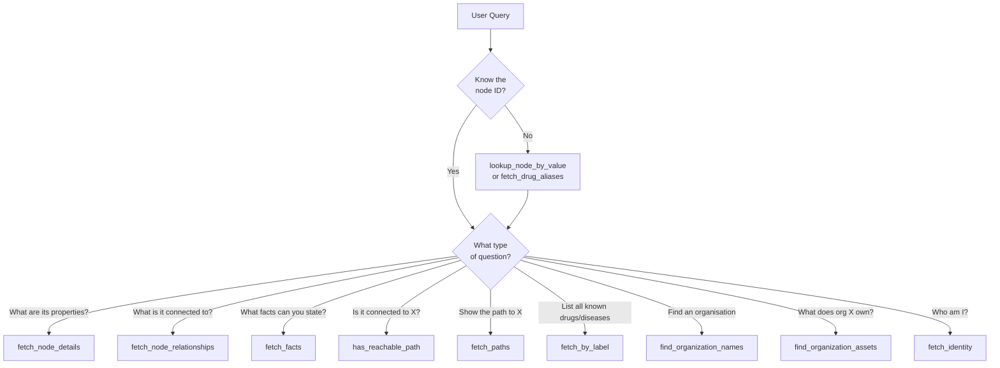

## 7.5 MCP Authentication Flow

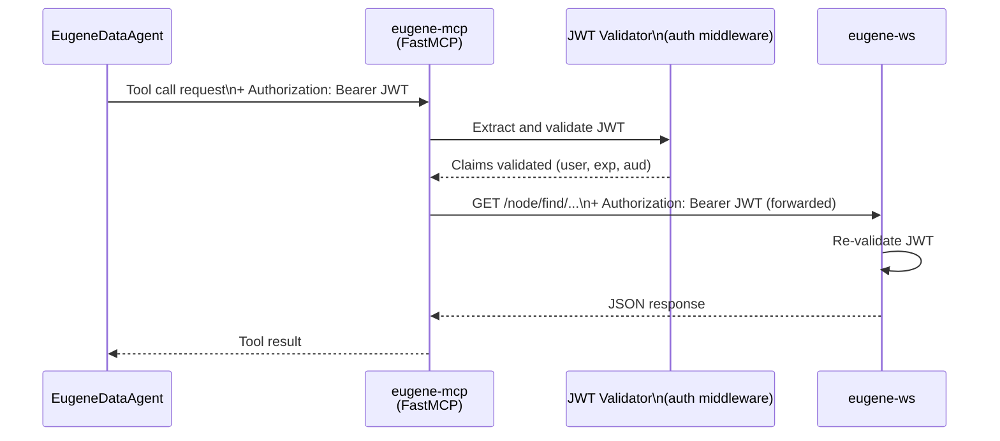

---

# 8. Authentication & Security Architecture

## 8.1 Authentication Strategy

Eugene employs a **two-layer authentication model**:

| Layer | Mechanism | Scope |
|---|---|---|
| Layer 1 — Enterprise SSO | Microsoft Entra ID (Azure AD) OAuth 2.0 | User authentication at the browser/UI boundary |
| Layer 2 — Eugene JWT | HS256-signed JWT issued by `eugene_ws` | Service-to-service authorisation across all microservices |

```mermaid
flowchart LR
    subgraph Layer1["Layer 1 — Enterprise SSO"]
        U[User Browser] -->|OAuth 2.0 Code Flow| ENTRA[Microsoft Entra ID]
        ENTRA -->|Auth code| CB[/auth/callback]
        CB -->|Validates code| ENTRA
        ENTRA -->|Access token + claims| CB
    end

    subgraph Layer2["Layer 2 — Eugene JWT"]
        CB -->|Issues Eugene JWT HS256| U
        U -->|Bearer JWT| AGENTUI[eugene-agent-ui]
        AGENTUI -->|Bearer JWT| AGENTWS[eugene-agent-ws]
        AGENTWS -->|Bearer JWT| MCP[eugene-mcp]
        MCP -->|Bearer JWT| WS[eugene-ws]
    end
```

## 8.2 JWT Token Structure

| Claim | Value | Description |
|---|---|---|
| `iss` | `https://eugene.ai.cslg1.cslg.net/{tenant_id}` | Eugene issuer URL |
| `aud` | `api://eugene/{client_id}` | Target audience |
| `sub` | User UPN / email | Subject (user identity) |
| `exp` | Unix timestamp | Expiry |
| `iat` | Unix timestamp | Issued-at |

**Signing algorithm:** HS256 (shared secret). Production environments should migrate to RS256 (asymmetric) for enhanced security.

## 8.3 Environment-Based Auth Behaviour

| Environment | Auth Mode | Behaviour |
|---|---|---|
| `local` | Dev bypass | `ENVIRONMENT=local` disables Entra ID OAuth. A local JWT is signed and returned immediately on `/login` without SSO. |
| `difflabs` | Full Entra ID | OAuth 2.0 full flow; Entra credentials required |
| `AIA (prod)` | Full Entra ID | OAuth 2.0 full flow with production Entra tenant |

## 8.4 Agent Access Control

The environment variable `EUGENE_AGENT_ALLOWLIST` accepts a pipe-separated (`|`) list of user UPNs (email addresses) permitted to use the agent endpoint. If the variable is empty or unset, all authenticated users are permitted.

```
EUGENE_AGENT_ALLOWLIST=alice@csl.com|bob@csl.com|carol@csl.com
```

## 8.5 Data Protection Controls

| Control | Implementation |
|---|---|
| Secrets at rest | All credentials stored in environment variables or AWS Secrets Manager (`fetch_secrets.py` in UI) |
| Secrets in version control | `.env` files are `.gitignore`d; only `.env.template` files are committed |
| Transport encryption | HTTPS/TLS enforced at AWS ALB in all non-local environments |
| Neo4j network isolation | Neo4j is not publicly exposed; accessible only within `eugene-net` Docker network or VPC |
| Cypher injection prevention | All Cypher queries use parameterised binding (`$variable`); no string interpolation |
| Container security | Non-root `eugene` user in all Dockerfiles |
| LLM API key protection | API keys are environment variables; never logged or rendered in API responses |

## 8.6 Security Validation Summary

| Control | Status | Notes |
|---|---|---|
| JWT validation at all service boundaries | PASS | Implemented in `router/auth/` in each service |
| Parameterised Cypher queries | PASS | All Neo4j adapters use `$parameter` binding |
| Non-root container user | PASS | `eugene` user in all Dockerfiles |
| Secrets not in source control | PASS | `.gitignore` covers all `.env` files |
| TLS at API boundary | PASS (prod) | Local dev runs without TLS by design |
| Rate limiting | OPEN | Not implemented at application layer; recommended at ALB |
| RS256 JWT migration | OPEN | Currently HS256; RS256 recommended for production |
| Container image scanning | OPEN | Trivy integration recommended in CI/CD |

---

# 9. Prompt Engineering & LLM Configuration

## 9.1 LLM Provider Selection

The agent supports two LLM providers, selected via the `LLM_PROVIDER` environment variable. If not set, the system auto-detects based on which API key is present.

```mermaid
flowchart TD
    ENV{LLM_PROVIDER\nenv var set?}
    ENV -->|"anthropic" or "claude"| CLAUDE[Anthropic Claude]
    ENV -->|"openai" or "gpt"| GPT[OpenAI GPT]
    ENV -->|Not set| DETECT{ANTHROPIC_API_KEY\npresent?}
    DETECT -->|Yes| CLAUDE
    DETECT -->|No| CHECK{OPENAI_API_KEY\npresent?}
    CHECK -->|Yes| GPT
    CHECK -->|No| ERR[Raise ConfigurationError]
```

## 9.2 LLM Model Configuration

### Anthropic Claude (Default)

| Parameter | Value |
|---|---|
| Default model | `claude-sonnet-4-20250514` |
| Max tokens | 16,384 |
| Temperature | 0.7 |
| Alternative models | `claude-haiku-4-5-20251001`, `claude-opus-4-20250514` |
| Config env var | `ANTHROPIC_MODEL_ID` |

### OpenAI GPT

| Parameter | Value |
|---|---|
| Default model | `gpt-4.1-mini` |
| Max completion tokens | 4,096 |
| Temperature | 0.7 |
| Top-p | 1.0 |
| Alternative models | `gpt-4.1`, `gpt-4o`, `gpt-4o-mini`, `gpt-3.5-turbo` |
| Config env var | `OPENAI_MODEL_ID` |

## 9.3 Agent System Prompt

The `EugeneDataAgent` is initialised with the following system prompt:

```
You are an agent tasked with helping investigate biomedical companies to assess
competitive threat and collaboration opportunities. In our case assets here mean
any drug, disease, patents, clinical trials, intellectual property, or financial
deals the company may have involvement. As an agent follow the Reason, Act,
Observe (ReAct) pattern. You are an agent that may call tools to retrieve data.
```

**Design rationale:**
- Scopes the agent's domain to biomedical competitive intelligence, preventing off-topic responses
- Defines "assets" explicitly to guide asset-profiling queries
- Instructs ReAct pattern adherence for transparent, step-by-step reasoning
- Does not claim any specific factual knowledge — agent is instructed to retrieve data via tools

## 9.4 Conversation Memory Configuration

| Parameter | Value | Effect |
|---|---|---|
| Manager type | `SlidingWindowConversationManager` | Maintains a rolling window of recent turns |
| `window_size` | 10 | Maximum number of turns retained in context |
| `per_turn` | 2 | Messages per turn stored (user + assistant) |
| `truncate_results` | True | Truncates long tool results to fit context window |
| Persistence | `FileSessionManager` | Conversations saved to disk by `conversation_id` |

## 9.5 Tool Enablement Configuration

The `ToolRequestEnum` controls which tool sets are activated per request:

| Enum Value | Tools Activated | Status |
|---|---|---|
| `EUGENE` | All 12 MCP tools | Active |
| `HTTP` | `http_request` local tool | Active (optional) |
| `PUBMED` | External PubMed API tools | Disabled (reserved) |
| `CLINICAL_TRIALS` | External ClinicalTrials.gov tools | Disabled (reserved) |
| `CHEMBL` | External ChEMBL tools | Disabled (reserved) |
| `BIORXIV` | External bioRxiv tools | Disabled (reserved) |

**Default local tools always active:** `calculator`, `current_time`, `python_repl`

## 9.6 Streaming Event Protocol

The agent streams responses as server-sent events with the following event types:

| Event Type | Payload | Meaning |
|---|---|---|
| `session` | `{"conversation_id": "..."}` | Session ID for multi-turn continuity |
| `content` | `{"token": "..."}` | Next text token to render |
| `done` | `{"metrics": {...}}` | Stream complete; includes token usage and timing |
| `error` | `{"message": "..."}` | Error occurred; agent could not complete |

---

# 10. Workflow Orchestration

## 10.1 Core API Internal Workflow (Hexagonal Pattern)

Every request to `eugene_ws` flows through the same 6-layer hexagonal pattern:

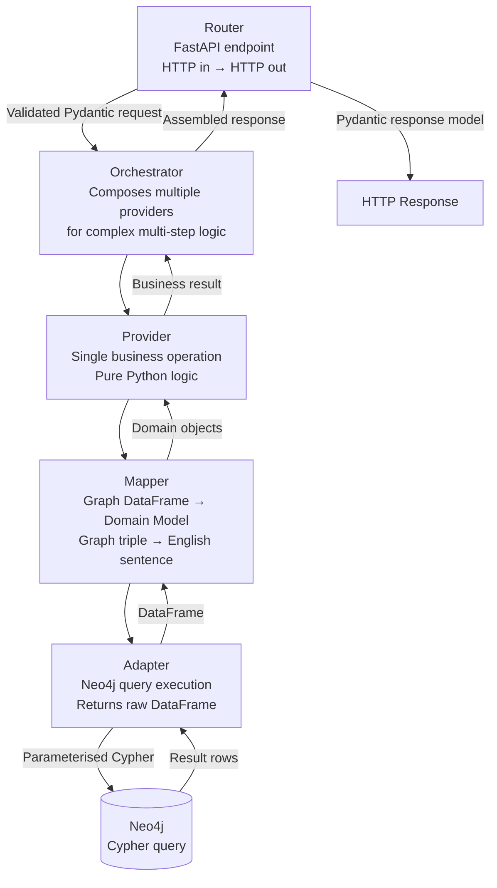

**Example:** A `GET /graph/facts/start/{start_id}` request traverses:

```
facts_router
  → FoundationalFactsOrchestrator
    → FoundationalFactsProvider
      → FactsMapper (triple → English)
        → Neo4jFoundationalNHopAdapter
          → Cypher: MATCH (a)-[r]->(b) WHERE a.id=$id RETURN ...
```

## 10.2 Agent Orchestration Workflow (ReAct Loop)

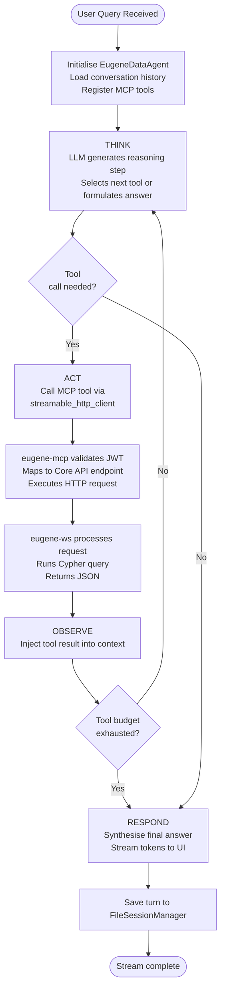

## 10.3 Data Ingestion Workflow

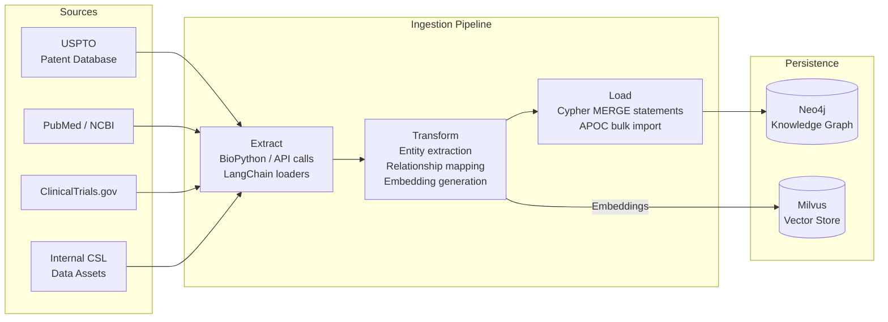

## 10.4 Competitive Intelligence Query — End-to-End Example

**Query:** *"Which European organisations have patents on drugs targeting EGFR, and do any have active clinical trials in lung cancer?"*

```
Step 1: lookup_node_by_value("EGFR")
        → { id: "gene:1956", label: "GeneProtein", name: "EGFR" }

Step 2: fetch_node_relationships("gene:1956", n_hop=2)
        → Relationships: TARGETED_BY [drug:100, drug:201, drug:312 ...]
                         ASSOCIATED_WITH [disease:89, disease:204 ...]

Step 3: For each drug in [drug:100, drug:201, drug:312]:
        fetch_node_relationships(drug_id, n_hop=1)
        → Filter: DISCLOSED_IN [patent:X, patent:Y ...]
        → Accumulate patent → organisation associations

Step 4: find_organization_names("*")
        → Filter results by hq_country in European countries

Step 5: For each European org with patents:
        find_organization_assets(org_id)
        → Filter: ClinicalTrial assets with status="RECRUITING" or "ACTIVE"
        → Filter: Disease association includes "lung cancer"

Step 6: Synthesise:
        "Three European organisations have patents on EGFR-targeting drugs
         with active lung cancer trials:
         1. AstraZeneca (UK) — Osimertinib, 4 patents, NCT... (Phase III)
         2. Roche (Switzerland) — Erlotinib, 7 patents, NCT... (Phase II)
         3. Merck KGaA (Germany) — Afatinib, 3 patents, NCT... (Phase III)"
```

---

# 11. Deployment Model & CI/CD

## 11.1 Environment Overview

| Environment | Platform | Region | Auth Mode | Purpose |
|---|---|---|---|---|
| Local | Docker Compose (Mac/Linux) | N/A | Dev JWT bypass | Developer local iteration |
| Difflabs | AWS ECS Fargate | us-east-1 | Full Entra ID | Integration testing and staging |
| AIA (Production) | AWS ECS Fargate | eu-central-1 | Full Entra ID | Production CSL deployment |

## 11.2 AWS Production Architecture

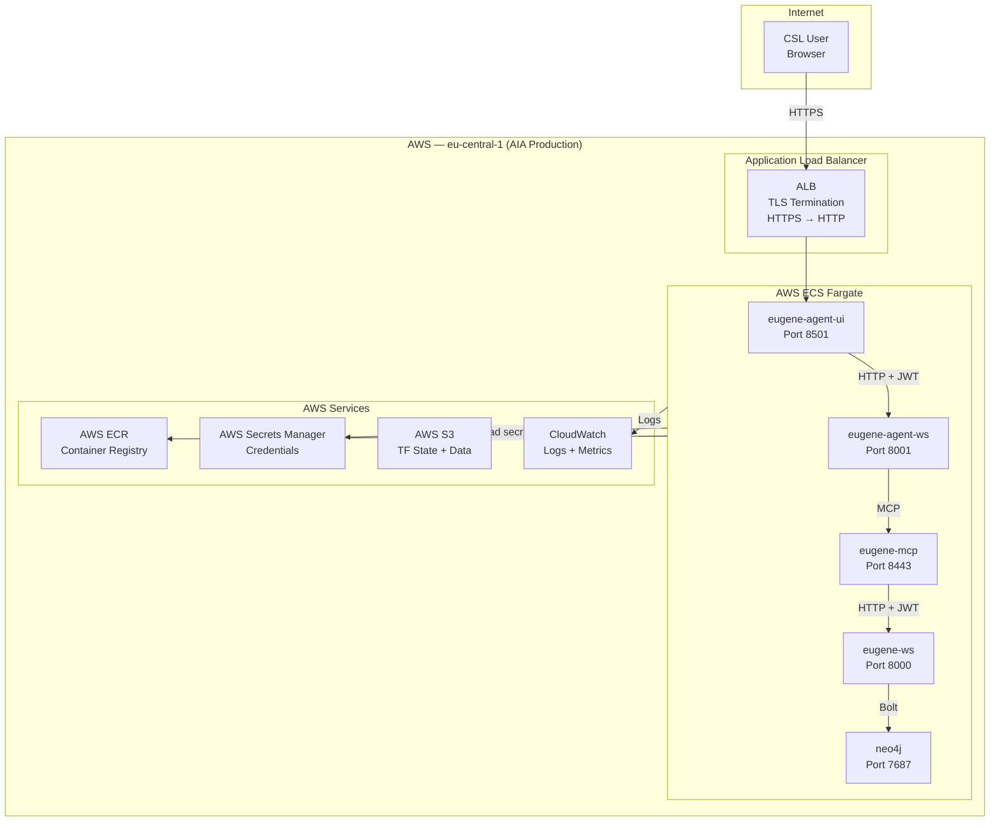

## 11.3 Docker Build Configuration

| Service | Dockerfile | Base Image | Runtime User | Exposed Port | Entry Command |
|---|---|---|---|---|---|
| `eugene_ws` | `docker/eugene_ws/Dockerfile` | `python:3.13-slim` | `eugene` (non-root) | 8000 | `uvicorn eugene_ws:app --host 0.0.0.0 --port 8000` |
| `eugene_mcp` | `docker/eugene_mcp/Dockerfile` | `python:3.13-slim` | `eugene` (non-root) | 8000 | `python src/eugene_mcp.py --host 0.0.0.0 --port 8000` |
| `eugene_agent_ws` | `docker/eugene_agent_ws/Dockerfile` | `python:3.13-slim` | `eugene` (non-root) | 8000 | `uvicorn eugene_chat_ws:app --host 0.0.0.0 --port 8000` |
| `eugene_agent_ui` | `docker/eugene_agent_ui/Dockerfile` | `python:3.13-slim` | `eugene` (non-root) | 8501 | `streamlit run src/eugene_agent_ui.py` |

**Notes:**
- All images install CPU-only PyTorch to minimise image size
- Strands session directory `/home/eugene/.strands` is created at build time
- AIA-specific image definitions are in `containers/` (separate from `docker/`)

## 11.4 Terraform Infrastructure Modules

| Module | Path | Provisions |
|---|---|---|
| ECS Services | `infrastructure/modules/eugene-services/` | ECS task definitions, services, ALB target groups |
| Container Registry | `infrastructure/modules/eugene-containers/` | ECR repositories for all service images |
| EC2 Baseline | `infrastructure/modules/eugene-ec2/` | EC2 cluster nodes, security groups, IAM roles |
| ECS Database | `infrastructure/modules/eugene-ecs-database/` | Neo4j ECS task, EBS volume, persistence config |
| USPTO Pipeline | `infrastructure/modules/eugene-services/uspto/` | Scheduled ECS tasks for USPTO patent data processing |

**Environment configs:** `infrastructure/environments/` contains `qa/` and `prod/` variable files.

## 11.5 CI/CD Pipeline

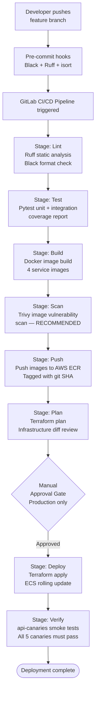

---

# 12. Environment Configuration Matrix

## 12.1 Service URL Matrix

| Service | Local (Host) | Docker Internal | Difflabs (AWS) | AIA Prod (AWS) |
|---|---|---|---|---|
| Neo4j Browser | `http://localhost:17474` | `http://neo4j:7474` | Internal VPC | Internal VPC |
| Neo4j Bolt | `bolt://localhost:17687` | `bolt://neo4j:7687` | Internal VPC | Internal VPC |
| Core API (Swagger) | `http://localhost:18000/docs` | `http://eugene_ws:8000` | HTTPS via ALB | HTTPS via ALB |
| MCP Server | `http://localhost:18443` | `http://eugene_mcp:8000` | HTTPS via ALB | HTTPS via ALB |
| Agent API | `http://localhost:18001/docs` | `http://eugene_agent_ws:8000` | HTTPS via ALB | HTTPS via ALB |
| Chat UI | `http://localhost:18501` | `http://eugene_agent_ui:8501` | HTTPS via ALB | HTTPS via ALB |

> **Note:** Local ports are prefixed with `1xxxx` to avoid conflicts with other local services. Inside Docker, services use standard ports (8000, 8501, etc.).

## 12.2 Authentication Configuration by Environment

| Variable | Local | Difflabs | AIA Prod |
|---|---|---|---|
| `ENVIRONMENT` | `local` | `production` | `production` |
| `ENTRA_TENANT_ID` | `not-used-in-local-mode` | Real tenant ID | Real tenant ID |
| `ENTRA_CLIENT_ID` | `not-used-in-local-mode` | Real client ID | Real client ID |
| `ENTRA_CLIENT_SECRET` | `not-used-in-local-mode` | AWS Secrets Manager | AWS Secrets Manager |
| `ENTRA_AUTHORITY` | Dummy URL | Live Entra authority | Live Entra authority |
| `REDIRECT_URI` | `http://localhost:18000/auth/callback` | HTTPS ALB URL | HTTPS ALB URL |
| `EUGENE_CLIENT_SECRET` | Dev secret | AWS Secrets Manager | AWS Secrets Manager |

## 12.3 Neo4j Configuration by Environment

| Variable | Local | AWS |
|---|---|---|
| `NEO4J_URI` | `bolt://neo4j:7687` | `bolt://host.docker.internal:7687` or VPC DNS |
| `NEO4J_USERNAME` | `neo4j` | AWS Secrets Manager |
| `NEO4J_PASSWORD` | `eugene_local_2024` | AWS Secrets Manager |
| Pagecache | 512 MB | 4–16 GB |
| Heap max | 1 GB | 4–8 GB |

## 12.4 LLM Configuration by Environment

| Variable | Local Dev | Production |
|---|---|---|
| `LLM_PROVIDER` | `anthropic` or `openai` | `anthropic` (default) |
| `ANTHROPIC_API_KEY` | Developer key | AWS Secrets Manager |
| `ANTHROPIC_MODEL_ID` | `claude-sonnet-4-20250514` | `claude-sonnet-4-20250514` |
| `OPENAI_API_KEY` | Developer key | AWS Secrets Manager |
| `OPENAI_MODEL_ID` | `gpt-4.1-mini` | `gpt-4.1-mini` |

## 12.5 Agent Configuration

| Variable | Description | Example |
|---|---|---|
| `EUGENE_MCP_SERVER_URL` | Full URL to MCP server `/mcp` endpoint | `http://eugene_mcp:8000/mcp` |
| `EUGENE_AGENT_API_URL` | Full URL to agent streaming endpoint | `http://eugene_agent_ws:8000/agent/api/query/stream` |
| `EUGENE_AGENT_ALLOWLIST` | Pipe-separated list of allowed user UPNs | `alice@csl.com\|bob@csl.com` |
| `EUGENE_ISSUER` | JWT issuer claim | `https://eugene.ai.cslg1.cslg.net/{tenant_id}` |
| `EUGENE_AUDIENCE` | JWT audience claim | `api://eugene/{client_id}` |

---

# 13. Monitoring, Observability & Health Checks

## 13.1 Health Check Architecture

```mermaid
flowchart LR
    subgraph Docker["Docker Compose Healthchecks"]
        direction TB
        NEO[neo4j\nwget localhost:7474\nInterval: 10s | Retries: 10]
        WS[eugene_ws\npython urllib GET /health\nInterval: 10s | Retries: 5]
    end

    subgraph Canaries["API Canary Service (api-canaries)"]
        direction TB
        C1[health_endpoint_canary\nGET /health]
        C2[node_find_endpoint_canary\nGET /node/find/...]
        C3[node_details_endpoint_canary\nPOST /node/details]
        C4[label_counts_endpoint_canary\nGET /count/...]
        C5[stats_endpoint_canary\nGET /stats]
    end

    subgraph AWS["AWS CloudWatch (Production)"]
        LOGS[CloudWatch Logs\nAll ECS task stdout/stderr]
        METRICS[CloudWatch Metrics\nCPU / Memory / Request count]
        ALARMS[CloudWatch Alarms\nAlert on error rate / latency]
    end

    NEO --> WS
    WS --> Canaries
    Canaries --> AWS
    Docker --> AWS
```

## 13.2 Service Health Endpoints

| Service | Health Path | Expected Response | Checked By |
|---|---|---|---|
| `eugene_ws` | `GET /health` | `{"status": "OK"}` | Docker healthcheck + canary |
| `eugene_agent_ws` | `GET /health` | `{"status": "OK"}` | Load balancer health probe |
| `eugene_mcp` | Implicit (FastMCP) | HTTP 200 | Depends-on dependency |
| `neo4j` | `GET localhost:7474` | HTTP 200 | Docker healthcheck |

## 13.3 Observability Dimensions

| Dimension | Mechanism | Location |
|---|---|---|
| **Structured logs** | FastAPI request logs (Uvicorn access log) | stdout → CloudWatch Logs |
| **Agent traces** | MLflow experiment tracking; tool call sequences per query | `agents/mlflow-0/` sidecar |
| **Agent metrics** | `AgentMetrics` model in `query/model/agent_metrics.py`; emitted on `done` SSE event | Logged per conversation turn |
| **API canaries** | 5 endpoint probes run on schedule | `api-canaries/` service |
| **Neo4j metrics** | Neo4j browser metrics page (`/browser`) | Port 7474 |
| **Container metrics** | AWS ECS CloudWatch integration | ECS task-level CPU/memory |

## 13.4 Recommended Alerting (Production)

| Alert | Condition | Severity | Action |
|---|---|---|---|
| Core API unhealthy | `/health` returns non-200 for >60s | Critical | Page on-call, restart ECS task |
| Neo4j unreachable | Bolt connection refused | Critical | Page on-call, check volume/EBS |
| LLM API error rate | >10% requests with LLM API errors in 5 min | High | Check API key; switch provider |
| Agent response P95 > 30s | Agent latency percentile exceeds threshold | Medium | Investigate tool call depth |
| Canary failures | Any canary probe fails for >2 consecutive runs | High | Automated Slack alert |

---

# 14. Testing Strategy & Quality Assurance

## 14.1 Test Architecture

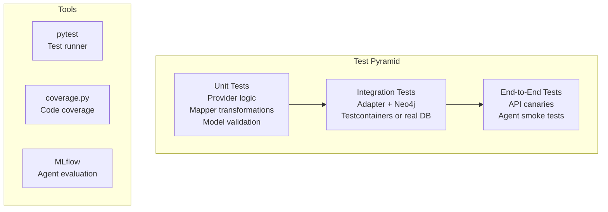

## 14.2 Test Configuration

| File | Purpose |
|---|---|
| `.pytest.ini` | Pytest configuration: test paths, markers, async mode |
| `.coveragerc` | Coverage measurement configuration |
| `tests/` | All test files |

## 14.3 Testing Layers

### Unit Tests
- **Scope:** Mappers, providers, model validation, utility functions
- **Location:** `tests/unit/`
- **Dependencies:** No external services; all Neo4j interactions mocked or stubbed
- **Key areas:**
  - `FactsMapper` — verify triple → English sentence conversion
  - `GraphMapper` — verify DataFrame → Graph model transformation
  - Domain providers — verify orchestration logic
  - Pydantic model validation — verify request/response schemas

### Integration Tests
- **Scope:** Adapter + Neo4j interaction
- **Location:** `tests/integration/`
- **Dependencies:** Real or Testcontainer-managed Neo4j instance
- **Key areas:**
  - Cypher query correctness for all 22+ adapters
  - Pagination behaviour
  - Node constraint and index enforcement
  - APOC procedure availability

### End-to-End / Smoke Tests
- **Scope:** Full API surface via HTTP
- **Mechanism:** `api-canaries/` service
- **Coverage:** 5 critical endpoints (health, node find, node details, label counts, stats)
- **Execution:** Manual on demand (recommended: post-deployment gate in CI/CD)

### Agent Evaluation (MLflow)
- **Location:** `agents/mlflow-0/`
- **Mechanism:** Ground-truth Q&A pairs evaluated against agent responses
- **Metrics:** Answer accuracy, tool call count, latency, token usage
- **Models tested:** Claude Sonnet, GPT-4.1-mini, Llama 3.1 70B (via Bedrock)

## 14.4 Quality Gates

| Gate | Tool | Threshold |
|---|---|---|
| Code formatting | Black | Zero formatting violations |
| Import ordering | isort | Zero import violations |
| Linting | Ruff | Zero lint errors |
| Unit test coverage | pytest-cov | Target: ≥80% |
| API canaries | api-canaries | All 5 probes pass |
| Container image scan | Trivy (recommended) | No CRITICAL CVEs |
| Agent evaluation | MLflow | Baseline accuracy maintained |

---

# 15. Data Ingestion & Knowledge Strategy

## 15.1 Data Sources

| Source | Data Domain | Entity Types | Access Method |
|---|---|---|---|
| USPTO | Intellectual Property | Patents, assignees, filing dates | USPTO bulk data API |
| PubMed / NCBI | Biomedical Literature | Research articles, PMIDs, authors | BioPython Entrez API |
| ClinicalTrials.gov | Clinical Research | Trials, sponsors, phases, statuses | ClinicalTrials.gov API |
| Internal CSL Data | Proprietary | Target Product Profiles (TPPs), internal projects | Direct data ingestion |
| DrugBank / ChEMBL | Drug Reference | Drug names, aliases, mechanisms | Database downloads |

## 15.2 Ingestion Architecture

The ingestion pipeline is separated from the `eugene_ws` API service. It is responsible for:

1. **Extraction** — Pulling raw data from each source via API calls or file downloads
2. **Transformation** — Entity extraction, relationship mapping, embedding generation
3. **Loading** — Writing to Neo4j via `MERGE` statements (idempotent upserts) and APOC bulk import
4. **Embedding** — Generating sentence-transformer and model2vec embeddings for Milvus indexing

The ingestion pipeline is also responsible for maintaining the `node_index` property on each node, which serves as the stable identifier for Milvus vector alignment.

## 15.3 Data Modelling Principles

| Principle | Implementation |
|---|---|
| Idempotent ingestion | All writes use Cypher `MERGE` (not `CREATE`); re-running ingestion is safe |
| Canonical identifiers | Each node has a `node_id` (domain-specific) and `node_index` (sequential, for Milvus alignment) |
| Provenance tracking | `source` property on all nodes indicates origin database |
| Alias modelling | Drug synonyms modelled as `SYNONYM_OF` relationships, not just properties |
| Organisation disambiguation | `hq_country` populated for disambiguated organisations; used in competitive filters |
| Hidden nodes | `is_hidden` property controls node visibility in query results without deletion |

## 15.4 Knowledge Graph Refresh Strategy

| Data Domain | Recommended Refresh Frequency | Trigger |
|---|---|---|
| Patent data (USPTO) | Weekly | Scheduled Terraform ECS task |
| Clinical trials | Bi-weekly | Scheduled Terraform ECS task |
| PubMed literature | Monthly | Scheduled Terraform ECS task |
| Drug reference data | Quarterly | Manual trigger |
| Internal CSL data | On-demand | Manual trigger |

## 15.5 Embedding Update Strategy

When the knowledge graph is updated with new nodes, the corresponding embeddings in Milvus must be updated. The `neo4j_foundational_node_adapter.py` provides an `upsert_node_embeddings` Cypher operation that sets `n.embeddings = $embeddings` on a node matched by `node_index`.

---

# 16. Project Structure & Folder Hierarchy

## 16.1 Top-Level Structure

```
knowledgeGraph/
├── agents/                     # Agentic microservices
│   ├── eugene-agent-ui/        # Streamlit chat UI
│   ├── eugene-agent-ws/        # FastAPI + Strands agent backend
│   ├── eugene-mcp/             # FastMCP tool server
│   └── mlflow-0/               # MLflow evaluation sidecar
├── api-canaries/               # Endpoint health monitoring service
├── bin/                        # Developer shell scripts (start, pre-commit, etc.)
├── containers/                 # AIA-specific Dockerfile definitions
├── difflabs/                   # Difflabs Docker + Terraform configs
├── docker/                     # Local dev Dockerfiles
│   ├── eugene_ws/
│   ├── eugene_mcp/
│   ├── eugene_agent_ws/
│   └── eugene_agent_ui/
├── docs/                       # Project documentation
├── eugene/                     # Database setup scripts and saved Cypher queries
│   └── saved_queries/
├── infrastructure/             # Terraform IaC for AWS
│   ├── environments/           # qa/ and prod/ variable files
│   └── modules/                # Reusable Terraform modules
├── src/                        # eugene_ws Core API source
├── tests/                      # Test suite
├── docker-compose.yml          # Local dev orchestration
├── docker.env.template         # Environment variable template
└── requirements.txt            # Root-level dependencies
```

## 16.2 `src/` — Core API Structure

```
src/
├── eugene_ws.py                # FastAPI app entry point — registers all 20 routers
├── router/                     # Cross-cutting routers
│   ├── auth/                   # Entra ID OAuth + JWT validation
│   ├── root_router.py
│   ├── health_router.py
│   └── release_notes_router.py
├── foundation/                 # Generic graph domain (core query capabilities)
│   ├── router/                 # 14 routers (label, count, node, graph, patents, pubmed, facts, etc.)
│   ├── model/                  # 16+ Pydantic models and enums
│   ├── provider/               # Orchestrators and providers
│   ├── mapper/                 # Graph mappers (19 files: FactsMapper, GraphMapper, etc.)
│   ├── infra/db/adapter/       # 22+ Neo4j Cypher adapters
│   └── conf/                   # Dependency injection wiring
├── organization/               # Organisation domain
├── patent/                     # Patent domain
├── pubmed/                     # PubMed literature domain
├── clinicaltrail/              # Clinical trials domain
├── tpp/                        # Target Product Profile / embedding domain
├── centree/                    # Centree integration domain
├── annotation/                 # Document annotation domain
├── graph/                      # Core graph models
│   ├── model/
│   │   ├── entity.py           # Entity(type, value, id)
│   │   ├── relationship.py     # Relationship(source, relation, target)
│   │   ├── extraction.py
│   │   ├── summary.py
│   │   └── finding.py
│   ├── community/              # Community detection
│   └── infra/db/               # graph_db_connection_factory.py
├── stats/                      # Database statistics domain
├── document/                   # Document processing
├── util/                       # Shared utilities
└── infra/db/                   # Base DB connection utilities
```

## 16.3 `agents/eugene-agent-ws/` — Agent Backend Structure

```
agents/eugene-agent-ws/
├── src/
│   ├── eugene_chat_ws.py       # FastAPI app entry point
│   ├── query/
│   │   ├── agent/
│   │   │   └── eugene_data_agent.py    # EugeneDataAgent (core agent class)
│   │   ├── router/
│   │   │   └── chat_query_agent_router.py  # POST /query, POST /query/stream
│   │   ├── model/
│   │   │   ├── chat_query_request.py
│   │   │   ├── chat_query_response.py
│   │   │   ├── agent_metrics.py
│   │   │   └── tool_request_enum.py
│   │   ├── conf/
│   │   │   └── conf.py         # LLM factory + agent DI wiring
│   │   └── infra/llm/
│   │       └── llm_factory.py  # LLM instantiation (Anthropic/OpenAI)
│   └── router/auth/            # JWT validation
└── requirements.txt
```

## 16.4 `agents/eugene-mcp/` — MCP Server Structure

```
agents/eugene-mcp/
├── src/
│   ├── eugene_mcp.py           # FastMCP server — registers all tools and resources
│   ├── tools/                  # Tool implementations (8 files, 12 tools)
│   ├── resources/
│   │   └── eugene_greeting_resources.py
│   ├── health/                 # Health check
│   ├── conf/
│   │   └── conf.py             # JWT verification config
│   ├── auth/                   # JWT middleware
│   └── util/
│       └── register.py         # Tool/resource registration helper
└── requirements.txt
```

---

# 17. Development Guide & Setup Instructions

## 17.1 Prerequisites

| Tool | Version | Purpose |
|---|---|---|
| Python | 3.12 – 3.13 (< 3.14) | All services |
| Docker Desktop | Latest | Local service orchestration |
| Docker Compose | v2+ | Included with Docker Desktop |
| Git | Latest | Version control |
| Terraform | Latest | Infrastructure changes |
| AWS CLI | Latest | Cloud deployment |
| Neo4j Desktop | Optional | Direct graph browser access |
| VS Code or PyCharm | Optional | IDE with Python support |

## 17.2 Local Setup — Quick Start (5 Minutes)

```bash
# 1. Clone the repository
git clone <repository-url>
cd knowledgeGraph

# 2. Copy and configure environment template
cp docker.env.template docker.env
# Edit docker.env: add your LLM API key (ANTHROPIC_API_KEY or OPENAI_API_KEY)

# 3. Start all services
docker compose up --build

# 4. Verify startup (all services healthy):
#    Neo4j Browser:    http://localhost:17474
#    Core API Swagger: http://localhost:18000/docs
#    MCP Server:       http://localhost:18443
#    Agent API Docs:   http://localhost:18001/docs
#    Chat UI:          http://localhost:18501

# 5. Login and get a token
open http://localhost:18000/login

# 6. Use the Chat UI
open http://localhost:18501
```

## 17.3 Local Setup — Python Virtual Environments

For running services outside Docker (during active development):

```bash
# Core API (eugene_ws)
python -m venv venv_eugene_ws
source venv_eugene_ws/bin/activate
pip install -r requirements.txt
uvicorn src.eugene_ws:app --reload --port 8000

# Agent Backend (eugene-agent-ws)
cd agents/eugene-agent-ws
python -m venv venv_agent_ws
source venv_agent_ws/bin/activate
pip install -r requirements.txt
uvicorn src.eugene_chat_ws:app --reload --port 8001

# MCP Server (eugene-mcp)
cd agents/eugene-mcp
python -m venv venv_mcp
source venv_mcp/bin/activate
pip install -r requirements.txt
python src/eugene_mcp.py --host 0.0.0.0 --port 8443
```

## 17.4 Domain-Driven Design — Adding a New Domain

When adding a new biomedical domain (e.g., `researcher`), follow the established pattern:

```bash
# Create domain structure
mkdir -p src/researcher/{router,model,provider,mapper,infra/db/adapter,conf}

# Implement layers in order (bottom-up):
# 1. src/researcher/model/researcher_model.py        → Pydantic response models
# 2. src/researcher/infra/db/adapter/               → Neo4j adapter (Cypher queries)
# 3. src/researcher/mapper/researcher_mapper.py      → DataFrame → domain model
# 4. src/researcher/provider/researcher_provider.py  → Business logic
# 5. src/researcher/router/researcher_router.py      → FastAPI endpoint
# 6. src/researcher/conf/conf.py                     → DI wiring
# 7. src/eugene_ws.py                                → Register router
```

## 17.5 Running Tests

```bash
# All tests
pytest

# With coverage
pytest --cov=src --cov-report=html

# Specific domain
pytest tests/foundation/

# Integration tests (requires running Neo4j)
pytest tests/integration/ -m integration

# Verbose output
pytest -v
```

## 17.6 Pre-commit Hooks

```bash
# Install hooks
./bin/pre-commit install

# Manual run
./bin/pre-commit run --all-files

# Individual tools
black src/ agents/
ruff check src/ agents/
isort src/ agents/
```

## 17.7 Neo4j Data Reset

```bash
# Stop services and delete all Neo4j data volumes
docker compose down -v

# Restart with fresh Neo4j instance
docker compose up --build
```

## 17.8 Accessing the Neo4j Browser

Navigate to `http://localhost:17474` in your browser.
- **Username:** `neo4j`
- **Password:** `eugene_local_2024` (local dev default)

Saved Cypher queries are available in `eugene/saved_queries/neo4j_query_saved_cypher.csv`.

---

# 18. Risks, Mitigations & Open Questions

## 18.1 Technical Risk Register

| ID | Risk | Likelihood | Impact | Mitigation | Owner | Status |
|---|---|---|---|---|---|---|
| TR-01 | LLM API rate limiting under concurrent load | Medium | High | Request queuing (Redis-backed), exponential backoff, provider failover | Platform Eng | Open |
| TR-02 | Deep N-hop query performance degradation | Medium | High | Enforce MAX_SUPPORTED_HOPS=2 in Core API; add composite Neo4j indexes | Platform Eng | Partially mitigated |
| TR-03 | Neo4j data loss on container restart | Low | Critical | Named Docker volumes (eugene_neo4j_data); EBS-backed in AWS; S3 snapshot schedule | Infra | Partially mitigated |
| TR-04 | JWT secret compromise (HS256 shared secret) | Low | Critical | Migrate to RS256 asymmetric signing; rotate secrets quarterly; store in Secrets Manager | Security | Open |
| TR-05 | Agent hallucination presenting fabricated biomedical data | Medium | High | System prompt restricts to graph-sourced evidence; agent must state "not found in graph" | Platform Eng | Mitigated by design |
| TR-06 | Prompt injection via user input | Low | High | System prompt domain scoping; tool call schema validation; no code execution allowed by default | Security | Mitigated by design |
| TR-07 | Dependency vulnerabilities (175+ packages) | Medium | Medium | Regular `pip-audit` scans; Dependabot in GitLab; pin versions in requirements.txt | Platform Eng | Open |
| TR-08 | MCP server as single point of failure | Medium | High | Deploy multiple MCP instances behind ALB; circuit breaker in agent layer | Platform Eng | Open |

## 18.2 Operational Risk Register

| ID | Risk | Likelihood | Impact | Mitigation | Owner | Status |
|---|---|---|---|---|---|---|
| OR-01 | Knowledge graph data staleness | Medium | High | Define refresh SLAs per source; scheduled ECS ingestion tasks | Data Eng | Partially mitigated |
| OR-02 | LLM model version deprecation breaking agent behaviour | Medium | Medium | Pin model IDs in config (`ANTHROPIC_MODEL_ID`); test before upgrading | Platform Eng | Mitigated |
| OR-03 | AWS cost overrun from LLM API usage | Medium | Medium | Set OpenAI/Anthropic spend limits; instrument token usage per query via `agent_metrics.py` | Finance / Platform | Open |
| OR-04 | Single AWS region deployment (AIA: eu-central-1) | Low | High | Document RPO/RTO; implement S3 cross-region Neo4j snapshot backup | Infra | Open |
| OR-05 | Entra ID app registration misconfiguration | Low | High | IaC for Entra app registrations; change management process | Security | Open |

## 18.3 Open Questions

| ID | Question | Category | Priority |
|---|---|---|---|
| OQ-01 | Should the agent be given write access to the graph (e.g., create annotation nodes from query results)? | Architecture | Medium |
| OQ-02 | What is the target RPO/RTO for the Neo4j knowledge graph in production? | Operations | High |
| OQ-03 | Should rate limiting be implemented at the application layer or ALB layer? | Security | High |
| OQ-04 | Is the `EUGENE_AGENT_ALLOWLIST` variable the right long-term RBAC strategy, or should Neo4j row-level security be implemented? | Security / Architecture | Medium |
| OQ-05 | Should external PubMed/ChEMBL/ClinicalTrials.gov tools (`ToolRequestEnum`) be activated for power users? | Product | Medium |
| OQ-06 | What is the data retention policy for conversation history stored by `FileSessionManager`? | Compliance | High |
| OQ-07 | When should the migration from Neo4j Community to Neo4j Enterprise (for Causal Cluster HA) be planned? | Architecture | Medium |
| OQ-08 | Should MLflow traces be retained beyond the current experiment run? Who has access to them? | Compliance | Medium |

---

# Appendix A: Complete Cypher Query Catalog

## A.1 Node Queries

### Find Node by Name (Exact)
```cypher
MATCH (n { node_name: $node_name })
WHERE n.is_hidden IS NULL OR NOT n.is_hidden
RETURN n.node_id AS node_id, n.node_name AS node_name
```
**Used by:** `neo4j_foundational_node_adapter.py` → `GET /node/find/{value}`

---

### Find All Nodes by Label (Paginated)
```cypher
MATCH (n:`{label}`)
RETURN n.node_id AS node_id, n.node_name AS node_name
ORDER BY node_name
SKIP $offset
LIMIT $limit
```
**Used by:** `neo4j_foundational_node_adapter.py` → `GET /labels/{label}`

---

### Count Nodes by Label
```cypher
MATCH (n:`{label}`)
RETURN count(n) AS count
```
**Used by:** `neo4j_foundational_node_adapter.py` → `GET /count/{label}`

---

### Find Node by Label and Index
```cypher
MATCH (n:`{label}` { node_index: $node_index })
RETURN n.node_index
```
**Used by:** Node verification before embedding upsert

---

### Upsert Node Embeddings
```cypher
MERGE (n:`{label}` { node_index: $node_index })
ON MATCH SET n.embeddings = $embeddings
RETURN n.node_index
```
**Used by:** Embedding update pipeline

---

## A.2 Graph Traversal Queries

### N-Hop Relationships from Node (by ID)
```cypher
MATCH (startNode { node_id: $start_id })-[r*1..{n_hop}]-(endNode)
RETURN startNode, r, endNode
SKIP $offset
LIMIT $limit
```
**Used by:** `neo4j_foundational_n_hop_adapter.py` → `GET /graph/relationship/start/{id}`
**Constraint:** `MAX_SUPPORTED_HOPS = 2`

---

### Fact Extraction (Typed Relationship Triples)
```cypher
MATCH (a)-[r]->(b)
WHERE a.id = $node_id
RETURN a.node_name AS subject,
       type(r) AS predicate,
       b.node_name AS object,
       labels(a) AS subject_labels,
       labels(b) AS object_labels
SKIP $offset
LIMIT $limit
```
**Used by:** `neo4j_foundational_n_hop_adapter.py` → `GET /graph/facts/start/{id}`

---

### Shortest Path Query (Up to 10 Paths)
```cypher
MATCH path = SHORTEST 10
  (startNode { node_id: $start_id })-[link*1..{n_hop}]-(endNode { node_id: $end_id })
RETURN [n IN nodes(path) | n.node_id] AS paths
```
**Used by:** `neo4j_foundational_path_adapter.py` → `GET /graph/path/start/{s}/end/{e}`
**Constraint:** `MAX_SUPPORTED_HOPS = 4`, `TOP_N = 10`

---

### Reachability Check
```cypher
MATCH path = ANY
  (startNode { node_id: $start_id })-[link*1..{n_hop}]-(endNode { node_id: $end_id })
RETURN toBoolean(count(path)) AS is_reachable
```
**Used by:** `neo4j_foundational_path_adapter.py` → `GET /graph/reachability/start/{s}/end/{e}`

---

## A.3 Patent Queries

### Find Patents by Drug ID
```cypher
MATCH (n:`Drug`)-[r:`DISCLOSED_IN`]-(n2:`PatentApplication`)
WHERE n.node_id = $drug_id
RETURN n.node_id AS drug_id,
       n.node_name AS drug_name,
       n2.patent_id AS patent_id
ORDER BY patent_id DESC
SKIP $offset
LIMIT $limit
```
**Used by:** `neo4j_patent_query_adapter.py` → `GET /patents/drugs`

---

### Find Patents by Clinical Trial (NCT ID)
```cypher
MATCH (n:`ClinicalTrial`)-[r:`SUPPORTS_PATENT_APPLICATION`]-(n2:`PatentApplication`)
WHERE n.nct_id = $nct_id
RETURN n.nct_id AS nct_id,
       n2.patent_id AS patent_id
ORDER BY patent_id DESC
SKIP $offset
LIMIT $limit
```
**Used by:** `neo4j_patent_query_adapter.py` → `GET /patents/clinicaltrials`

---

### Find Patents by Gene/Protein
```cypher
MATCH (n:`GeneProtein`)-[r:`PATENT_APP_TARGET`]-(n2:`PatentApplication`)
WHERE n.node_name = $gene
RETURN n.node_name AS node_name,
       n2.patent_id AS patent_id
ORDER BY patent_id DESC
SKIP $offset
LIMIT $limit
```
**Used by:** `neo4j_patent_query_adapter.py` → `GET /patents/geneproteins`

---

### Count Patents by Drug
```cypher
MATCH (n:`Drug`)-[r:`DISCLOSED_IN`]-(n2:`PatentApplication`)
WHERE n.node_id = $drug_id
RETURN count(n2) AS count
```
**Used by:** `neo4j_patent_query_adapter.py` → `GET /count/patents/drugs`

---

## A.4 PubMed Queries

### Find PubMed Articles by Drug ID
```cypher
MATCH (n:`Drug`)-[r:`FEATURED_IN`]-(n2:`Research`)
WHERE n.node_id = $drug_id
RETURN n.node_id AS drug_id,
       n.node_name AS drug_name,
       n2.pmid AS pmid
ORDER BY pmid DESC
SKIP $offset
LIMIT $limit
```
**Used by:** `neo4j_pubmed_query_adapter.py` → `GET /pmids/drugs`

---

### Find PubMed Articles by Clinical Trial
```cypher
MATCH (start:`ClinicalTrial`)-[r]-(target)
WHERE start.nct_id = $nct_id
  AND (target:`Drug` OR target:`GeneProtein`)
OPTIONAL MATCH (target)-[r2]-(end:`Research`)
RETURN start.nct_id AS nct_id,
       target.node_id AS target_id,
       end.pmid AS pmid
ORDER BY nct_id, target_id, pmid DESC
SKIP $offset
LIMIT $limit
```
**Used by:** `neo4j_pubmed_query_adapter.py` → `GET /pmids/clinicaltrials`

---

### Find PubMed Articles by Gene/Protein
```cypher
MATCH (n:`GeneProtein`)-[r:`RESEARCH_TARGET`]-(n2:`Research`)
WHERE n.node_name = $gene
RETURN n.node_name AS node_name,
       n2.pmid AS pmid
ORDER BY pmid DESC
SKIP $offset
LIMIT $limit
```
**Used by:** `neo4j_pubmed_query_adapter.py` → `GET /pmids/geneproteins`

---

## A.5 Database Statistics Queries

### Count All Nodes
```cypher
MATCH (n)
RETURN count(n) AS count
```

### Count All Relationships
```cypher
MATCH ()-[r]-()
RETURN count(r) AS count
```

### Count Disambiguated Organisations
```cypher
MATCH (n:`Organization`)
WHERE n.hq_country IS NOT NULL
RETURN count(n) AS count
```

### USPTO Date Range
```cypher
MATCH (n:`PatentApplication`)
WHERE n.filing_date IS NOT NULL
RETURN min(n.filing_date) AS min_date,
       max(n.filing_date) AS max_date
```

---

# Appendix B: Environment Variable Reference

## B.1 Core Service Variables (`eugene_ws`)

| Variable | Required | Default | Description |
|---|---|---|---|
| `ENVIRONMENT` | Yes | — | `local` (skip OAuth) or `production` (full Entra ID) |
| `NEO4J_URI` | Yes | — | Neo4j Bolt URI (`bolt://neo4j:7687`) |
| `NEO4J_USERNAME` | Yes | `neo4j` | Neo4j username |
| `NEO4J_PASSWORD` | Yes | `eugene_local_2024` | Neo4j password |
| `EUGENE_TENANT_ID` | Yes | — | Eugene JWT tenant ID |
| `EUGENE_CLIENT_ID` | Yes | — | Eugene JWT client ID |
| `EUGENE_CLIENT_SECRET` | Yes | — | HS256 signing secret for Eugene JWT |
| `ENTRA_TENANT_ID` | Prod only | `not-used-in-local-mode` | Microsoft Entra ID tenant ID |
| `ENTRA_CLIENT_ID` | Prod only | `not-used-in-local-mode` | Entra ID app client ID |
| `ENTRA_CLIENT_SECRET` | Prod only | `not-used-in-local-mode` | Entra ID app client secret |
| `ENTRA_AUTHORITY` | Prod only | Dummy URL | Entra ID authority URL |
| `ENTRA_SCOPE` | Yes | `email` | OAuth scopes requested |
| `REDIRECT_URI` | Yes | `http://localhost:18000/auth/callback` | OAuth callback URI |
| `REDIRECT_PATH` | Yes | `/auth/callback` | OAuth callback path |

## B.2 MCP Server Variables (`eugene_mcp`)

| Variable | Required | Default | Description |
|---|---|---|---|
| `EUGENE_API_BASE` | Yes | — | Base URL of `eugene_ws` Core API |
| `EUGENE_ISSUER` | Yes | — | Expected JWT `iss` claim for validation |
| `EUGENE_AUDIENCE` | Yes | — | Expected JWT `aud` claim for validation |

## B.3 Agent Backend Variables (`eugene_agent_ws`)

| Variable | Required | Default | Description |
|---|---|---|---|
| `EUGENE_MCP_SERVER_URL` | Yes | — | Full URL to MCP server (`http://eugene_mcp:8000/mcp`) |
| `ENVIRONMENT` | Yes | — | `local` or `production` |
| `LLM_PROVIDER` | No | Auto-detect | `anthropic` or `openai` |
| `ANTHROPIC_API_KEY` | Conditional | — | Required if using Claude |
| `ANTHROPIC_MODEL_ID` | No | `claude-sonnet-4-20250514` | Claude model ID |
| `OPENAI_API_KEY` | Conditional | — | Required if using GPT |
| `OPENAI_MODEL_ID` | No | `gpt-4.1-mini` | OpenAI model ID |
| `EUGENE_AGENT_ALLOWLIST` | No | (all allowed) | Pipe-separated user UPN allowlist |

## B.4 Agent UI Variables (`eugene_agent_ui`)

| Variable | Required | Default | Description |
|---|---|---|---|
| `EUGENE_AGENT_API_URL` | Yes | — | Full URL to agent streaming endpoint |

## B.5 Optional Variables

| Variable | Service | Description |
|---|---|---|
| `HF_HUB_CACHE` | `eugene_ws` | HuggingFace model cache directory |

---

# Appendix C: Release Notes

Release notes are served live at `GET /releases` from the running `eugene_ws` instance.

## Version History

### v2.2 — 16 September 2025
- Added `GET /stats` database statistics endpoint with full entity counts, USPTO date range, and disambiguated organisation count
- Added PubMed search endpoints: `GET /pmids/drugs`, `GET /pmids/clinicaltrials`, `GET /pmids/geneproteins`
- Added PubMed count endpoints: `GET /count/pmids/drugs`, `GET /count/pmids/clinicaltrials`, `GET /count/pmids/geneproteins`
- Updated release notes structure

### v2.1 — 11 September 2025
- Added patent/PubMed searches by clinical trial NCT ID: `GET /patents/clinicaltrials`, `GET /count/patents/clinicaltrials`
- Added patent/PubMed searches by gene/protein target: `GET /patents/geneproteins`, `GET /count/patents/geneproteins`
- Enhanced drug synonym endpoint: additional alias types returned

### v2.0 — 4 September 2025
- **Eugene 2.0 data model** — Full integration of patent, clinical trial, and organisation data
- New endpoints: `GET /patents/drugs`, `GET /count/patents/drugs`
- Organisation search: `GET /organizations/{name}`, `GET /organizations/assets/{id}`
- `DISCLOSED_IN`, `SUPPORTS_PATENT_APPLICATION`, `CONDUCTED_BY` relationships added to graph

### v1.2 — 28 August 2025
- Added pagination to all list endpoints (`page`, `page_size` parameters)
- Added `GET /count/{label}` endpoint
- Expanded node type support (additional labels queryable)
- Replaced 1-hop endpoint with generalised N-hop endpoint (`n_hop` parameter 1–2)
- Renamed `company` endpoints to `organization` for semantic clarity

### v1.1 — 1 August 2025
- Updated all endpoints to return node IDs alongside names
- Added UI-specific endpoints for frontend rendering
- Added `GET /drugs/aliases/{drug_name}` drug synonym lookup
- Added `GET /list/organization/aliases/{name}` (subsequently deprecated in v1.2)

### v1.0 — Initial Release
- Core foundational graph query endpoints: node lookup, N-hop relationships, path finding, fact extraction
- Microsoft Entra ID authentication integration
- Neo4j 5.26 + APOC plugin support
- Docker Compose local development environment

---

## Document Sign-Off

| Role | Name | Signature | Date |
|---|---|---|---|
| Solution Architect | | | |
| Lead Engineer | | | |
| Product Owner | | | |
| Security Review | | | |
| Data Engineering | | | |
| Final Approval | | | |

---

*Eugene Enterprise Validation & Technical Reference Document v2.0*
*Confidential — CSL Behring / AI Engineering*
*Generated: 30 March 2026*
*Next Review: 30 June 2026*
