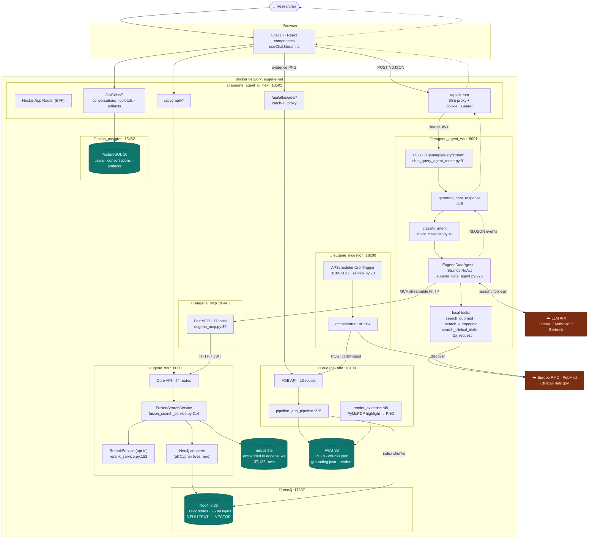
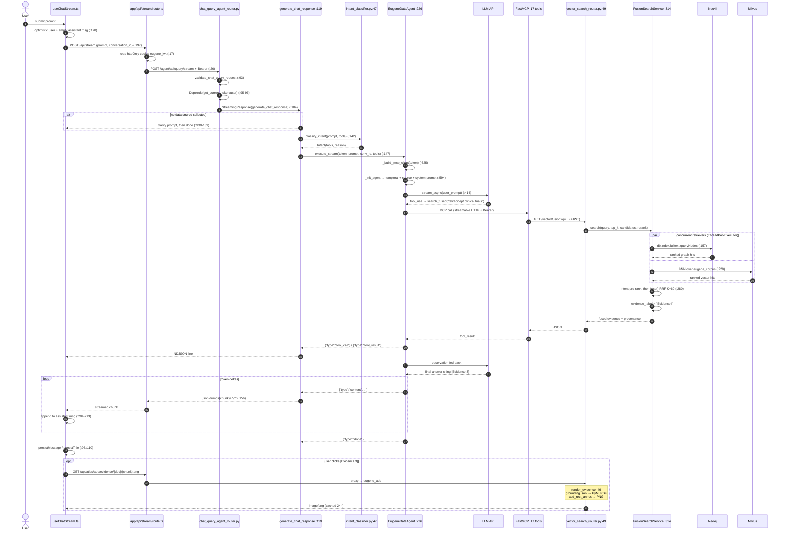

# Eugene — Complete System Architecture Analysis

**Purpose:** reverse-engineered documentation of this repository, written so a senior
engineer can understand the whole system in one reading without running it first.

**Method:** documentation pass → inventory pass → entry-point pass → trace pass →
synthesis. Every behavioural claim cites a file path, with line numbers where they
are meaningful. Diagrams are Mermaid. Route facts were additionally verified
against each service's live `/openapi.json`.

**Analysed:** 2026-08-05, against the running local stack (all 9 containers up).

---

## Contents

- [0. Inventory pass](#0-inventory-pass)
- [0b. Documentation pass — what the docs claim](#0b-documentation-pass--what-the-docs-claim)
- [1. Program entry & exit — internal route call map](#1-program-entry--exit--internal-route-call-map)
- [2. Full end-to-end architecture explanation](#2-full-end-to-end-architecture-explanation)
- [3. Architecture diagram](#3-architecture-diagram)
- [4. Sequence diagram](#4-sequence-diagram)
- [5. Configuration deep-dive](#5-configuration-deep-dive)
- [6. Agent invocation — how the call is made](#6-agent-invocation--how-the-call-is-made)
- [7. Docker & runtime topology](#7-docker--runtime-topology)
- [8. Gaps & risks](#8-gaps--risks)
- [9. New developer quickstart](#9-new-developer-quickstart)

---

## 0. Inventory pass

### 0.1 Top-level directories

| Directory | Purpose |
|---|---|
| `src/` | **Core API** (`eugene_ws`) — graph queries, vector/fused retrieval, stats, auth. DDD-layered |
| `agents/` | All service tiers: `eugene-agent-ws` (LLM agent), `eugene-mcp` (tool server), `eugene-ade` (document extraction), `eugene-agent-ui-next` (Next.js UI), `eugene-agent-ui` (legacy Streamlit), `mlflow-0` (offline eval experiments) |
| `ingestion/` | Nightly discovery/extraction scheduler and orchestrator |
| `eval/` | Retrieval + answer accuracy harness (added recently; see §8) |
| `docker/` | One Dockerfile per service |
| `containers/` | Per-service `requirements.txt` consumed by the Dockerfiles |
| `docs/` | Project documentation (**note: `docs/`, not `doc/`** — the prompt's `doc/` does not exist) |
| `infrastructure/` | Terraform for AWS deployment |
| `bin/` | Seed scripts, Cypher loaders, operational tooling |
| `tests/` | **Test *data* only** (31 JSON fixtures). Test *code* is colocated as `*_test.py` beside sources |
| `eugene/` | EC2 machine setup + database install docs |
| `dumps/`, `s3-data/`, `knowledge-graph-external-data/` | Raw and staged source data |
| `api-canaries/`, `difflabs/` | Synthetic monitoring and deployment-specific assets |

### 0.2 Languages, frameworks, drivers

| Concern | Choice | Evidence |
|---|---|---|
| Backend language | Python 3.13 | `docker/eugene_ws/Dockerfile:1` (`python:3.13-slim`) |
| Web framework | **FastAPI** (all four Python services) | `src/eugene_ws.py:110`, `agents/eugene-agent-ws/src/eugene_chat_ws.py:53`, `agents/eugene-ade/src/ade/api.py:31`, `ingestion/scheduler/service.py:88` |
| ASGI server | uvicorn | `docker/eugene_ws/Dockerfile:44` |
| **Agent framework** | **Strands Agents SDK** — *not* LangGraph/LangChain/CrewAI | `agents/eugene-agent-ws/src/query/agent/eugene_data_agent.py:8-19` |
| Tool protocol | **MCP** via **FastMCP** | `agents/eugene-mcp/src/eugene_mcp.py:5` |
| Neo4j driver | **official `neo4j` Python driver (Bolt)** — *not* py2neo, *not* a GraphRAG library | `src/graph/infra/db/graph_db_connection_factory.py:5,41` |
| Cypher | **Hand-written string templates**, parameterised | e.g. `src/foundation/infra/db/adapter/neo4j_foundational_n_hop_adapter.py:126-148` |
| Vector store | **Milvus** (embedded *milvus-lite*, single file) | `src/foundation/vector/vector_search_service.py:15,36` |
| Embeddings | `sentence-transformers/all-MiniLM-L6-v2`, 384-dim, CPU | `src/foundation/vector/vector_search_service.py:22-23,73` |
| Reranker | `BAAI/bge-reranker-base` cross-encoder, CPU | `src/foundation/vector/rerank_service.py:45` |
| LLM providers | **Bedrock (Nova) / Anthropic / OpenAI**, switchable | `agents/eugene-agent-ws/src/query/conf/conf.py:18-59` |
| Frontend (primary) | **Next.js 14 + Chakra UI + Cytoscape** | `agents/eugene-agent-ui-next/package.json` |
| Frontend (legacy) | Streamlit | `docker-compose.yml:205-222` |
| Relational store | PostgreSQL 16 (UI workspace only) | `docker-compose.yml:72` |
| Document parsing | PyMuPDF + DocLayout-YOLO | `agents/eugene-ade/requirements.txt` |
| Rate limiting | `slowapi` | `src/eugene_ws.py:6-8,113-116` |
| Logging | `python-json-logger` structured JSON | `src/util/observability.py:23` |

> **Ambiguity flagged:** `src/graph/infra/db/graph_db_connection_factory.py:19` — the
> generic `instance()` returns a **Kuzu** connection, not Neo4j. Kuzu is an embedded
> graph DB used by an earlier experiment. The live API path uses
> `remote_neo4j_instance_from_env()` (line 53). Kuzu is vestigial on the serving path
> but still imported at module load (line 3), so `kuzu` remains a hard dependency.

---

## 0b. Documentation pass — what the docs claim

`docs/` holds ~30 documents. The most load-bearing:

| Document | Claim |
|---|---|
| `docs/DEVELOPER_GUIDE.md` | Eugene is a biomedical KG + chat agent. **"5 running services"**, Streamlit UI, **12 MCP tools**, **20 endpoints**, 5-step request flow UI → Agent → MCP → Core API → Neo4j |
| `docs/EUGENE_COMPLETE_DOCUMENTATION.md` | Full system reference (2,071 lines) |
| `docs/INGESTION_ARCHITECTURE.md` | Nightly discover → extract → index → rank pipeline |
| `docs/ADE_EVIDENCE_PLAN.md` | Plan for grounded evidence rendering |
| `docs/ROUTE_DEEP_DIVE.md` | Per-route walkthroughs |
| `docs/graphrag.md` | Marked **deprecated** in `README.md:47-50` |
| `README.md:5` | *"Since this project is an experiment, some folders and files are deprecated."* |

### Drift between docs and code — reconciled

The `DEVELOPER_GUIDE` describes an **earlier, smaller system**. Verified differences:

| Claim (`docs/DEVELOPER_GUIDE.md`) | Reality | Evidence |
|---|---|---|
| "**5 running services**" | **9** compose services | `docker-compose.yml` — neo4j, atlas_postgres, eugene_ws, eugene_mcp, eugene_agent_ws, eugene_agent_ui, eugene_agent_ui_next, eugene_ade, eugene_ingestion |
| UI is **Streamlit**, port 8501 | Primary UI is **Next.js** on 18502; Streamlit kept "for regression parity" | `docker-compose.yml:203-205` comment: *"FRONTEND TIER (legacy) … New traffic should use eugene_agent_ui_next"* |
| MCP has **12 tools** | **17 tools** | `agents/eugene-mcp/src/eugene_mcp.py:39-66` |
| Core API has **20 endpoints** | **44** | live `/openapi.json` on :18000 |
| Diagram: `UI → AGENT → MCP → API → DB` | Correct but incomplete — omits ADE, ingestion, Postgres, and the UI's direct calls to Core API and ADE | `docker-compose.yml:227-250` |
| §12 Testing: *"pytest … all tests, parallel, with coverage"* | 40 `*_test.py` files exist; **no CI config found**, and coverage is unverified | see §8 |

**Verdict:** treat `DEVELOPER_GUIDE.md` as accurate for *intent and layering*, and as
stale for *counts, topology, and the frontend*. The newer
`docs/EUGENE_MASTER_IMPLEMENTATION_GUIDE.md` and `docs/EUGENE_API_ROUTES.md` match the
current code.

---

## 1. Program entry & exit — internal route call map

### 1.1 Entry points

| Service | Container CMD/ENTRYPOINT | App object | File |
|---|---|---|---|
| Core API | `uvicorn eugene_ws:app --app-dir src --host 0.0.0.0 --port 8000` | `app` | `docker/eugene_ws/Dockerfile:44` → `src/eugene_ws.py:110` |
| Agent | uvicorn `eugene_chat_ws:app` | `app` (`root_path="/agent/api"`) | `agents/eugene-agent-ws/src/eugene_chat_ws.py:53-57` |
| MCP | `main()` → `FastMCP(...)` | `mcp` | `agents/eugene-mcp/src/eugene_mcp.py:93-96` |
| ADE | uvicorn `ade.api:app` | `app` (with `lifespan`) | `agents/eugene-ade/src/ade/api.py:23-40` |
| Ingestion | uvicorn `service:app` | `app` (with `lifespan`) | `ingestion/scheduler/service.py:88-93` |
| Next.js UI | `next start` on 18502 | App Router | `docker/eugene_agent_ui_next/Dockerfile` |
| Streamlit UI | `streamlit run` on 8501 | — | `docker/eugene_agent_ui/Dockerfile` |

### 1.2 Core API boot sequence — exact order

`src/eugene_ws.py`, executed top-to-bottom at import:

```
107  configure_json_logging("eugene-ws")      # structured JSON logging first
108  load_env()                               # find_dotenv() + load_dotenv()
110  app = FastAPI(title="Eugene Core API", version="2.0.0")
113  limiter = make_limiter()                 # slowapi
114  app.state.limiter = limiter
115  app.add_exception_handler(RateLimitExceeded, _rate_limit_exceeded_handler)
116  app.add_middleware(SlowAPIMiddleware)    # ← outermost
119  app.add_middleware(CORSMiddleware, ...)  # origins from EUGENE_CORS_ORIGINS
128  app.middleware("http")(request_id_middleware)   # X-Request-ID
130  add_routers(app)                         # 24 routers registered
```

**Middleware chain (request order):** `SlowAPIMiddleware` → `CORSMiddleware` →
`request_id_middleware` → route handler. Starlette applies middleware in reverse
registration order, so the last-registered (`request_id_middleware`) runs closest to
the handler.

**Router registration** — `src/eugene_ws.py:31-103`. Note lines 86-101: the vector
router is imported inside a `try/except` because `pymilvus` **raises at import time**
on a malformed URI; guarding it costs 5 routes instead of the whole API.

### 1.3 Lifecycle — the honest picture

| Service | Startup hook | Shutdown hook |
|---|---|---|
| **Core API** | **None.** No `lifespan`, no `on_event` | **None** |
| Agent | None | None |
| **ADE** | `lifespan` warms the YOLO model — `agents/eugene-ade/src/ade/api.py:23-28` | none (no explicit teardown) |
| **Ingestion** | `lifespan` starts APScheduler — `ingestion/scheduler/service.py:70-83` | `scheduler.shutdown(wait=False)` — line 85 |

> **Finding:** the **Core API has no lifespan handler at all**. The Neo4j driver is a
> class-level singleton created lazily on first use
> (`src/graph/infra/db/graph_db_connection_factory.py:34-50`) and **never closed** —
> there is no `driver.close()` anywhere on the serving path. In practice the process
> dying releases the sockets, so this is untidy rather than broken, but it means
> there is no graceful connection-pool teardown and no startup health gate on Neo4j.
> Pool behaviour is bounded by env vars (lines 38-40): `NEO4J_MAX_POOL_SIZE` (50),
> `NEO4J_CONNECTION_TIMEOUT` (10s), `NEO4J_MAX_TX_RETRY_TIME` (30s).

### 1.4 Internal route call map — Core API (`eugene_ws`, :18000)

Handler line numbers are from the router file; the delegation column names the
adapter that builds Cypher.

| Method + Path | Handler (file:line) | Delegates to | Neo4j / store access | Response |
|---|---|---|---|---|
| `GET /` | `root_router.py:12` | — | none | JSON, **auth required** |
| `GET /health` | `health_router.py:15` | — | none | `{status}` |
| `GET /health/ready` | `health_router.py:20` | dependency probes | connectivity check | readiness JSON |
| `GET /health/data-freshness` | `health_router.py:57` | snapshot query | `MATCH (:DataSnapshot)` | `{snapshot_date}` |
| `GET /login` | `auth/auth_router.py:30` | Entra ID | none | redirect |
| `GET /auth/callback` | `auth/auth_router.py:84` | `_validate_or_raise` (line 120) | none | HTML w/ token |
| `POST /auth/token` | `auth/auth_router.py:60` | `eugene_jwts` | none | `{access_token}` |
| `GET /auth/whoami` | `auth/auth_router.py:55` | `get_current_user` | none | claims, **auth** |
| `GET /releases` | `release_notes_router.py:13` | — | none | list |
| `GET /node/find/{node_value}` | `node_id_lookup_router.py:26` | `Neo4jFoundationalNodeAdapter` | name/index lookup (RANGE + FULLTEXT) | node ids |
| `POST /node/details` | `node_details_router.py:29` | `Neo4jFoundationalNodeAdapter` | `MATCH (n {node_id: $id})` | node details |
| `GET /labels/{label}` | `label_router.py:33` | `Neo4jFoundationalNodeAdapter` | `MATCH (n:<label>)` paged | page of nodes |
| `GET /count/{label}` | `count_router.py:29` | `Neo4jFoundationalNodeCountAdapter` | `count(n)` | `{count}` |
| `GET /graph/relationship/start/{start_id}` | `n_hop_router.py:28` | `Neo4jFoundationalNHopAdapter` | `_build_n_hop_by_id_query` — `n_hop_adapter.py:138-148` | edges |
| `GET /graph/facts/start/{start_id}` | `facts_router.py:30` | facts adapter | indication / contraindication / off-label rels | facts |
| `GET /graph/path/start/{start_id}/end/{end_id}` | `search_path_router.py:27` | path adapter | variable-length `MATCH` | paths |
| `GET /graph/reachability/start/.../end/...` | `search_path_router.py:67` | path adapter | existence check | boolean |
| `POST /facet/{label}` | `facet_router.py:31` | `Neo4jFoundationalFacetAdapter` | grouped counts | facets |
| `POST /similarity/{label}` | `similarity_router.py:35` | `Neo4jFoundationalSimilarityAdapter` | embedding/one-hot similarity | scores |
| `GET /drugs/aliases/{drug_name}` | `drug_alias_search_router.py:33` | `Neo4jDrugAliasesAdapter` | alias traversal | aliases |
| `GET /drugs/aliases/id/{drug_id}` | `drug_alias_search_router.py:65` | `Neo4jDrugAliasesAdapter` | alias traversal | aliases |
| `GET /patents/{drugs\|clinicaltrials\|geneproteins}` | `patent_search_router.py:43,86,129` | patent adapter | related-patent traversal | patents |
| `GET /count/patents/*` | `patent_count_router.py:32,50,68` | patent adapter | counts | `{count}` |
| `GET /pmids/*` | `pubmed_search_router.py:43,84,127` | pubmed adapter | related-doc traversal | PMIDs |
| `GET /count/pmids/*` | `pubmed_count_router.py:32,50,68` | pubmed adapter | counts | `{count}` |
| `GET /organizations/{organization_name}` | `organization_search_router.py:28` | organization adapter | name match | orgs + `node_id` |
| `GET /organizations/assets/{organization_id}` | `organization_search_router.py:67` | organization adapter | asset traversal | assets |
| `GET /stats` | `database_stats_router.py:20` | stats adapter | label/rel counts | `DatabaseStats` |
| `GET /stats/top-proteins` | `database_stats_router.py:26` | stats adapter | degree ranking | list |
| `GET /stats/shared-gene-diseases` | `database_stats_router.py:33` | stats adapter | shared-gene pairs | list |
| `POST /research/digest` | `digest_router.py:61` | inline Cypher | `MATCH (p:paper) WHERE p.indexed_at >= $since` | digest |
| `GET /vector/health` | `vector_search_router.py:21` | `VectorSearchService.health` | Milvus only | readiness |
| `GET /vector/search/{query}` | `vector_search_router.py:27` | `VectorSearchService.search` | Milvus only | hits |
| `GET /vector/fusion/health` | `vector_search_router.py:43` | `FusionSearchService.health` | Neo4j + Milvus | readiness |
| **`GET /vector/fusion`** | `vector_search_router.py:49` | `FusionSearchService.search` (`fusion_search_service.py:314`) | **both** — fulltext + vector | fused evidence |
| `GET /vector/fusion/{query}` | `vector_search_router.py:96` | same | same | **avoid — see §2.4** |

### 1.5 Route map — Agent (`eugene-agent-ws`, :18001, `root_path=/agent/api`)

| Method + Path | Handler (file:line) | Delegates to | Response |
|---|---|---|---|
| `GET /agent/api/` | `router/root_router.py:15` | — | JSON |
| `GET /agent/api/health` | `router/health_router.py:23` | — | `{status}` |
| `GET /agent/api/health/ready` | `router/health_router.py:28` | probes | readiness |
| `GET /agent/api/auth/whoami` | `router/auth/auth_router.py:17` | `get_current_user` | claims |
| `POST /agent/api/query` | `query/router/chat_query_agent_router.py:35` | `EugeneDataAgent.execute` | `ChatQueryResponse` |
| **`POST /agent/api/query/stream`** | `chat_query_agent_router.py:91` | `generate_chat_response` (line 119) → `EugeneDataAgent.execute_stream` | `StreamingResponse`, NDJSON over `text/event-stream` |

### 1.6 Route map — ADE (:18100) and Ingestion (:18200)

Full tables are in [EUGENE_API_ROUTES.md](EUGENE_API_ROUTES.md) §3–4. Summary:
ADE exposes 10 routes (`agents/eugene-ade/src/ade/api.py:75,92,98,115,137,145,167,180,202,219`);
Ingestion exposes 4 (`ingestion/scheduler/service.py:96,106,115,140`).

### 1.7 Where execution ends

| Path | Termination |
|---|---|
| Ordinary JSON route | Pydantic `response_model` serialization → `CORSMiddleware` adds headers → `request_id_middleware` stamps `X-Request-ID` → uvicorn writes response |
| **Chat stream** | `StreamingResponse` (`chat_query_agent_router.py:104`) consumes the async generator until `generate_chat_response` returns (line 156-160). Client disconnect propagates as generator close. **No explicit `finally` cleanup on the agent side** |
| ADE evidence render | PNG bytes + `Cache-Control: public, max-age=86400` (`ade/api.py:215`); PyMuPDF document closed in `finally` (`ade/render.py:83-84`) |
| ADE batch ingest | Returns `202`-style JSON immediately; work continues in `BackgroundTasks` (`ade/api.py:107`) — failures persisted by `pipeline.ingest_safe` (`ade/pipeline.py:404`) |
| Nightly sweep | `orchestrator.run()` returns a summary dict stored in `_state["last_result"]` (`ingestion/scheduler/service.py:66`) |
| Shutdown | Only Ingestion has one: `scheduler.shutdown(wait=False)` (line 85). **No Neo4j/Milvus teardown anywhere** |

---

## 2. Full end-to-end architecture explanation

### 2.1 Frontend — Next.js App Router (`agents/eugene-agent-ui-next`)

**Owns:** conversation UI, session cookie, conversation persistence, context-graph
rendering, and *all* browser-facing HTTP. **Boundary:** it never talks to Neo4j or
the LLM directly; it is a backend-for-frontend over the internal services.

- **Input capture and streaming** — `hooks/useChatStream.ts`. On submit it appends
  an optimistic user message plus an empty assistant message (line 178), then POSTs
  to `/api/stream` with `conversation_id` (line 197).
- **Transport is NDJSON over SSE-style streaming**, not WebSockets. The hook reads
  the body with a stream reader and dispatches on `ev.type`:
  `content` (line 204), `tool_call` (214), `tool_result` (234), `error` (254).
- **Auth bridging** — `app/api/stream/route.ts:16-23` reads the **httpOnly**
  `eugene_jwt` cookie and re-injects it as `Authorization: Bearer`. The browser never
  holds a bearer token. Line 51 sets `X-Accel-Buffering: no` so no proxy buffers the
  stream.
- **Persistence** — conversations and messages go to **Postgres**, not Neo4j, via
  `/api/atlas/conversations*` (`useChatStream.ts:73,96,110`).
- **Evidence** — `app/api/atlas/ade/[...path]/route.ts` is a catch-all proxy to ADE;
  binary responses stream through untouched.

### 2.2 Backend / Core API (`src/`) — DDD layering

**Owns:** graph access, retrieval, statistics, token issuance. **Boundary:** it knows
nothing about agents, prompts, or LLMs.

Layering, per package (`foundation`, `organization`, `stats`, `graph`, `tpp`):

```
router/     FastAPI routes; validation via Pydantic + Annotated
provider/   orchestration / use-case services
infra/db/adapter/   Neo4j adapters — the ONLY place Cypher is written
mapper/     row → domain model
model/      Pydantic domain + response models
conf/conf.py  manual dependency-injection factories
```

`conf.py` is the composition root: `src/foundation/conf/conf.py` imports every
adapter and wires it to the shared driver. There is **no DI container** — factories
are plain functions.

**Cypher construction** is hand-written parameterised templates. Example —
`neo4j_foundational_n_hop_adapter.py:138-148`:

```python
return """MATCH (startNode { node_id: $start_id })-[r]-{0,%s}(endNode%s)
          ...""" % (n_hop, label_filter)
```

Note the **hybrid**: `$start_id` is a bind parameter (safe), while hop count and
label filter are `%`-interpolated. Hop count is validated by
`_ensure_valid_n_hop_size_or_throw` (line 149); the label filter comes from a
path/query parameter. See §8.

**Cross-cutting** — JSON logging (`src/util/observability.py:23`), per-key rate
limiting (line 49), `X-Request-ID` propagation (line 60).

### 2.3 Agent layer (`agents/eugene-agent-ws`)

**Owns:** intent classification, tool selection, prompt assembly, the ReAct loop,
and event streaming. **Boundary:** it holds no database credentials — every graph
fact arrives through MCP tools.

**There is exactly one agent.** `EugeneDataAgent`
(`query/agent/eugene_data_agent.py:226`). No supervisor, no multi-agent graph, no
sequential chain. "Multi-agent" in this repo means **multiple services**, not
multiple LLM agents.

Orchestration is a **single ReAct loop with dynamic tool binding**:

1. `classify_intent(prompt, user_selected)` — `query/util/intent_classifier.py:47`,
   called at `chat_query_agent_router.py:142`. Deterministic, not an LLM call.
2. `_init_agent` (`eugene_data_agent.py:526`) selects the tool set from the enabled
   sources, deduplicates by object identity, and builds a three-part system prompt.
3. `agent.stream_async(user_prompt)` (line 414) runs Reason → Act → Observe.

**System prompt** is assembled per turn from three parts, in this order
(`eugene_data_agent.py:594-596`):

| Part | Source | Why first |
|---|---|---|
| Temporal directive | `build_temporal_directive(...)` | Without it the model answers "as of now" with its training cutoff — observed: a 2026 deployment reporting *"as of now means June 2024"* |
| Source directive | `build_source_directive(include_tools)` (line ~160-223) | Enforces strict source isolation; if the graph lacks the answer the agent must **ask consent** before going outside |
| Main prompt | `EugeneDataAgent.system_prompt` (line 227, ~48 lines) | Tool guide, citation rules, hard rules |

**Memory:** `SlidingWindowConversationManager(window_size=10, per_turn=2)` created
**per conversation** (line 310-314) — a shared instance leaked history across
concurrent users.

**Guard rails**, in two layers:

- *Prompt-level* (lines 252-266): never repeat an identical tool call; ≤20 tool calls
  per turn; never invent data; resolve alias nodes before claiming "no connection".
- *Code-level*, because a prompt rule is advisory: `_AGENT_MAX_ITERATIONS` = 20
  (line 33) and `_HARD_TOOL_CALL_BUDGET` = 25 (line 44) are enforced in the loop, and
  `max_parallel_tools` is pinned to 1. Both are applied via `setattr` after
  construction (lines 613-617) because Strands 1.21 exposes no constructor kwarg —
  wrapped in `try/except` so newer releases pick it up and older ones ignore it.
- *Tool-surface*: utility tools (`calculator`, `current_time`) and `python_repl` are
  **opt-in and off by default** (lines 36, 39). The recorded reason is a runaway ReAct
  loop — the agent spamming `current_time` while trying to "search the web".

### 2.4 Neo4j layer

**Graph model — live counts (2026-08-05):**

| Label | Nodes | Label | Nodes |
|---|---|---|---|
| `biological_process` | 28,642 | `drug` | 7,957 |
| `gene_protein` | 27,671 | `cellular_component` | 4,176 |
| `disease` | 17,080 | `clinical_trial` | 3,110 |
| `effect_phenotype` | 15,311 | `pathway` | 2,516 |
| `anatomy` | 14,035 | `exposure` | 818 |
| `molecular_function` | 11,169 | `paper` | 39 |
| `paper_chunk` / `evidence_span` | 9,039 (dual-labelled) | `DataSnapshot` | 2 |

**Relationship types (25):** biomedical edges (`drug_protein`, `disease_protein`,
`protein_protein`, `pathway_protein`, `indication`, `off-label use`, `drug_effect`,
`drug_drug`, `phenotype_*`, `exposure_*`, `molfunc_*`), trial edges (`evaluated_in`,
`featured_in`), and the document subgraph (`has_chunk`, `mentions`).

**Key properties:** `node_id`, `node_index`, `node_name`, `node_source` on entities;
`chunk_id`, `doc_id`, `page`, `bbox_*`, `text`, `chunk_type`, `content_hash`,
`table_row/col`, `parent_chunk_id` on `paper_chunk`.

**Indexes (live):** RANGE on `node_id`/`node_name` per label; three FULLTEXT —
`entity_names` (10 labels, on `node_name`), `eugene_fusion_fulltext`
(`clinical_trial|drug|disease|gene_protein`), **`paper_chunk_fulltext` (on `text`)**;
one VECTOR index `protein_embedding_vec` on `gene_protein.embedding`.
**Constraints:** `drug_idx_unique`, `paper_chunk_id`, `paper_doc_id`.

> Passages are indexed on `text`, not `node_name`, deliberately: `node_name` is only a
> 200-char preview, so indexing it would make most of a paper unsearchable
> (`fusion_search_service.py:68-97`).

**Retrieval is hybrid — and it is not a GraphRAG library.** It is hand-rolled
Reciprocal Rank Fusion in `src/foundation/vector/fusion_search_service.py`:

- `_graph_search` (line 157) — Lucene fulltext across two unioned indexes, escaping
  Lucene metacharacters so user text cannot inject query syntax.
- `_vector_search` (line 220) — Milvus kNN; degrades to graph-only if the collection
  is missing.
- `fuse` (line 280) — `score = Σ weight / (RRF_K + rank)`, `RRF_K = 60` (line 40),
  weights **graph 1.12 / vector 1.00** (lines 45-46). RRF works on **ranks**, which is
  the only comparable unit between a cosine similarity and a Lucene score.
- `search` (line 314) — runs both concurrently, pre-ranks graph hits by intent
  *before* fusing (RRF consumes rank position, so doing it after would be a no-op),
  optionally reranks, then issues `evidence_label` strings.
- Optional cross-encoder rerank — `rerank_service.py:152`, model at line 45, candidate
  cap 60 (line 54), MaxP windows of 600 chars (line 68).

**Citation integrity:** the *backend* issues `"Evidence {i}"` labels; the prompt
forbids the model from constructing internal URLs or chunk ids
(`eugene_data_agent.py:233`). Prevention, not detection.

> **Known trap:** `GET /vector/fusion/{query}` (path variant) 404s on any query
> containing `/` — and `BAFF/APRIL` is central to this corpus — *even
> percent-encoded*. Use `?q=`. Documented at `vector_search_router.py:56-65`.

### 2.5 Document tier (ADE) — where evidence comes from

Pipeline `agents/eugene-ade/src/ade/pipeline.py:215` (`_run_pipeline`):
fetch → store → parse → layout → table cells → verify → enrich → artifacts → index.

The load-bearing idea: `parser.py:70` normalizes every bounding box to **fractions of
the page**, which is what lets `render.py:34` (`_rect_for`) place a highlight
correctly at any DPI. Chunk ids are deterministic SHA-1 (`parser.py:49`) because the
same string is both the Neo4j key and the Milvus primary key with no join table.

"Agentic" here means a **verify/retry loop with no LLM** (`verify.py:76`,
`retry_settings` at line 175), not a language model.

---

## 3. Architecture diagram



---

## 4. Sequence diagram

Query: *"What clinical trials exist for telitacicept?"*



---

## 5. Configuration deep-dive

### 5.1 Every configuration source

| # | Source | Location | Consumed by |
|---|---|---|---|
| 1 | `docker.env` | repo root, **git-ignored**; template at `docker.env.template` | `env_file:` in compose for `eugene_ws`, `eugene_mcp`, `eugene_agent_ws`, `eugene_agent_ui_next`, `eugene_ade` |
| 2 | `environment:` blocks | `docker-compose.yml` | per-service overrides |
| 3 | Host env / shell | `${VAR:-default}` interpolation in compose | compose at parse time |
| 4 | `.env` via python-dotenv | `find_dotenv()` at `src/eugene_ws.py:23` | in-container fallback |
| 5 | Python config modules | `src/foundation/conf/conf.py`, `agents/eugene-agent-ws/src/query/conf/conf.py`, `agents/eugene-mcp/src/conf/conf.py` | DI factories reading `os.environ` |
| 6 | YAML | `ingestion/src/pipeline/config/research_areas.yaml` | `orchestrator.load_config():44` |
| 7 | `.pytest.ini` | repo root | pytest |

> **There is no Pydantic `BaseSettings`.** All configuration is read with
> `os.environ.get(...)` at module import or first use. Consequences: no schema, no
> type coercion beyond manual `int()`/`float()`, and **no startup validation** — a
> typo'd variable silently becomes its default.

### 5.2 Precedence order

```
shell env  >  docker-compose `environment:`  >  docker-compose `env_file: docker.env`
           >  in-container .env (python-dotenv)  >  os.environ.get() default in code
```

Two important consequences:

1. `environment:` **wins over** `env_file:`. So `ENVIRONMENT=local`
   (`docker-compose.yml:196`) overrides anything in `docker.env`.
2. `load_dotenv()` at `src/eugene_ws.py:25` is called **without** `override=True`, so
   it will **not** clobber variables already injected by Docker. Correct behaviour,
   easy to get wrong.

### 5.3 Flow from compose into the app

```
docker compose up
  → compose interpolates ${VAR:-default} from the host shell
  → container env = env_file(docker.env) + environment: block
  → CMD uvicorn eugene_ws:app --app-dir src
      → import src/eugene_ws.py
          :107 configure_json_logging()
          :108 load_env() → find_dotenv() → load_dotenv() (non-override)
          :110 app = FastAPI(...)
          :130 add_routers() → imports conf.py modules
                → factories call os.environ[...] → adapters constructed
      → first request touches GraphDbConnectionFactory
          → remote_neo4j_instance_from_env() reads NEO4J_URI/USERNAME/PASSWORD
          → driver created lazily and cached on the class
```

### 5.4 Key variables by domain

**Neo4j** — `NEO4J_URI` (`bolt://neo4j:7687`), `NEO4J_USERNAME`, `NEO4J_PASSWORD`,
`NEO4J_MAX_POOL_SIZE` (50), `NEO4J_CONNECTION_TIMEOUT` (10), `NEO4J_MAX_TX_RETRY_TIME`
(30). Database name is **not** configurable on the serving path — adapters default to
`database="neo4j"` (`neo4j_foundational_n_hop_adapter.py:25`).

**LLM** — `LLM_PROVIDER` (`bedrock|anthropic|openai`; auto-detects from available keys
if unset, `query/conf/conf.py:18-35`), `OPENAI_API_KEY`, `OPENAI_MODEL_ID`
(default `gpt-4.1-mini`, **compose runs `gpt-4.1`**), `ANTHROPIC_API_KEY`,
`ANTHROPIC_MODEL_ID` (`claude-sonnet-4-20250514`), `BEDROCK_MODEL_ID`
(`amazon.nova-lite-v1:0`).

> **Temperature is never set.** No `temperature`/`top_p` appears in
> `query/conf/conf.py` or `LlmFactory` — every call uses provider defaults. If
> determinism matters for a regression suite, this is the gap to close.

**Vector / rerank** — `EUGENE_MILVUS_URI` (**not** `MILVUS_URI`; see the warning at
`vector_search_service.py:31-38` — pymilvus reads a bare `MILVUS_URI` into its global
config **at import time** and demands `http(s)://`, so pointing it at a file path made
`import pymilvus` raise and silently disabled every `/vector` route),
`EUGENE_RERANK_MODEL`, `EUGENE_RERANK_MAX_CANDIDATES` (60), `EUGENE_RERANK_WINDOW`
(600), `EUGENE_RERANK_ENABLED`.

**ADE** — `ADE_S3_BUCKET` (**required, no default** — `storage.py:61-62` raises),
`AWS_REGION`, `ADE_LAYOUT_ENABLED`, `ADE_LAYOUT_CONF` (0.25), `ADE_LAYOUT_MIN_IOU`
(0.15), `ADE_MAX_CONCURRENT_INGESTS` (2), `ADE_GRAPH_INDEX_ENABLED`.

**Ingestion** — `INGESTION_HOUR` (1), `INGESTION_MINUTE` (0), `INGESTION_TZ` (UTC),
`INGESTION_ADE_TIMEOUT_S` (600), `INGESTION_CONFIG`.

**Auth / service discovery** — `EUGENE_TENANT_ID`, `EUGENE_CLIENT_ID`,
`EUGENE_CLIENT_SECRET`, `REDIRECT_PATH`, `EUGENE_AGENT_ALLOWLIST` (empty = any
authenticated user, `agents/eugene-agent-ws/src/router/auth/auth.py:31`),
`EUGENE_MCP_SERVER_URL`, `EUGENE_CORE_API_URL`, `EUGENE_API_BASE` (**required** —
`agents/eugene-mcp/src/conf/conf.py:36` raises if absent), `EUGENE_ADE_URL`,
`ATLAS_DATABASE_URL`, `ATLAS_JWT_SECRET`, `EUGENE_MCP_VERIFY_SSL`,
`EUGENE_CORS_ORIGINS`, `EUGENE_MAX_PROMPT_CHARS` (40000).

### 5.5 Hardcoded secrets and config problems — flagged

| Issue | Location | Severity |
|---|---|---|
| **JWT secret with a working default** — `ATLAS_JWT_SECRET:-dev-atlas-secret-change-in-prod-please-32chars` | `docker-compose.yml:249` | **High.** Deploys silently with a public, guessable signing key |
| **Neo4j password default** `eugene_local_2024` in compose and in code | `docker-compose.yml:108`, `ade/indexer.py:53` | **High** if ever reachable off-host |
| **Postgres password default** `atlas_local_2026` | `docker-compose.yml:248` | Medium |
| `ENVIRONMENT=local` hardcoded in the compose file | `docker-compose.yml:109,196` | Medium — easy to ship a "local" auth posture |
| `docker.env` keys read but never validated at startup | all `conf.py` | Medium — failure surfaces as a 500 on first request |
| Model default drift: code `gpt-4.1-mini`, compose `gpt-4.1` | `query/conf/conf.py:57` vs `docker.env` | Low — but the doc'd default is not what runs |
| Kuzu imported but unused on the serving path | `graph_db_connection_factory.py:3` | Low — dead dependency in the image |

---

## 6. Agent invocation — how the call is made

### Step 1 — instantiation (module import, not per request)

```python
# agents/eugene-agent-ws/src/query/conf/conf.py:64
def eugene_data_agent() -> EugeneDataAgent:
    return EugeneDataAgent(
        eugene_mcp_server_url=eugene_mcp_server_url(),   # :37
        model=llm_model(),                               # :41
    )
```

Called once at router import — `chat_query_agent_router.py:27`
(`eugene_agent = eugene_data_agent()`). **The wrapper is a module-level singleton;
the Strands `Agent` object itself is rebuilt per request** (§3), which is what keeps
concurrent conversations isolated.

`llm_model()` (`conf.py:41-59`) resolves the provider and returns a Strands model via
`LlmFactory`.

### Step 2 — handing the user message over

`chat_query_agent_router.py:147` — a direct `async for` over an async generator. **No
task queue, no `graph.invoke()`** (there is no graph — it is not LangGraph):

```python
async for chunk in eugene_agent.execute_stream(
    token=token, user_prompt=prompt,
    conversation_id=chat_request.conversation_id,
    include_tools=tools,
):
    yield json.dumps(chunk, ensure_ascii=False, default=str) + "\n"
```

### Step 3 — prompt assembly

`eugene_data_agent.py:594-596`:

```python
system_prompt = f"{temporal_directive}\n\n{source_directive}\n\n{self.system_prompt}"
```

- `temporal_directive` — `build_temporal_directive(online, snapshot_date)`;
  `snapshot_date` is fetched from Core API `/health/data-freshness` and cached 15
  minutes (`_snapshot_date`, line 285-308).
- `source_directive` — `build_source_directive(include_tools)`, encodes the
  consent-before-external-source policy.
- `self.system_prompt` — the static prompt at line 227.

**Retrieved graph context is *not* stuffed into the system prompt.** It arrives as
*tool results* inside the ReAct loop. Chat history is managed by the sliding-window
conversation manager, not concatenated manually.

### Step 4 — tool binding and the round trip

Binding — `_init_agent` (`eugene_data_agent.py:526-620`): local Strands tools are
appended per enabled source, MCP tools come from `mcp_client.list_tools_sync()`, both
are deduplicated by `id()` and passed as `tools=[*mcp_tools, *local_tools]` to
`Agent(...)` (line 600).

Round trip:

```
LLM emits tool_use  →  Strands dispatches
    → MCP tool over streamable HTTP with Bearer token
        (agents/eugene-mcp/src/util/context.py:6 extracts it from the Authorization header)
    → tool builds a Core API URL   (eugene_vector_tools.py:40)
    → Core API runs Cypher / Milvus
    → JSON back to the tool → back to Strands → appended as observation
    → LLM reasons again, or emits the final answer
```

**Token propagation is end-to-end:** browser cookie → `Bearer` (Next.js proxy) →
`Depends(get_current_token)` → `MCPClient` header (line 625-637) → FastMCP
`extract_token()` → Core API `Authorization`. The agent never holds DB credentials.

### Step 5 — output back to HTTP

Streaming, not return-value. `agent.stream_async(user_prompt)` (line 414) yields
Strands events; `_extract_tool_events` converts them into the UI envelope; the
router serialises each as an NDJSON line (`chat_query_agent_router.py:156`) inside a
`StreamingResponse` (line 104). The non-streaming `POST /query` (line 35) uses
`execute()` (line 317) and returns a single `ChatQueryResponse`.

**Resilience:** `execute_stream` retries up to `EUGENE_AGENT_MODEL_RETRIES` (default 3)
on transient model errors, each attempt with a **fresh session id** so a failed turn's
partial tool-use state is not replayed into the model (lines 352-370).

---

## 7. Docker & runtime topology

### 7.1 Services

| Service | Image / build | Host port | Volumes | Healthcheck | depends_on |
|---|---|---|---|---|---|
| `neo4j` | `neo4j:5.26.9-community-bullseye` | 17474, 17687 | `eugene_neo4j_data`, `eugene_neo4j_logs` | `wget --spider :7474` (:59) | — |
| `atlas_postgres` | `postgres:16-alpine` | 15432 | `atlas_pg_data` | `pg_isready` (:83) | — |
| `eugene_ws` | `docker/eugene_ws/Dockerfile` | 18000 | `eugene_vector`, `eugene_hf_cache` | urllib `/health` (:143) | `neo4j` (**`service_healthy`**) |
| `eugene_mcp` | `docker/eugene_mcp/Dockerfile` | 18443 | — | — | `eugene_ws` (**healthy**) |
| `eugene_agent_ws` | `docker/eugene_agent_ws/Dockerfile` | 18001 | — | — | `eugene_mcp` (**start only**) |
| `eugene_agent_ui` | `docker/eugene_agent_ui/Dockerfile` | 18501 | — | — | `eugene_agent_ws` |
| `eugene_agent_ui_next` | `docker/eugene_agent_ui_next/Dockerfile` | 18502 | — | — | `eugene_agent_ws`, `eugene_ws`, `atlas_postgres` |
| `eugene_ade` | `docker/eugene_ade/Dockerfile` | 18100 | `eugene_ade_models` | urllib `/health` (:294) | `neo4j` (**healthy**) |
| `eugene_ingestion` | `docker/eugene_ingestion/Dockerfile` | 18200 | — | urllib `/health` (:346) | `eugene_ade` |

Network: single bridge `eugene-net`. Six named volumes.

> **Ordering gap:** only `eugene_ws` and `eugene_ade` use
> `condition: service_healthy`. `eugene_agent_ws`, both UIs and `eugene_ingestion` use
> bare `depends_on`, which waits for *container start*, not readiness. On a cold boot
> the agent can come up before MCP is serving; it recovers on the first request, but
> the first request may fail.

### 7.2 Dockerfile build strategy

`docker/eugene_ws/Dockerfile` is **single-stage** (`python:3.13-slim`), not multi-stage:

- **Line 13** installs `torch==2.7.0` from the **CPU wheel index first** — this skips
  ~4.5 GB of NVIDIA/CUDA transitive dependencies. Line 21 adds the same index as an
  `--extra-index-url` so anything resolving torch transitively also gets the CPU wheel.
  A recent commit records the effect: *"CPU-only torch — cut image 7.45GB → 2.04GB"*.
- **Lines 30-40** create a non-root `eugene` user and — critically — **`mkdir` the
  volume mount points inside the image and `chown` them** before `USER eugene`. Docker
  initialises a named volume from the image path's contents *and ownership*; without
  this the directories appear root-owned at mount time and the uid-1000 process cannot
  write them, which *silently broke milvus-lite* (PermissionError on its `.lock`) and
  the HuggingFace cache.
- Final image contains: Python 3.13, CPU torch, app deps, `slowapi`,
  `python-json-logger`, and `src/`. No build toolchain removal step, so
  `build-essential` remains in the layer cache (line 6).

### 7.3 Bring-up and verification

```bash
cp docker.env.template docker.env      # then fill in the keys
docker compose up -d --build           # ~10-15 min cold (torch + YOLO weights)
docker compose ps                      # all 9 services

# health, in dependency order
curl -s localhost:17474 >/dev/null && echo "neo4j ok"
docker exec atlas-postgres pg_isready -U atlas
curl -s localhost:18000/health && curl -s localhost:18000/vector/fusion/health
curl -s localhost:18443/health
curl -s localhost:18001/agent/api/health
curl -s localhost:18100/health          # includes S3 + layout-model status
curl -s localhost:18200/health          # includes next scheduled run
open http://localhost:18502
```

Expect `{"ready":true}` from `/vector/fusion/health` only after the corpus is
embedded; ADE `/health` reports `"status":"DEGRADED"` if `ADE_S3_BUCKET` is unset or
unreachable.

---

## 8. Gaps & risks

### 8.1 Drift from documentation

| # | Drift | Evidence |
|---|---|---|
| D1 | `docs/DEVELOPER_GUIDE.md` describes **5 services, 12 tools, 20 endpoints, Streamlit UI**; reality is **9 / 17 / 44 / Next.js** | §0b |
| D2 | The prompt (and some docs) refer to a `doc/` folder — it is `docs/` | `ls` |
| D3 | `docs/graphrag.md` describes a GraphRAG approach marked deprecated; current retrieval is hand-rolled RRF | `README.md:47`, `fusion_search_service.py` |
| D4 | `README.md:5` warns the repo contains deprecated folders but does not enumerate them | `README.md` |
| D5 | `DEVELOPER_GUIDE` §12 implies a working coverage-gated suite; no CI workflow found | §8.3 |

### 8.2 Security

| # | Risk | Severity | Location |
|---|---|---|---|
| S1 | **`ATLAS_JWT_SECRET` has a working default.** Any deploy that forgets to set it signs sessions with a value published in the repo | **High** | `docker-compose.yml:249` |
| S2 | **ADE and Ingestion have no authentication at all.** `POST /ade/ingest` and `POST /ingest/run` trigger expensive work; ADE also serves original PDFs | **High** if exposed | `ade/api.py`, `ingestion/scheduler/service.py` |
| S3 | **Core API data routes are unauthenticated in this configuration** — `/stats`, `/labels/*`, `/graph/*`, `/vector/*` return 200 without a token (verified). Only `/` and `/auth/whoami` are gated | **High** if exposed | verified by request |
| S4 | Default Neo4j/Postgres passwords in compose and in `ade/indexer.py:53` | High | see §5.5 |
| S5 | **Cypher built with `%`-interpolation** for hop count and label filters. Hop count is validated (`n_hop_adapter.py:149`); **the label filter path is worth an audit** — it reaches the template from a request parameter | Medium | `n_hop_adapter.py:126-148` |
| S6 | `EUGENE_MCP_VERIFY_SSL=false` escape hatch exists for dev | Low–Medium | `eugene_data_agent.py:626` |
| S7 | `python_repl` is importable into the agent's tool namespace (`eugene_data_agent.py:11`) — **but it is correctly gated** behind `EUGENE_ALLOW_PYTHON_REPL`, default `"false"` (line 36), and is set nowhere in compose or `docker.env`. Same for `calculator`/`current_time` via `EUGENE_ALLOW_UTILITY_TOOLS` (line 39). **This is a control, not a defect** — noted so nobody enables it casually | Low (as shipped) | `eugene_data_agent.py:36,39,551-554` |
| S8 | Full JWT prefix logged (`token[0:8]`) — truncated, so low risk, but tokens flow through many hops | Low | `mcp/util/context.py:16` |

### 8.3 Testing

- **40 colocated `*_test.py` files** exist plus 31 JSON fixtures in `tests/data/` — so
  the claim "there are no tests" would be wrong.
- **No CI configuration was found** (`.github/workflows`, `.gitlab-ci.yml` absent), so
  nothing enforces that they pass.
- **No tests cover the new subsystems**: `eval/`, `rerank_service.py`, the ADE
  pipeline, or the fusion service. The `eval/` harness measures *accuracy*, not
  correctness, and needs a live stack.
- No contract tests between MCP tools and Core API routes — a route rename breaks the
  agent silently at runtime.

### 8.4 Single points of failure & operational

| # | Risk | Detail |
|---|---|---|
| O1 | **milvus-lite is single-process** — only `eugene_ws` may open it. It cannot be scaled horizontally, and a second replica would fail on the lock file | `README` of ADE; `corpus_ingest_service` comment |
| O2 | **Neo4j is a single community-edition container**, one volume, no replica | `docker-compose.yml:36` |
| O3 | **No Neo4j driver teardown, no lifespan on the Core API** | §1.3 |
| O4 | **Cross-encoder rerank costs ~20–30 s/query on CPU** — measured ~0.46 s per candidate; unusable interactively without a GPU | `rerank_service.py:48-54` |
| O5 | **ADE `_MAX_CONCURRENT_INGESTS=2`** — measured, 5 concurrent YOLO runs pushed the container to 1211% CPU and starved neighbours | `pipeline.py:28-40` |
| O6 | Ingestion single-flight lock is **in-process** — two scheduler replicas would both run | `service.py:35` |
| O7 | **5 routes are dead code** (`organization_alias_search_router`, `tpp/search_router`) — implemented, never mounted, absent from the live spec | `src/eugene_ws.py:56-79` |
| O8 | **Entity linking is name-match only** (~4.5 mentions/paper), capped at 40, scoped to title + opening chunks — misses synonym-only mentions | `ade/indexer.py:231-281` |
| O9 | Same paper under two identifiers becomes **two documents** (PMID vs PMCID slug to different `doc_id`s) — dedup on DOI not implemented | `agents/eugene-ade/README.md` |
| O10 | **No OCR** — scanned PDFs flagged `text_layer: false` and yield nothing | `parser.py:299` |
| O11 | Source edits are currently `docker cp`'d into the running `eugene-ws`; a rebuild is required to persist the retrieval changes | see §9 step 9 |

### 8.5 Correctness traps worth knowing

- `GET /vector/fusion/{query}` 404s on queries containing `/` — use `?q=`.
- `EUGENE_MILVUS_URI`, never `MILVUS_URI` — the latter breaks `import pymilvus`.
- IDF query boosting is **deliberately gated behind `rerank=true`**: on its own it
  moved fused retrieval@10 *down* 38.5% → 28.3% (`fusion_search_service.py:181-193`).
- An MS MARCO cross-encoder is the wrong reranker here — it scored a table containing
  the answer at −7.49 versus −1.46 for an unrelated abstract, and drove retrieval@10
  from 43.5% to 6.5% (`rerank_service.py:36-44`).

---

## 9. New developer quickstart

**From `git clone` to a working chat session — 10 steps.**

```bash
# 1. Clone and enter
git clone <repo-url> knowledgeGraph && cd knowledgeGraph

# 2. Create the env file (git-ignored) and fill it in
cp docker.env.template docker.env
#    Required minimum:
#      NEO4J_URI=bolt://neo4j:7687
#      NEO4J_USERNAME=neo4j
#      NEO4J_PASSWORD=<choose one>
#      LLM_PROVIDER=openai            # or anthropic / bedrock
#      OPENAI_API_KEY=sk-...
#      OPENAI_MODEL_ID=gpt-4.1
#      EUGENE_API_BASE=http://eugene_ws:8000    # REQUIRED by eugene_mcp, no default
#    Optional (document/evidence tier):
#      ADE_S3_BUCKET=<bucket>  AWS_REGION=us-east-1  + AWS credentials
#    STRONGLY recommended: set ATLAS_JWT_SECRET to a real 32+ char secret (see §5.5 S1)

# 3. Build and start everything (cold build ~10-15 min: torch + YOLO weights)
docker compose up -d --build

# 4. Watch the dependency-ordered services come healthy
docker compose ps
docker compose logs -f eugene_ws        # Ctrl-C when "Application startup complete"

# 5. Verify the data tier
curl -s localhost:18000/health
curl -s localhost:18000/stats | head -c 300      # expect ~142k nodes if seeded
#    If the graph is empty, load it first — see eugene/README.md and bin/seed/

# 6. Verify retrieval (BOTH retrievers must be ready)
curl -s localhost:18000/vector/fusion/health
#    {"graph":true,"vector":true,"corpus_rows":N,"ready":true}
#    If "vector":false → embed the corpus:
#      docker exec eugene-ws python -m foundation.vector.corpus_ingest_service \
#        --labels paper_chunk,drug,disease,clinical_trial

# 7. Verify the agent tier
curl -s localhost:18443/health                  # MCP tool server
curl -s localhost:18001/agent/api/health        # agent
open http://localhost:18001/agent/api/docs      # Swagger

# 8. Open the chat UI and ask something
open http://localhost:18502
#    Register/login, then pick a data source chip (Eugene KG) — with NO source
#    selected the agent deliberately returns a clarity prompt instead of guessing
#    (chat_query_agent_router.py:130).
#    Try: "What clinical trials exist for telitacicept?"

# 9. (Optional) Document/evidence tier
curl -s localhost:18100/health                  # S3 + layout model status
curl -X POST localhost:18100/ade/ingest -H 'Content-Type: application/json' \
  -d '{"source":"europepmc","id":"PMC13202553"}'
curl -X POST localhost:18200/ingest/dry-run     # what the nightly sweep WOULD fetch

# 10. Read the code in this order
#     1. src/eugene_ws.py                                   the spine
#     2. src/foundation/router/vector_search_router.py       how a route is shaped
#     3. src/foundation/vector/fusion_search_service.py:314  hybrid retrieval
#     4. agents/eugene-agent-ws/.../eugene_data_agent.py:226 the one LLM agent
#     5. agents/eugene-ade/src/ade/pipeline.py:215           PDF → graph
#     6. agents/eugene-agent-ui-next/hooks/useChatStream.ts  the client end
```

**Run the tests:**

```bash
pytest                      # colocated *_test.py (40 files); config in .pytest.ini
pytest src/foundation/      # one package
```

**Two things that will bite you first:**

1. `EUGENE_API_BASE` is **required** by `eugene_mcp` and raises at import if missing
   (`agents/eugene-mcp/src/conf/conf.py:36`) — the container will restart-loop.
2. If you edit retrieval code, the running container may hold `docker cp`'d changes
   (§8.4 O11). Rebuild `eugene_ws` to make source edits authoritative:
   `docker compose up -d --build eugene_ws`.

---

## Appendix — related documents

| Document | Scope |
|---|---|
| [EUGENE_MASTER_IMPLEMENTATION_GUIDE.md](EUGENE_MASTER_IMPLEMENTATION_GUIDE.md) | Function-by-function reference, written for a fresh graduate |
| [EUGENE_API_ROUTES.md](EUGENE_API_ROUTES.md) | All 98 endpoints, verified against live OpenAPI |
| [../eval/README.md](../eval/README.md) | Accuracy methodology and measured results |
| [DEVELOPER_GUIDE.md](DEVELOPER_GUIDE.md) | Original guide — accurate on intent, **stale on topology** (§0b) |
