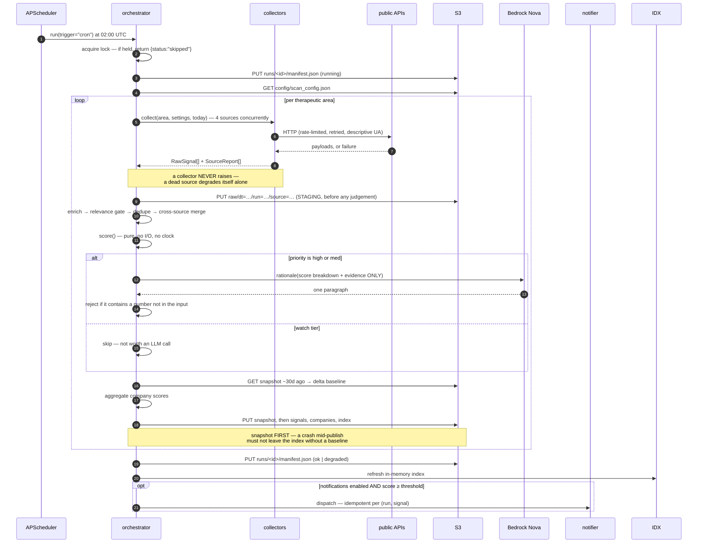
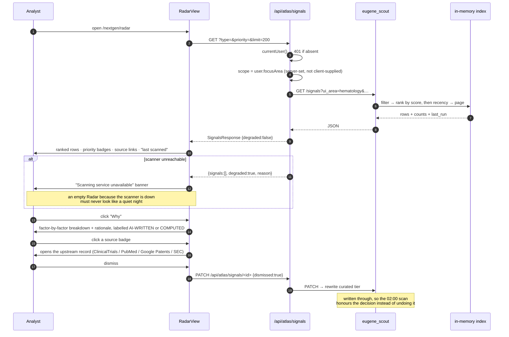
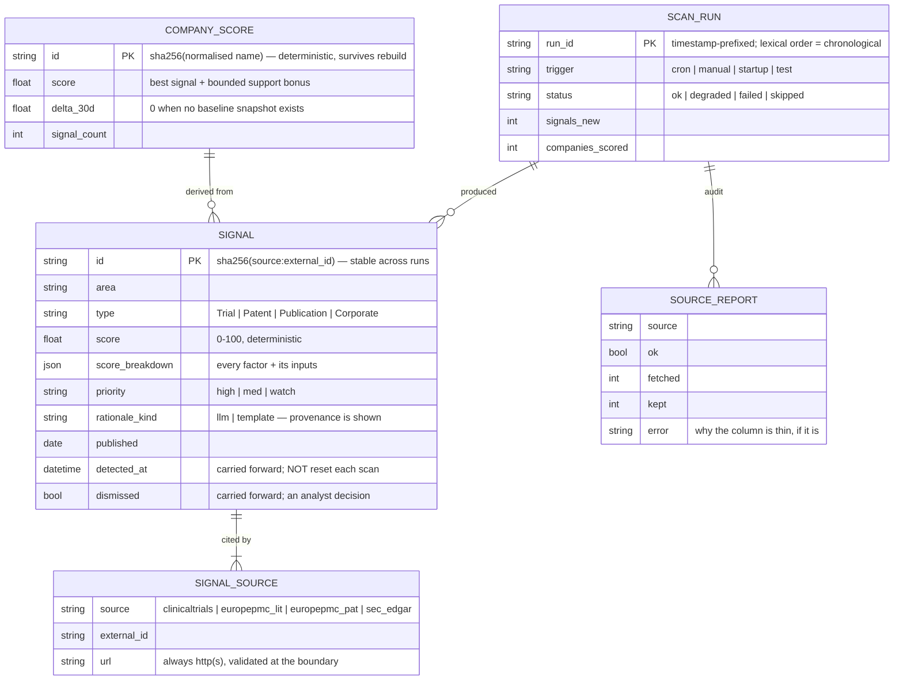
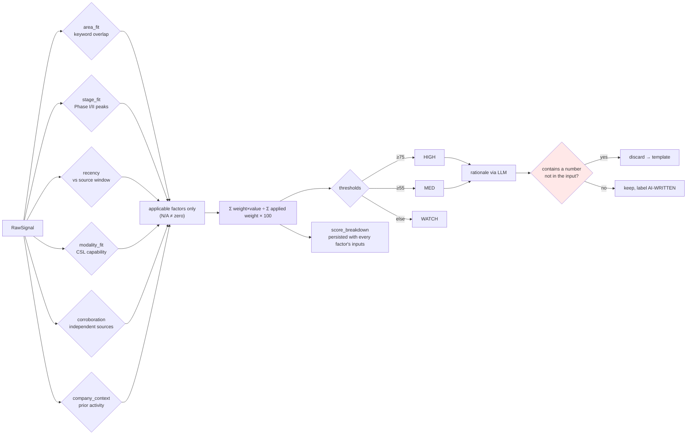
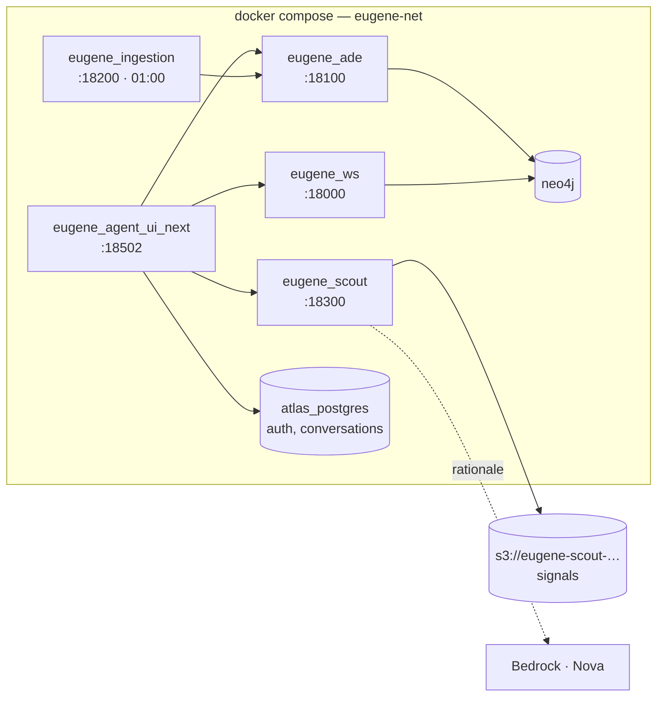

# Use Case 1 — Architecture

Real-Time Pipeline Intelligence & Partnership Opportunity Scanning, as built.

Implementation lives in [`agents/eugene-scout/`](../agents/eugene-scout/) (scanner) and
[`agents/eugene-agent-ui-next/`](../agents/eugene-agent-ui-next/) (Radar, Watchlist, Today,
Settings). Source contracts are recorded in
[`agents/eugene-scout/docs/SOURCE_CONTRACTS.md`](../agents/eugene-scout/docs/SOURCE_CONTRACTS.md).

---

## 1. Component architecture

```mermaid
graph TB
  subgraph Browser["Browser — CSL Atlas"]
    RV["RadarView<br/>live signals + score breakdown"]
    WV["WatchlistView<br/>ranked companies"]
    TV["TodayView<br/>real counters"]
    SV["Settings › Scanning<br/>weights, sources, run history"]
  end

  subgraph BFF["eugene_agent_ui_next :18502 — Next.js BFF"]
    AUTH["currentUser() — atlas_session JWT<br/>scope derived from profile, not query string"]
    R1["/api/atlas/signals"]
    R2["/api/atlas/signals/[id]"]
    R3["/api/atlas/watchlist"]
    R4["/api/atlas/scout/stats"]
    R5["/api/atlas/scout/runs"]
    R6["/api/atlas/scout/config"]
    R7["/api/atlas/scout/scan"]
  end

  subgraph Scout["eugene_scout :18300 — FastAPI"]
    SCHED["APScheduler<br/>daily 02:00 UTC · weekly digest"]
    ORCH["orchestrator.run()<br/>single-flight asyncio.Lock"]
    IDX["SignalIndex<br/>in-memory, atomically swapped"]

    subgraph COL["Collectors — never raise, report instead"]
      C1["trials.py<br/>ClinicalTrials.gov v2"]
      C2["literature.py<br/>Europe PMC SRC:MED"]
      C3["patents.py<br/>USPTO Open Data Portal"]
      C4["edgar.py<br/>SEC EDGAR full-text"]
    end

    ENR["enrich.py — company attribution"]
    GATE["relevance gate<br/>specific-keyword requirement"]
    DED["dedupe.py<br/>identity + cross-source merge"]
    SCO["scoring.py<br/>PURE · deterministic · 6 factors"]
    RAT["rationale.py<br/>LLM prose only · output verified"]
    NTF["notify.py — off by default, idempotent"]
    STO["store.py — repository"]
  end

  subgraph S3["s3://eugene-scout-087084717211 — the only database"]
    RAW[("raw/ — STAGING<br/>untouched payloads, write-once")]
    CUR[("curated/ — FINAL<br/>signals · companies · index · snapshots")]
    RUNS[("runs/ — audit trail")]
    CFG[("config/ — BD-editable")]
  end

  subgraph Ext["External"]
    CT["ClinicalTrials.gov"]
    EP["Europe PMC"]
    US["api.uspto.gov"]
    SE["efts.sec.gov"]
    BR["Bedrock — Nova"]
  end

  RV & WV & TV & SV --> AUTH --> R1 & R2 & R3 & R4 & R5 & R6 & R7
  R1 & R2 & R3 & R4 & R5 & R6 & R7 -->|"HTTP, server-side only"| Scout

  SCHED --> ORCH
  ORCH --> COL
  C1 --> CT
  C2 --> EP
  C3 --> US
  C4 --> SE
  COL -->|RawSignal[]| RAW
  COL --> ENR --> GATE --> DED --> SCO --> RAT --> STO
  RAT -.optional.-> BR
  STO --> CUR & RUNS
  STO --> CFG
  SCO --> NTF
  CUR --> IDX --> Scout
```

**Ownership rule.** `eugene_scout` is the only process that reads or writes the scout bucket.
The UI never touches S3; it talks HTTP. Two owners of one store is how a layout silently
diverges between writer and reader.

---

## 2. Scheduled scan



---

## 3. Analyst opens Radar



---

## 4. Data model



---

## 5. Scoring flow



The red node is the fence. It is the difference between a briefing an analyst can rely on and
one containing a confident, fabricated statistic.

---

## 6. Deployment



`eugene_scout` scans at **02:00**, after `eugene_ingestion`'s **01:00** sweep, so it sees the
papers that run has just indexed rather than racing it.

---

## 7. Where each PDF requirement landed

| Use-case requirement | Implementation |
|---|---|
| Scheduled orchestrator agent | `orchestrator.py` + APScheduler cron |
| Sub-agents across ClinicalTrials, PubMed, EDGAR, patents | Four collectors behind one `Collector` protocol |
| Entity extraction linked to internal ontology | `enrich.py` — taxonomy keywords + Neo4j linkage |
| Scoring against configurable BD criteria | `scoring.py` + `config/scan_config.json` |
| Ranked output to a structured store | S3 `curated/`, served from the in-memory index |
| Report-generation agent | `digest.py` → Markdown → `/briefing` page → `createArtifact()` → `/a/<id>` with MD/HTML/DOCX/PDF export |
| High-scoring signals pushed with a one-paragraph rationale | `notify.py`, off by default, idempotent |
| 8–12 ranked companies, rationale, sources, next action | `digest.py` — all four, with the band honestly under-filled on a quiet week |
| Human-in-the-loop checkpoints | Low-confidence signals are ranked, never suppressed; dismissal is an explicit analyst action |
| Auditability | `runs/` manifests + `score_breakdown` + `signal_sources` — every claim traces to a URL |
| Configurable thresholds, not code | Settings › Scanning, stored in S3, versioned |
