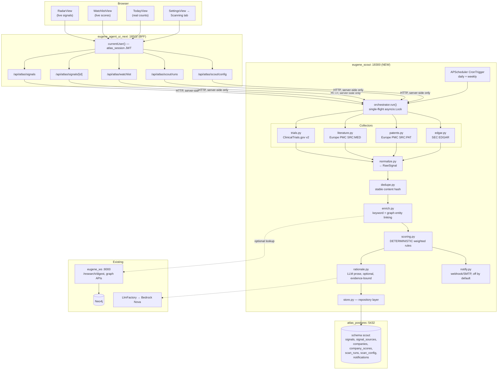
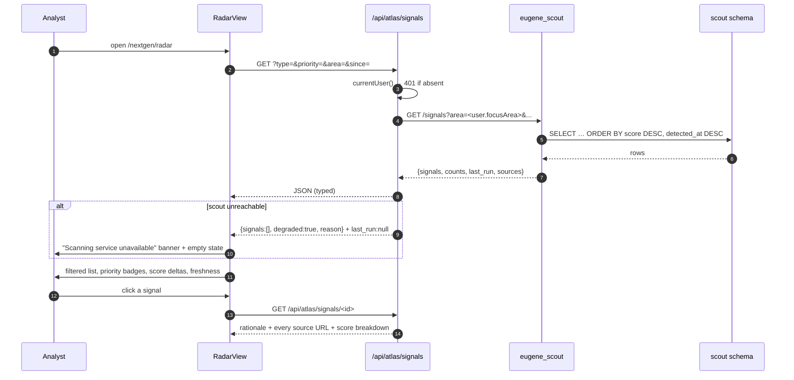
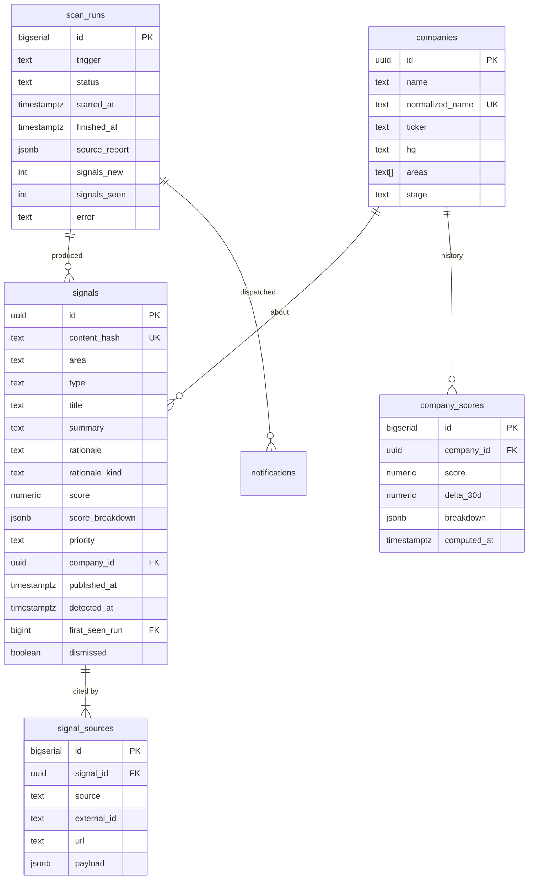

# Implementation Prompt — Use Case 1: Real-Time Pipeline Intelligence & Partnership Opportunity Scanning

> Paste everything below the line into Claude Code (or an agent session) as a single task prompt.
> It is written to be executed against **this** repository as it exists today.

---

## 0. Role and prime directive

You are implementing **Use Case 1 (Real-Time Pipeline Intelligence & Partnership Opportunity
Scanning)** from `CSL_BD_AWS_Bioinformatics_UseCases.pdf` into the existing Eugene / CSL Atlas
codebase at `/Users/rajeshgupta/PycharmProjects/knowledgeGraph`.

**Prime directive — no invention.** Every fact you rely on must be one of:

1. Something you read in a file in this repo during this session, or
2. Something you verified with a command whose real output you can show, or
3. Something stated explicitly in this prompt.

If you cannot satisfy one of those three for a claim, you must stop and say so rather than write
code around a guess. Specifically forbidden:

- Inventing REST endpoints, query parameters, or JSON field names for any external API.
  Every external contract is verified live in **Phase 0** before a line of collector code is written.
- Inventing internal module paths, function names, exported symbols, env vars, table names, or
  container names. `grep`/`Read` first, then write.
- Adding an npm or pip dependency without first reading the existing
  `agents/eugene-agent-ui-next/package.json` / `ingestion/requirements.txt` and justifying it.
- Adding AWS services that are not already in this stack. See the AWS mapping table in §2.
- "Fixing" unrelated files, reformatting, or touching the 30+ files already dirty on
  `feature/nextgen`. Run `git status` first; leave pre-existing modifications alone.

When something in this prompt conflicts with what the code actually does, **the code wins** —
report the conflict, then proceed with the code's reality.

---

## 1. What already exists (verified — do not re-derive, but do re-read before editing)

**Next.js 14 App Router UI** — `agents/eugene-agent-ui-next` (port 18502, base path `/nextgen`):

| Path | What it is | UC-1 relevance |
|---|---|---|
| `app/(atlas)/radar/page.tsx` + `components/atlas/views/RadarView.tsx` | Radar screen | **Currently renders 7 hardcoded signals from `lib/atlas/seed.ts`.** This is the screen UC-1 must make real. |
| `components/atlas/views/WatchlistView.tsx` | Company table | Also hardcoded (`COMPANIES` in `seed.ts`). Becomes live scores. |
| `components/atlas/views/TodayView.tsx` | Daily briefing | The "Since you last looked: **3 new signals**, **2 score moves**" strip is hardcoded. Becomes real counts. |
| `components/atlas/OvernightDigest.tsx` + `app/api/atlas/digest/route.ts` | Live digest, proxies `POST {EUGENE_CORE_API_URL}/research/digest` | The **correct pattern to copy**: proxy route → backend, degrade to an explicit empty state on failure, never an error card. |
| `lib/atlas/intel.ts` | Direct Europe PMC / ClinicalTrials.gov v2 fetchers, `clean()`, `withinDays()`, `freshest()`, `WINDOW_DAYS`, 15-min in-memory cache | Reference implementation for date-filtering. **Read the comments at lines 50–75** — they document that Europe PMC does *not* honour `sort=P_PDATE_D desc`, which is why filtering, not sorting, is mandatory. |
| `lib/atlas/areas.ts` | `FOCUS_AREAS` (hematology / nephrology / immunology / oncology), `getArea()` | The UI-side taxonomy. |
| `lib/atlas/db.ts` | `pg` Pool, lazy idempotent `SCHEMA_SQL`, `query()`, `getSetting()`/`setSetting()`, `withTransaction()` | The UI owns tables `users`, `login_audit`, `conversations`, `messages`, `app_settings`, `artifacts`, `uploads`. |
| `lib/atlas/auth.ts` | `currentUser()` → `SessionUser {id,email,name,role,focusArea}` from httpOnly JWT cookie `atlas_session` | Every new API route must gate on this. |
| `components/atlas/ui.tsx` | `PageContainer`, `PageHeader`, `SectionLabel`, `PriorityBadge`, `ScoreDelta`, `DeltaPill`, `Card` | Reuse these. Do not invent a parallel design system. |
| `lib/atlas/nav.ts` | `NAV[]` drives sidebar + command palette + ⌘1–7 | Radar is already `⌘4`; no new nav entry needed. |
| `e2e/` | Playwright specs (`views.spec.ts`, `api.spec.ts`, `chat-ui.spec.ts`) | Extend, don't replace. |

**Python backend tier:**

| Path | What it is |
|---|---|
| `ingestion/scheduler/service.py` | **The scheduler pattern to copy.** FastAPI + APScheduler `AsyncIOScheduler`/`CronTrigger`, `asyncio.Lock` so only one run is in flight, `run_in_threadpool` for blocking work, `_state` dict exposed for status, manual trigger endpoint, `coalesce=True`, `misfire_grace_time`. |
| `ingestion/src/pipeline/orchestrator.py` | Nightly discover → extract → index → rank. Reads declared areas from YAML. Calls `eugene_ade` over HTTP rather than re-parsing. |
| `ingestion/src/pipeline/config/research_areas.yaml` | **The real CSL taxonomy** — `areas[].id/label/enabled/queries.{literature,trials_condition,trials_intervention}/keywords`, derived from `bin/seed/csl_behring_assets.cypher`. Hemophilia, hereditary angioedema, etc. |
| `src/foundation/router/digest_router.py` | `POST /research/digest` on `eugene_ws`. Takes `{keywords, since, limit}` from the caller *on purpose* so the taxonomy has one home. |
| `agents/eugene-agent-ws/src/query/infra/llm/llm_factory.py` + `query/conf/conf.py` | `LlmFactory.bedrock_model()` / `.openai_model()` / `.anthropic_model()`, provider chosen by `LLM_PROVIDER` env with auto-detect. Bedrock default `amazon.nova-lite-v1:0`. |
| `agents/eugene-ade/src/ade/*` | Document extraction service (`eugene_ade`, port 18100). |
| `docker-compose.yml` | Services: `atlas_postgres`, `eugene_ws`, `eugene_mcp`, `eugene_agent_ws`, `eugene_agent_ui`, `eugene_agent_ui_next`, `eugene_ade`, `eugene_ingestion`. Network `eugene-net`. Volume `atlas_pg_data`. |

**Known environment constraint (project memory, treat as fact):** on AWS Bedrock in this account
**only Amazon Nova models work**; Anthropic models are blocked by a missing Marketplace
subscription. So any LLM step must default to `amazon.nova-lite-v1:0` via the existing
`LlmFactory`, and must degrade gracefully to a non-LLM path when no provider is configured.

---

## 2. Mapping the PDF's AWS architecture onto this stack

The PDF names AWS managed services. This repo runs on Docker Compose today (with a Terraform
EC2 path under `infrastructure/environments/ui-only-ec2`). **Implement the local-stack column.**
Do not add new AWS services. Keep the mapping documented in code comments so the AWS migration
path stays legible.

| PDF says | Implement as | Why |
|---|---|---|
| Amazon EventBridge (scheduling) | APScheduler `CronTrigger` inside the new `eugene_scout` container | Exactly the pattern `eugene_ingestion` already uses; ships with the stack, survives a rebuild, visible to `docker compose ps`. |
| Bedrock multi-agent orchestrator + sub-agents | A deterministic Python orchestrator with pluggable **collectors** + a **scoring engine**; the LLM is used *only* to write the plain-English rationale | Determinism is the anti-hallucination control. A ranked list produced by an LLM cannot be audited or reproduced; a rule-scored list with an LLM-written explanation can. |
| Amazon Comprehend Medical (entity extraction) | Keyword/ontology matching against `research_areas.yaml` keywords + optional lookup against the existing Neo4j graph via `eugene_ws` | Comprehend Medical is not provisioned here. Keyword+graph linkage is verifiable and already how `digest_router.py` scopes results. |
| AWS HealthLake (internal ontology) | Neo4j graph behind `eugene_ws` | Already the system of record. |
| Amazon S3 (source data lake) | Postgres `scout` schema for signals; existing ADE S3 bucket for PDFs | No new bucket. |
| AWS Lambda | FastAPI route handlers in `eugene_scout` | Same code, different envelope. |
| Email / Slack push | Outbound webhook + SMTP, **disabled by default**, configured through Settings | Must never fire from a dev box by accident. |

---

## 3. Target architecture

### 3.1 Component architecture



**Ownership rule (non-negotiable):** `eugene_scout` is the *only* process that reads or writes the
`scout` Postgres schema. The Next.js app never adds `scout` tables to `lib/atlas/db.ts`'s
`SCHEMA_SQL` and never issues SQL against them — it talks HTTP. Two owners of one schema is how
migrations silently diverge.

### 3.2 System sequence — scheduled scan

```mermaid
sequenceDiagram
  autonumber
  participant CRON as APScheduler
  participant ORCH as orchestrator
  participant COL as collectors (async gather)
  participant EXT as external APIs
  participant DB as scout schema
  participant LLM as Bedrock Nova
  participant NTF as notifier

  CRON->>ORCH: run(trigger="cron")
  ORCH->>ORCH: acquire lock — if held, return {status:"skipped"}
  ORCH->>DB: INSERT scan_runs (status='running')
  ORCH->>DB: SELECT enabled areas + weights from scan_config
  loop per area
    ORCH->>COL: collect(area, since)
    COL->>EXT: HTTP (per-source rate limit, timeout, retry)
    EXT-->>COL: raw payloads (or failure)
    COL-->>ORCH: RawSignal[] + per-source status
  end
  Note over ORCH: a failed source degrades that source only,<br/>it never fails the run
  ORCH->>ORCH: normalize → drop out-of-window → dedupe by content_hash
  ORCH->>DB: SELECT existing hashes (only NEW items proceed)
  ORCH->>ORCH: enrich (keywords, company, entities)
  ORCH->>ORCH: score() — pure function, no I/O, no LLM
  alt LLM configured AND signal is high priority
    ORCH->>LLM: rationale(signal + its evidence only)
    LLM-->>ORCH: 1 paragraph
    ORCH->>ORCH: reject if it cites anything not in the evidence
  else
    ORCH->>ORCH: template rationale from the score breakdown
  end
  ORCH->>DB: UPSERT signals, signal_sources; recompute company_scores + history
  ORCH->>DB: UPDATE scan_runs (status='ok', counts, per-source report)
  opt notifications enabled AND score >= threshold
    ORCH->>NTF: dispatch(digest)
    NTF->>DB: INSERT notifications (idempotency key = run+signal)
  end
```

### 3.3 System sequence — analyst opens Radar



### 3.4 Data model



---

## 4. Scoring engine — the auditability contract

`scoring.py` must be a **pure function**: `score(signal, config) -> ScoreResult`. No network, no
LLM, no clock reads beyond an injected `now`. Same input → same output, always.

```
score = Σ (weight_i × factor_i), clamped 0–100
```

Factors (each returns 0–1, each must record its own inputs into `score_breakdown`):

1. `area_fit` — overlap between the signal's matched keywords and the area's declared keywords.
2. `stage_fit` — development stage from the payload (Phase I/II ranks highest per the PDF's
   "Series A/B, Phase I/II" thesis). Unknown stage → neutral, never a bonus.
3. `recency` — linear decay across the source's window (reuse the `WINDOW_DAYS` reasoning from
   `lib/atlas/intel.ts`; patents get a much wider window than literature).
4. `modality_fit` — modality keywords vs CSL capabilities (plasma-derived, recombinant, gene
   therapy, vaccines).
5. `corroboration` — how many independent sources back the same signal (this is what
   `signal_sources` is for).
6. `company_context` — whether the company is already on the watchlist / has prior signals.

Weights live in `scan_config` (a DB row), **not in code** — the PDF's "configurable thresholds,
managed as configuration not code" principle. Ship defaults; expose them in Settings.

`priority` is derived from score bands, also configurable: `high >= 75`, `med >= 55`, else `watch`.
Match the existing `Priority` union in `lib/atlas/seed.ts` (`"high" | "med" | "watch"`) so
`PriorityBadge` keeps working unchanged.

**The LLM never produces a score, a rank, a date, a company name, or a number.** It only turns an
already-computed `score_breakdown` plus verbatim source titles into one paragraph of prose. Give it
only that evidence, and drop the LLM output (falling back to the template) if it contains a digit
that does not appear in the input. Store `rationale_kind` as `'llm'` or `'template'` so the UI can
be honest about provenance.

---

## 5. Phases

Work phase by phase. **Do not start a phase until the previous one's acceptance check passes and
you have shown its real output.** Commit at the end of each phase on `feature/nextgen`
(commit only; do not push unless asked).

### Phase 0 — Contract verification (no feature code)

Verify every external contract live, and write the actual observed responses to
`agents/eugene-scout/docs/SOURCE_CONTRACTS.md` (field names, one trimmed sample response per
source, rate-limit/UA requirements, and the exact URL used).

Run at minimum:

```bash
UA='CSL-Atlas-Scout/1.0 (biomedical BD intelligence; contact: semanticraj@gmail.com)'

# ClinicalTrials.gov v2 — confirm field paths used by lib/atlas/intel.ts still hold
curl -sG 'https://clinicaltrials.gov/api/v2/studies' \
  --data-urlencode 'query.term=hemophilia gene therapy' \
  --data-urlencode 'pageSize=3' --data-urlencode 'sort=LastUpdatePostDate:desc' \
  -H "User-Agent: $UA" | head -c 3000

# Europe PMC — literature and patents
curl -sG 'https://www.ebi.ac.uk/europepmc/webservices/rest/search' \
  --data-urlencode 'query=(hemophilia) AND SRC:MED' --data-urlencode 'format=json' \
  --data-urlencode 'pageSize=3' -H "User-Agent: $UA" | head -c 2000
curl -sG 'https://www.ebi.ac.uk/europepmc/webservices/rest/search' \
  --data-urlencode 'query=(factor VIII) AND SRC:PAT' --data-urlencode 'format=json' \
  --data-urlencode 'pageSize=3' -H "User-Agent: $UA" | head -c 2000

# SEC EDGAR — CONTRACT UNVERIFIED IN THIS PROMPT. Determine the real full-text-search
# endpoint and response shape yourself, and record it. SEC requires a descriptive
# User-Agent with contact info; respect their 10 req/s guidance.
```

**If any source cannot be verified** (blocked, changed, no egress from your environment): do
**not** guess its shape. Mark it `enabled: false` in config, implement its collector behind the
same interface with a clearly-labelled `NotVerifiedError`, and say so in your report. Three
working collectors beats four where one is fiction.

**Acceptance:** `SOURCE_CONTRACTS.md` exists and every field name the collectors will read appears
in a pasted real response — or is explicitly marked unverified/disabled.

### Phase 1 — `eugene_scout` service skeleton

```
agents/eugene-scout/
├── README.md
├── requirements.txt
├── docs/SOURCE_CONTRACTS.md
└── src/scout/
    ├── __init__.py
    ├── api.py            # FastAPI app + lifespan + APScheduler (copy ingestion/scheduler/service.py)
    ├── config.py         # env + scan_config row loading, weight defaults
    ├── db.py             # asyncpg/psycopg pool, idempotent CREATE SCHEMA scout + tables
    ├── models.py         # pydantic: RawSignal, Signal, ScoreResult, ScanRun, SourceReport
    ├── orchestrator.py   # run(); single-flight; per-source isolation
    ├── collectors/{__init__,base,trials,literature,patents,edgar}.py
    ├── normalize.py  dedupe.py  enrich.py  scoring.py  rationale.py  notify.py  store.py
    └── areas.py          # loads ingestion/src/pipeline/config/research_areas.yaml
```

Rules:
- **Reuse the taxonomy, do not fork it.** Read `research_areas.yaml`; if the path is not mountable
  into the container, copy it in the Dockerfile build context and add a comment naming the source
  of truth. Never retype the queries by hand.
- `collectors/base.py` defines one `Collector` protocol: `async def collect(area, since, limit) ->
  tuple[list[RawSignal], SourceReport]`. Every collector honours a timeout, a retry-with-backoff,
  the descriptive User-Agent, and **returns a failure report instead of raising**.
- Date filtering, not sorting — port `withinDays`/`freshest` semantics from `lib/atlas/intel.ts`
  and cite that file in a comment explaining why.
- Endpoints: `GET /health`, `GET /status`, `POST /scan` (manual trigger, background),
  `GET /signals`, `GET /signals/{id}`, `PATCH /signals/{id}` (dismiss), `GET /companies`,
  `GET /runs`, `GET /config`, `PUT /config`.

**Acceptance:** `python -m pytest agents/eugene-scout/tests -q` green (unit tests with recorded
fixtures — no network in tests); `uvicorn scout.api:app` starts; `GET /health` returns 200.

### Phase 2 — Pipeline + deterministic scoring

Implement normalize → dedupe → enrich → score → store. Unit tests must cover:
- a fixture signal scores identically across 100 runs (determinism);
- an out-of-window item is dropped;
- the same item from two sources produces **one** signal with **two** `signal_sources` rows;
- a collector raising produces `status: "degraded"` on the run, not a crash;
- weight changes in `scan_config` move the score in the expected direction.

**Acceptance:** `POST /scan` against live sources returns a run summary with non-zero
`signals_new`, and `GET /signals` returns them ranked. Paste the real output.

### Phase 3 — Compose + config wiring

- `docker/eugene_scout/Dockerfile` (mirror `docker/eugene_ingestion/Dockerfile`).
- `docker-compose.yml`: service `eugene_scout`, container `eugene-scout`, port `18300:8000`,
  network `eugene-net`, `depends_on: [atlas_postgres, eugene_ws]`, healthcheck matching the
  existing style, `restart: unless-stopped`.
- Env: `ATLAS_DATABASE_URL`, `EUGENE_CORE_API_URL=http://eugene_ws:8000`,
  `SCOUT_CRON_HOUR` (default 2 — **after** ingestion's 01:00 so it can see the night's papers),
  `SCOUT_CRON_MINUTE`, `SCOUT_TZ=UTC`, `SCOUT_WEEKLY_DIGEST_DOW`, `SCOUT_NOTIFY_ENABLED=false`,
  `SCOUT_NOTIFY_WEBHOOK_URL`, `SCOUT_HIGH_THRESHOLD`, `LLM_PROVIDER`, `BEDROCK_MODEL_ID`.
- Add `EUGENE_SCOUT_URL=http://eugene_scout:8000` to the `eugene_agent_ui_next` service env.
- Update `docker.env.template` and the compose comment block. Do not put secrets in the compose file.

**Acceptance:** `docker compose config` parses; `docker compose up -d eugene_scout` healthy;
`curl localhost:18300/health` 200.

### Phase 4 — BFF routes in Next.js

Add under `agents/eugene-agent-ui-next/app/api/atlas/`: `signals/route.ts`,
`signals/[id]/route.ts`, `watchlist/route.ts`, `scout/runs/route.ts`, `scout/config/route.ts`.

Each one: `export const runtime = "nodejs"; export const dynamic = "force-dynamic";`,
`currentUser()` → 401 when absent, area defaulted from `user.focusArea`, `AbortSignal.timeout(…)`,
and **graceful degradation exactly like `app/api/atlas/digest/route.ts`** — on failure return a
well-formed empty payload with `degraded: true` and a `reason`, never a 500 that blanks the page.
`scout/config` PUT requires `user.role === 'admin'` (check what roles actually exist in `users`
before enforcing; if only `analyst` exists, gate it and say so).

Put shared response types in `lib/atlas/scout.ts` (client-safe types only — no `server-only`
import there if a client component needs them; follow how `lib/atlas/areas.ts` handles this).

**Acceptance:** `npm run typecheck` clean; `curl` each route logged-out → 401; logged-in → 200
with the documented shape.

### Phase 5 — UI

- **RadarView** — replace `SIGNALS` from `seed.ts` with live data. Keep the existing filter chips,
  `PriorityBadge`, `ScoreDelta`, and `Card` layout. Add: source badges linking out to every
  `signal_sources.url`, a "last scanned" line, a **Rescan** button (POST to a trigger route,
  disabled while a run is in flight), an expandable score-breakdown panel per signal, a dismiss
  action, and honest empty / degraded / loading states.
- **WatchlistView** — live `companies` + `company_scores`, real `delta_30d`. Keep `ScoreBar`,
  `DeltaPill`, `STAGE_STYLE`.
- **TodayView** — replace the hardcoded "3 new signals, 2 score moves" with real counts since the
  user's last visit; keep `OvernightDigest` where it is.
- **SettingsView** — new "Scanning" section: enabled sources, area toggles, scoring weights,
  thresholds, notification target + a **Send test** button, cron schedule (read-only display),
  and the last 10 runs with per-source status.
- Delete from `seed.ts` **only** the exports that are now fully unused, and only after
  `grep -rn "SIGNALS\|COMPANIES" --include=*.tsx --include=*.ts` shows no remaining reference.
  `PROGRAMS`, `BRIEFS`, `RESEARCH_TEMPLATES`, `ASK_SUGGESTIONS` stay — they belong to other views.

**Acceptance:** `npm run build` clean; `npx playwright test` green; screenshots of Radar in
populated, empty, and degraded states.

### Phase 6 — Weekly digest + notifications + docs

- Weekly job renders the PDF's deliverable: **8–12 ranked companies, each with a plain-English
  rationale, the sources consulted, and a next-action recommendation.** Persist it as an
  artifact via the existing `artifacts` table/`lib/atlas/artifacts.ts` path so it is viewable at
  `/nextgen/a/<id>` and exportable to MD/HTML/DOCX/PDF with zero new code.
- Notifications: webhook + optional SMTP, **off by default**, idempotent per (run, signal),
  and every dispatch recorded in `notifications`. A "Send test" path that does not require a
  real scan.
- `agents/eugene-scout/README.md`: architecture, the AWS mapping table from §2, how to run,
  how to add a source, how to tune weights, and the audit trail story
  (`scan_runs.source_report` + `score_breakdown` + `signal_sources` = every claim traceable to a URL).
- Add the Mermaid diagrams from §3 to the README.

**Acceptance:** a full `POST /scan` → digest artifact → visible at `/nextgen/a/<id>`; test
notification delivered to a local sink; docs render.

---

## 6. Standing engineering rules

- **Match the surrounding code.** These files carry unusually dense *why* comments (see
  `digest_router.py`, `intel.ts`, `orchestrator.py`, the compose centrality block). Write comments
  at that density and in that register: explain the decision and the measurement behind it, not
  what the line does. No banner comments, no `# TODO`, no commented-out code.
- Python: `from __future__ import annotations`, type hints throughout, `logging` (never `print`),
  `datetime` timezone-aware in UTC.
- TypeScript: strict, no `any` in exported signatures, `interface` for response shapes mirroring
  the Python pydantic models field-for-field.
- Every external call: explicit timeout, bounded retry, descriptive User-Agent, and a failure path
  that degrades rather than throws.
- Secrets only through env / `app_settings`. Never in the image, never committed.
- Idempotent schema creation on startup (the `ensureSchema()` pattern) — no separate migration step.
- Do not modify: `lib/atlas/db.ts` `SCHEMA_SQL` (scout owns its own schema), anything under
  `infrastructure/`, or any of the currently-dirty files unless the phase explicitly requires it.

## 7. Reporting

At the end of each phase, report exactly:

1. Files created / modified (paths only).
2. Commands run and their **real** output for the acceptance check.
3. Anything you could not verify, disabled, or deferred — and why.
4. Any place where this prompt contradicted the codebase, and which you followed.

If you are blocked, stop and ask. A wrong assumption written into a scoring engine is far more
expensive than a question.
